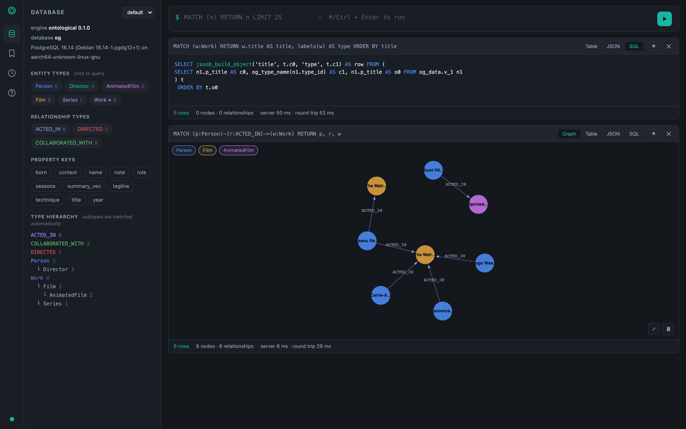

# Ontological

A Cypher-native ontology graph database that lives **inside PostgreSQL**.

Neo4j-class traversal, TypeDB-class type inheritance and pgvector-backed
semantic search — including **embeddings on relationships**, not just nodes —
delivered as one extension you install with `CREATE EXTENSION`.

It speaks **two query languages over one graph**: Cypher, and TypeQL. TypeDB's
own bookstore example — schema, data and documented queries — loads and runs
here unmodified; see [Running a TypeDB example](#running-a-typedb-example).

```sql
CREATE EXTENSION ontological CASCADE;

SELECT og_create_graph('kb');
SELECT og_create_type('kb', 'Vehicle', 'entity');
SELECT og_create_type('kb', 'Car', 'entity', ARRAY['Vehicle']);
SELECT og_create_type('kb', 'EV',  'entity', ARRAY['Car']);

-- One label. The whole hierarchy answers.
SELECT og_cypher('kb', $$ MATCH (v:Vehicle) RETURN v.model $$);
```

---

## Why this exists

Apache AGE already puts Cypher on PostgreSQL. It stores nodes and edges as rows
in ordinary heap tables with properties in an `agtype` (JSON) column, and it
hands Cypher to the server as a *string inside a function call*. Two consequences
follow, and they are structural rather than incidental:

- **Every hop costs `degree` index probes plus `degree` random heap fetches**,
  and every property read costs a JSON parse.
- **The optimiser cannot cost the pattern.** AGE does rewrite `cypher()` into a
  query tree, but `agtype` leaves it without column statistics or ordinary
  indexes, so join order is chosen from defaults rather than from the data.

Measurement puts almost all of the observed cost somewhere narrower than either
bullet: a single indexed hop through AGE reads about as many pages as we do,
while its variable-length path operator rescans at every depth. See
[`docs/benchmark.md`](docs/benchmark.md) before quoting the first bullet.

Ontological answers both:

| | Apache AGE | Ontological |
|---|---|---|
| adjacency | one row per edge + B-tree | CSR-style segments: ≤256 neighbours per heap tuple |
| properties | `agtype` JSON blob | real typed columns generated from the type catalog |
| identifiers | graphid | `int8` with `[shard:9][type:18][local:36]` bit fields |
| Cypher | string argument to `cypher()` | parsed → compiled to plain SQL the planner optimises |
| inheritance | multi-label bookkeeping by hand | interval-indexed type hierarchy, constant-time subtype tests |
| vectors | — | pgvector on nodes **and relationships** |

A third project, **pgGraph**, answers the same question from the other side: it
stores no graph at all, compiling the topology of your existing relational
tables into an in-memory CSR array. That buys a pointer-free hot loop for deep
traversal and gives up patterns, types, transactional visibility and row-level
security to get it. Both comparisons — how each one declares its tables, how
each one traverses, and what their published numbers do and do not show — are in
[`docs/comparison.md`](docs/comparison.md).

Measured on identical data on one machine, with **every system's answers checked
for equality before any timing is reported**, and with each system given the
indexes a competent operator would create:

**50,000 nodes / 974,936 edges, median latency**

| query | Ontological (Cypher) | Ontological (storage) | Neo4j 5 | Apache AGE | AGE without `*1..n` | TypeDB 3 | plain recursive CTE |
|---|---|---|---|---|---|---|---|
| 1 hop | 2.10 ms | 0.31 ms | 0.74 ms | 2.15 ms | 2.15 ms | 0.46 ms | 0.24 ms |
| 2 hops | 3.96 ms | 0.50 ms | 0.92 ms | 799.50 ms | 7.99 ms | 1.48 ms | 0.36 ms |
| 3 hops | 33.86 ms | 4.33 ms | **2.99 ms** | 22,412 ms | 34.63 ms | 19.73 ms | 3.49 ms |
| property scan | 0.62 ms | 0.24 ms | 0.68 ms | 0.27 ms | 0.24 ms | 0.52 ms | 0.19 ms |

Four things in that table deserve to be said out loud rather than buried:

- **Neo4j is 11× faster than this project at three hops** and its latency barely
  moves with scale (3.7× for 26× the data, against our 9.4×). That is the number
  to beat, and we do not beat it.
- **A hand-written recursive CTE over two indexed tables beats us everywhere.**
  It carries no query engine, no type system and no Cypher — but it is faster,
  and pretending otherwise would make the rest of these numbers worth less.
- **Apache AGE's collapse is its `*1..n` operator, not its storage.** Asked the
  same question as a union of fixed-length patterns, AGE answers in 34.63 ms
  instead of 22,412 ms. Against that column we are at parity, not 660× ahead.
  An earlier version of this README claimed 615× against AGE; that number was
  measured against an AGE with no index on its edge endpoints, and it should not
  have been published.
- **The Cypher engine costs 7.8× over the raw storage path at three hops**
  (33.86 ms vs 4.33 ms), mostly jsonb projection and SPI round-tripping. That is
  the honest current price of the query surface, and it is the next thing to fix.

Full method, the 5,000-node tables, the protocol-floor correction and what each
engine's numbers mean: [`docs/benchmark.md`](docs/benchmark.md). Reproduce with
`python3 bench/harness.py --scale 50000 --degree 20`. The harness voids its own
timings when the systems disagree on an answer.

---

## What is built

Eleven specifications, planned and implemented in order. Status is stated
plainly; partial means partial.

| # | Spec | Status |
|---|------|--------|
| [001](specs/001-graph-storage-engine/) | Native graph storage engine | **working** — adjacency segments, typed property tables, bulk load, reorg, integrity checker |
| [002](specs/002-ontology-type-system/) | Ontology type system & inheritance indexing | **working** — entity/relation/attribute types, multiple inheritance, roles, constraints, interval labels |
| [003](specs/003-cypher-query-engine/) | Native Cypher engine | **working** — lexer, parser, compiler to SQL, read + write paths, `WITH`, list comprehensions, `CALL`. `UNION` not yet |
| [004](specs/004-vector-hybrid-search/) | Vector & hybrid semantic search | **working** — node *and relationship* embeddings, filter push-down, hybrid RRF ranking, recall harness |
| [005](specs/005-postgres-supabase-interop/) | PostgreSQL / Supabase interop | **working** — relational views, RLS helper, PostgREST RPC, table mapping |
| [006](specs/006-semantic-web-adapters/) | RDF / OWL / SPARQL / SHACL | **partial** — RDF load & dump, OWL→type-hierarchy mapping, overflow fidelity. SPARQL not yet |
| [007](specs/007-distributed-cluster/) | Distributed cluster | **read replicas only** — sharding is designed, not implemented. See the plan for why |
| [008](specs/008-agent-native-interface/) | Agent-native interface | **working** — schema introspection with token budget, correctable errors, dry-run estimates, history, audit, roles |
| [009](specs/009-benchmark-conformance/) | Benchmark & conformance harness | **working** — AGE/CTE comparison with a correctness gate, integrity checks, regression compare |
| [010](specs/010-typeql-query-surface/) | TypeQL query surface | **partial** — TypeDB 3.x `define`/`insert`/`put`/`match`/`fetch`/pipeline/`delete`/`update`, verified against the upstream TypeDB bookstore example. User-defined functions parse and round-trip but do not evaluate |
| [011](specs/011-bolt-protocol-gateway/) | Bolt protocol gateway | **working** — Bolt 4.4: a Neo4j driver connects with only its URI changed. `Node`/`Relationship`, transactions, change counters, `EXPLAIN`, PostgreSQL roles as authentication. **Neo4j's own MCP server runs against it unmodified** ([`examples/meeting-rooms/`](examples/meeting-rooms/)). Bolt 5.x, `Path` and TLS not yet |

Governance lives in [`.specify/memory/constitution.md`](.specify/memory/constitution.md).
Every deviation from it is recorded in the relevant `plan.md` under *Complexity
Tracking* — including the two that matter most: this release is not a Table
Access Method, and Cypher still enters through a function call because
PostgreSQL 16 has no hook to replace the top-level parser without patching the
kernel. Constitution principle I (never fork) outranks principle II, so
principle II loses this round, and the plan says so.

---

## Getting started

### Docker (everything included)

```bash
docker build -f docker/Dockerfile.dev -t ontological-dev .
docker run -d --name og -v "$PWD":/work -p 28816:28816 -w /work ontological-dev sleep infinity

docker exec og bash -lc 'cd /work/engine && \
  cargo pgrx install --features pg16 --no-default-features \
    --pg-config /usr/lib/postgresql/16/bin/pg_config --sudo && \
  cargo pgrx start pg16 && \
  createdb -h localhost -p 28816 og && \
  psql -h localhost -p 28816 -d og -c "CREATE EXTENSION ontological CASCADE" && \
  psql -h localhost -p 28816 -d og -f /work/examples/demo.sql'
```

### The Studio

A Neo4j-Browser-style console: query stream, force-directed graph, table and
JSON views — plus a **SQL tab that shows the statement your Cypher compiled to**.

```bash
cd portal && npm install
PGHOST=127.0.0.1 PGPORT=28816 PGDATABASE=og PGUSER=dev npm start
# http://localhost:7474
```



*Query stream, force-directed graph, and the SQL tab showing exactly what the
Cypher above it compiled to.*

The Studio also serves the benchmark report at
[`/benchmark.html`](http://localhost:7474/benchmark.html) — this database
against Neo4j, Apache AGE and TypeDB, rendered straight from
`bench/results/`, so the page and the measurements cannot disagree.

---

## The three things worth trying

### 1. Inheritance that actually inherits

```cypher
MATCH (w:Work) RETURN w.title, labels(w)
```

`Work` is abstract; `Film`, `AnimatedFilm` and `Series` answer. Nobody
maintains a second label, and the subtype test is a single indexed range
comparison — not a recursive walk. `SELECT og_cypher_sql(...)` to see it.

### 2. Semantic search over relationships

```sql
SELECT score, entity->>'note'
FROM og_similar('default', <edge_id>, 'context', 3);
```

The embedding is a property of the *relationship*. Because properties are real
columns, it gets an HNSW index, MVCC and row-level security for free.

### 3. Look at the SQL

```sql
SELECT og_cypher_sql('default',
  $$ MATCH (p:Person)-[:ACTED_IN]->(w:Work) WHERE p.born > 1960 RETURN w.title $$);
```

```sql
SELECT jsonb_build_object('w.title', t.c0) AS row FROM (
SELECT n2.p_title AS c0 FROM og_data.v_5 n1
  CROSS JOIN og_data.v_2 n2
  CROSS JOIN LATERAL (SELECT u.nbr, u.eid FROM og_data.og_adj adj3,
                      LATERAL unnest(adj3.nbr, adj3.eid) AS u(nbr, eid)
                      WHERE adj3.src = n1.id AND adj3.dir = 'o'::"char"
                        AND adj3.etype = ANY(ARRAY[7]::int4[])) u4
 WHERE n2.id = u4.nbr AND (n1.p_born > 1960)
) t
```

The label is already resolved to concrete tables, `p_born > 1960` is a real
column predicate on an indexable column, and the traversal is a join the planner
costs like any other. Paste it into `EXPLAIN`. Paste it into your own query.

---

## Running a TypeDB example

The bookstore example from [typedb/typedb-examples](https://github.com/typedb/typedb-examples)
is vendored under [`examples/typedb/bookstore/`](examples/typedb/bookstore/) —
`schema.tql` and `data.tql` byte for byte as upstream publishes them. Nothing in
them was adjusted to run here.

```sql
SELECT og_create_graph('bookstore');
SELECT og_typeql_script('bookstore', pg_read_file('/work/examples/typedb/bookstore/schema.tql'));
SELECT og_typeql_script('bookstore', pg_read_file('/work/examples/typedb/bookstore/data.tql'));
```

Then run a query straight out of that example's own README:

```sql
SELECT og_typeql('bookstore', $$
match
  $book isa book, has genre "science fiction";
fetch {
  "title": $book.title,
  "authors": [
    match authoring (work: $book, author: $author);
    fetch { "name": $author.name };
  ],
  "price": $book.price
};
$$);
```

```json
{"price": 91.47, "title": "The Hitchhiker's Guide to the Galaxy", "authors": [{"name": "Adams, Douglas"}]}
{"price": 5.49, "title": "Dune", "authors": [{"name": "Herbert, Frank"}]}
```

That is what TypeDB's documentation says the query returns.
`python3 tests/typeql/run.py` re-checks it, and 27 other properties, against the
vendored files on every run.

**The same graph answers in Cypher**, because there is only one graph. TypeQL
reifies relations as nodes and stores attributes as shared, value-deduplicated
instances; that mapping is not hidden — read it off `og_typeql_attribute` and
`og_typeql_role`.

```sql
SELECT og_cypher('bookstore',
  $$ MATCH (b:ebook)-[:`$has`]->(t:title) RETURN t.val $$);
```

What does not work yet: TypeDB **functions** (`fun`) are parsed, stored and
reproduced by `og_typeql_schema()`, but calling one raises an explicit error
rather than guessing. Two of the four queries in the bookstore README use
functions, so two of four run today. That is the honest number.

---

## Documentation

- [`docs/architecture.md`](docs/architecture.md) — how the pieces fit, with diagrams
- [`docs/comparison.md`](docs/comparison.md) — Apache AGE and pgGraph: storage, traversal, and what their numbers show
- [`docs/cypher.md`](docs/cypher.md) — supported syntax, precisely, including what is not
- [`docs/typeql.md`](docs/typeql.md) — the TypeQL surface, the storage mapping, and what is not supported
- [`docs/api.md`](docs/api.md) — every SQL function
- [`docs/agents.md`](docs/agents.md) — using this from an LLM agent
- [`bolt/README.md`](bolt/README.md) — the Bolt gateway: how to run it, and its support matrix
- [`examples/meeting-rooms/`](examples/meeting-rooms/) — Neo4j's own MCP server, unmodified, answering a Korean question against this database
- [`tests/neo4j-movies/README.md`](tests/neo4j-movies/README.md) — the official Neo4j Movie sample, run on all three paths
- [`bench/README.md`](bench/README.md) — benchmark method and how to reproduce

## Testing

```bash
docker exec og bash -lc 'cd /work/engine && cargo test'          # parser, lexer, RDF, ids
docker exec og bash -lc 'cd /work && ./tests/run.sh'             # SQL regression suite
docker exec og bash -lc 'cd /work && python3 tests/typeql/run.py'  # TypeQL vs the TypeDB example
docker exec og bash -lc 'cd /work/bolt && cargo test'            # PackStream round trips
docker exec og bash -lc 'cd /work && python3 tests/neo4j-movies/run.py'  # Neo4j sample, postgres + bolt + neo4j
docker exec og bash -lc 'cd /work && python3 bench/harness.py'   # benchmark + integrity
```

## Licence

Apache-2.0.
