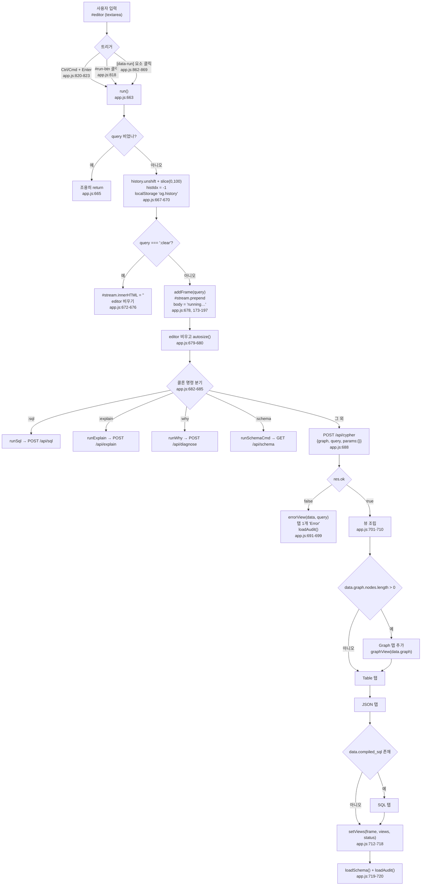
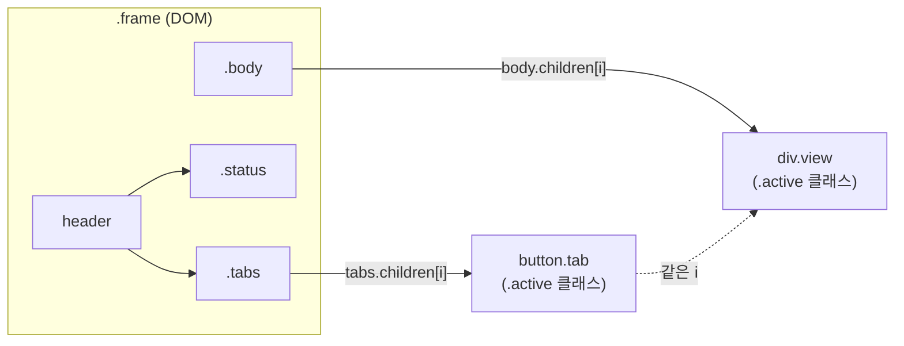
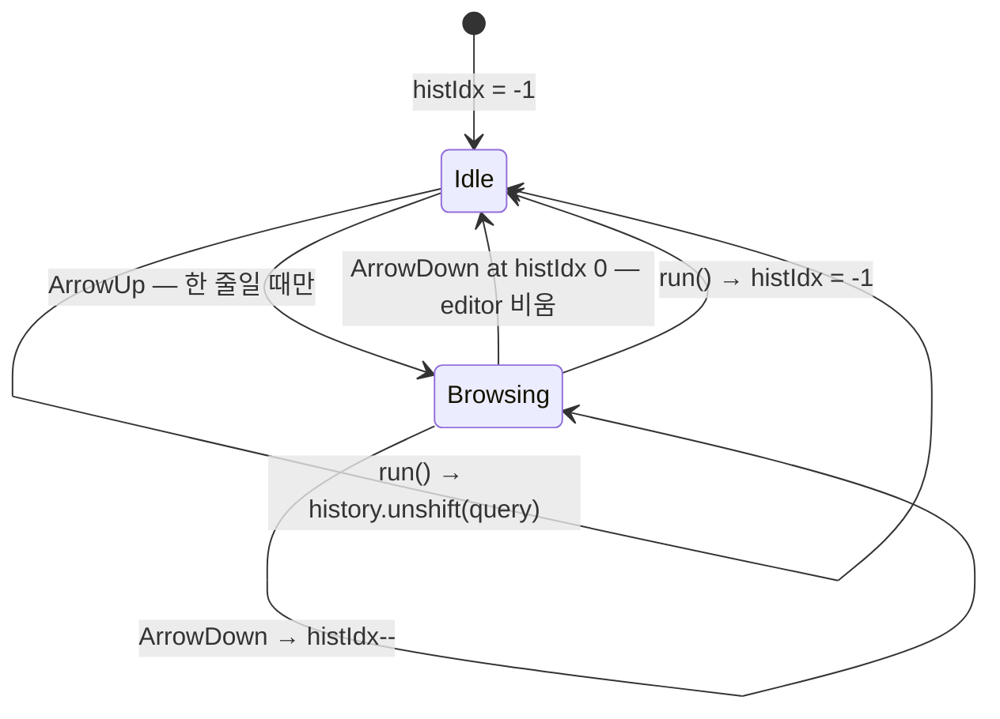
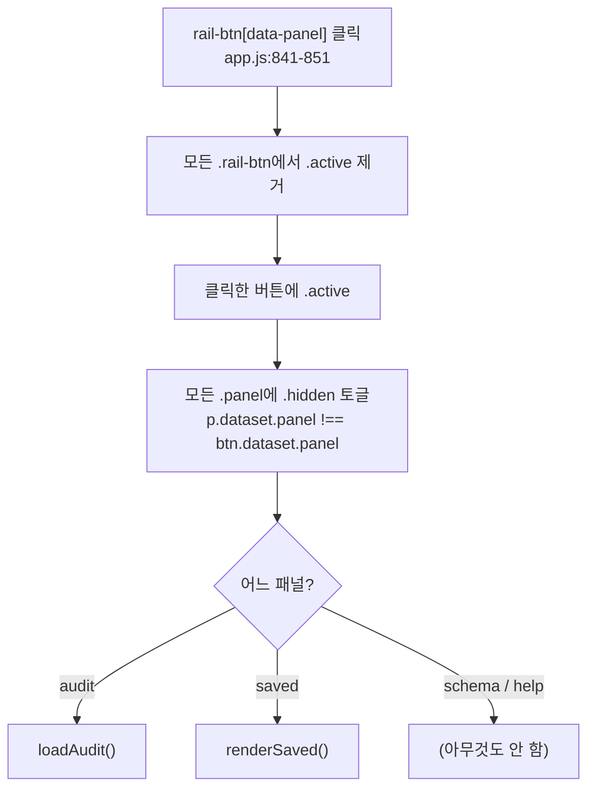
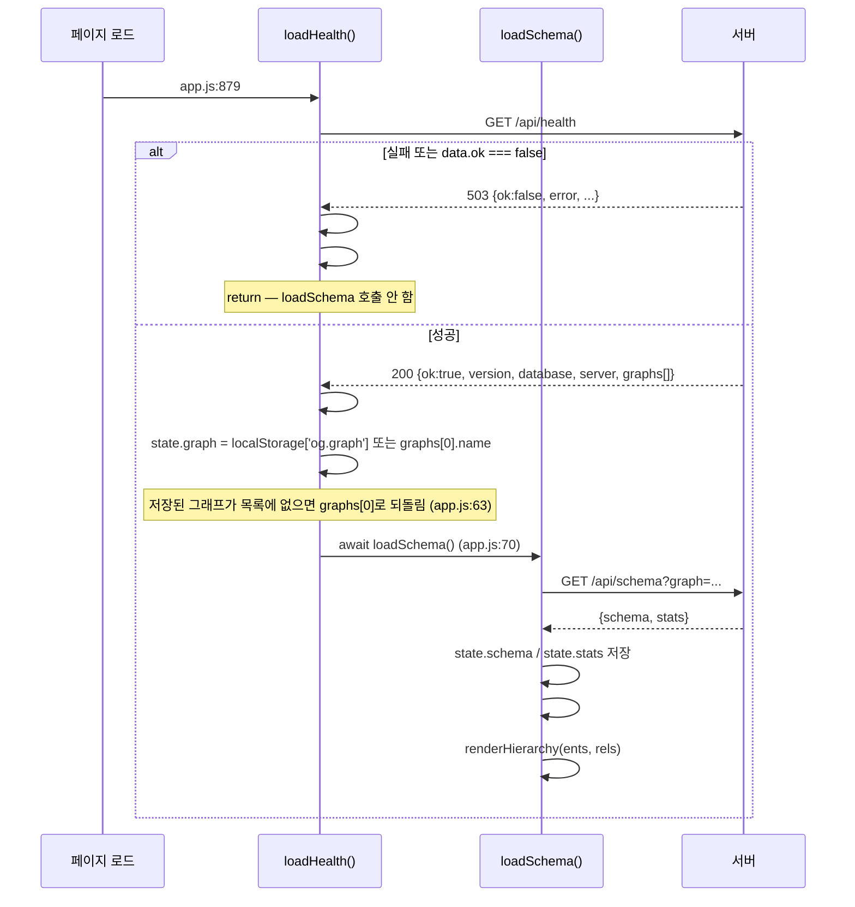
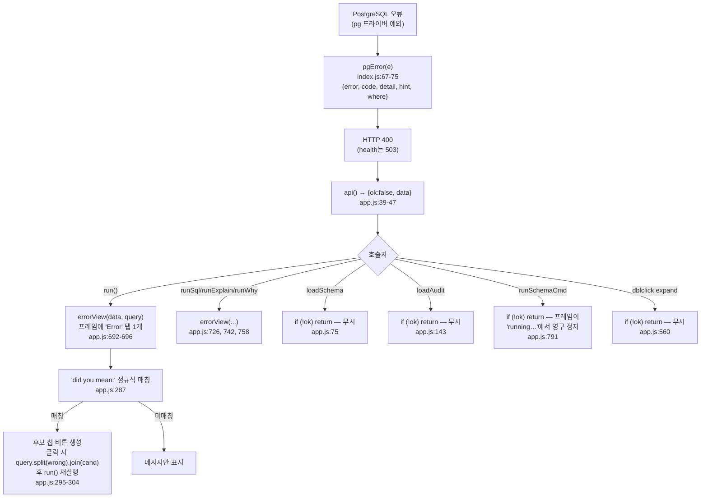
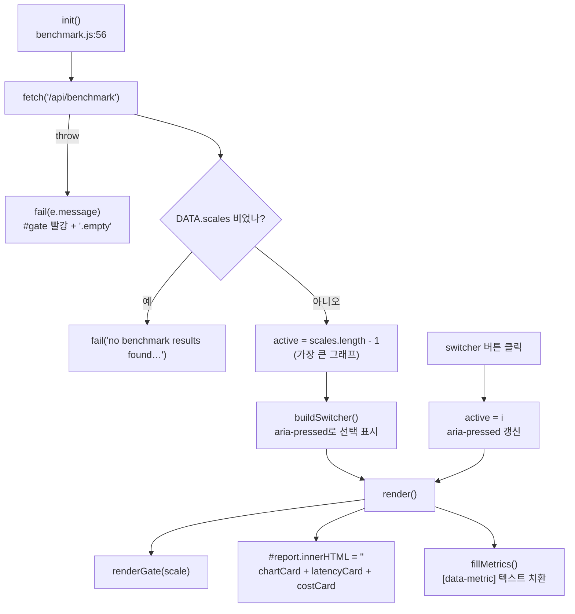

# Studio 상태 흐름 — 입력에서 렌더까지, 그리고 상태가 실제로 어디 있는가

> **이 문서가 답하는 질문**
> - 사용자가 Enter를 누르면 무슨 일이 순서대로 벌어지나?
> - 상태는 어디에 보관되나 — 모듈 변수? DOM? localStorage? 클로저?
> - 그래프/테이블/JSON/SQL 탭 전환은 무엇에 의존하나?
> - 히스토리(↑/↓)와 저장 질의는 어떤 규칙으로 동작하나?
> - 오류가 나면 화면은 어떤 상태가 되고, 어떻게 복구되나?

---

## 1. 사실 — 상태가 있는 곳은 다섯 군데다

Studio에는 상태 관리 라이브러리가 없다. 상태는 **다섯 개의 서로 다른 저장소**에 흩어져 있고,
각각 수명과 동기화 규칙이 다르다.

| # | 저장소 | 실체 | 수명 | 근거 |
|---|---|---|---|---|
| 1 | **모듈 변수 `state`** | `graph` `schema` `stats` `saved` `history` `histIdx` | 페이지 수명 | `app.js:13-20` |
| 2 | **localStorage** | `og.saved` · `og.history` · `og.graph` | 브라우저 영속 | `app.js:17-18, 62, 192, 670, 855, 874` |
| 3 | **DOM 자체** | 프레임 목록, 활성 탭, 패널 표시 여부, inspector 열림 | DOM 수명 | `app.js:187, 209-212, 632, 845-847` |
| 4 | **시뮬레이션 클로저** | `view` `running` `alpha` `dragging` `panning` `hover` `selected` `nodes` `edges` `index` | 그래프 뷰마다 1벌 | `app.js:365-376` |
| 5 | **모듈 전역 보조** | `frameSeq` (프레임 ID 카운터) · `colorMemo` (라벨→색 메모) | 페이지 수명 | `app.js:171, 27` |

**결정적 사실**: `state` 객체에는 "현재 질의", "실행 중 여부", "결과"가 **없다.**
그것들은 전부 DOM(프레임)에 산다. 그래서 프레임을 `el.remove()`하면(`app.js:188`)
그 질의에 관한 모든 것이 사라진다 — 복원 경로가 없다.

### 1.1 `state` 객체 전문

```js
// portal/web/app.js:13-20
const state = {
  graph: 'default',
  schema: null,
  stats: null,
  saved: JSON.parse(localStorage.getItem('og.saved') || '[]'),
  history: JSON.parse(localStorage.getItem('og.history') || '[]'),
  histIdx: -1,
};
```

- `saved` / `history`는 **모듈 로드 시점에 한 번만** localStorage에서 읽는다.
  이후 두 탭을 동시에 열면 서로 덮어쓴다 (동기화 없음).
- `JSON.parse`가 try/catch 없이 최상위에 있다. localStorage 값이 손상되면
  스크립트 전체가 이 줄에서 던지고, **Studio가 백지로 뜬다.** (→ `FE-14`)

### 1.2 localStorage 키 3종

| 키 | 쓰는 곳 | 상한 | 읽는 곳 |
|---|---|---|---|
| `og.saved` | `app.js:192` (프레임 ★ 버튼), `app.js:874` (remove) | `slice(0, 50)` — **저장할 때만** 적용 | `app.js:17` |
| `og.history` | `app.js:670` (`run()` 진입 시 무조건) | `slice(0, 100)` (`app.js:668`) | `app.js:18` |
| `og.graph` | `app.js:855` (`#graph-select` change) | — | `app.js:62` |

`og.saved`의 상한 처리에는 비대칭이 있다: `state.saved.unshift(title)`로 메모리에는
전부 쌓이고(`app.js:191`), localStorage에는 앞 50개만 나간다(`app.js:192`).
반면 `unsave`(`app.js:873-874`)는 `state.saved` 전체를 그대로 저장한다.
따라서 50개를 넘긴 뒤 하나를 지우면 **잘려 있던 항목들이 되살아나 저장된다.**

---

## 2. 질의 실행 흐름

### 2.1 전체 흐름



### 2.2 각 단계의 부작용

| 단계 | 부작용 | 근거 |
|---|---|---|
| `run()` 진입 | 질의를 **실행 전에** 히스토리에 넣는다. 실패한 질의도 남는다 | `app.js:667` |
| `addFrame()` | 프레임을 `#stream`에 **prepend** — 최신이 위 | `app.js:187` |
| `addFrame()` | `.close` / `.save` 핸들러를 이 시점에 붙인다 | `app.js:188-195` |
| `setViews()` | `tabs.innerHTML = ''` + `body.innerHTML = ''`로 기존 뷰를 통째로 버린다 | `app.js:202-203` |
| 성공 후 | `loadSchema()`를 **매 질의마다** 다시 호출 (인스턴스 수 갱신 목적) | `app.js:719` |
| 성공/실패 후 | `loadAudit()` 호출 | `app.js:697, 720` |

**주의**: `runSql` / `runExplain` / `runWhy` / `runSchemaCmd`는 `loadAudit()`을 부르지 않는다.
`:sql`로 실행한 SQL은 `og_audit`에도 남지 않는다(엔진의 감사 기록은 `og_cypher` 안에만 있다,
`engine/src/cypher/mod.rs:96, 107`).

### 2.3 콜론 명령 5종

| 명령 | 접두 길이 | 라우트 | 만드는 탭 | 근거 |
|---|---|---|---|---|
| `:sql <stmt>` | `slice(5)` | `POST /api/sql` | Table, JSON | `app.js:682, 723-737` |
| `:explain <cypher>` | `slice(9)` | `POST /api/explain` | SQL, Plan | `app.js:683, 739-753` |
| `:why <cypher>` | `slice(5)` | `POST /api/diagnose` | Diagnosis | `app.js:684, 755-787` |
| `:schema` | 완전 일치 | `GET /api/schema` | Schema, Storage | `app.js:685, 789-800` |
| `:clear` | 완전 일치 | — | (스트림 비움) | `app.js:672-676` |

`:clear`만 `addFrame()` **이전에** 처리된다. 나머지 넷은 프레임이 이미 만들어진 뒤 분기한다.

---

## 3. 뷰 전환 — 탭은 인덱스로 묶여 있다

### 3.1 구조



```js
// portal/web/app.js:208-214
tab.onclick = () => {
  $$('.tab', tabs).forEach((t) => t.classList.remove('active'));
  $$('.view', body).forEach((x) => x.classList.remove('active'));
  tab.classList.add('active');
  body.children[i].classList.add('active');
  if (v.onShow) v.onShow(body.children[i]);
};
```

**전환 상태는 CSS 클래스 하나다.** `.view { display:none }` / `.view.active { display:block }`
(`style.css:147-148`).

**결정적 결합**: 탭 버튼 `i`와 패널 `body.children[i]`가 **배열 인덱스로만** 묶여 있다.
탭과 패널 사이에 id도 `aria-controls`도 없다. `views` 배열의 순서를 바꾸거나
중간에 조건부 탭을 삽입하면 조용히 어긋난다.

### 3.2 뷰 순서 규칙 (`/api/cypher` 경로)

```
[Graph]? → Table → JSON → [SQL]?
```

- `Graph`는 `data.graph.nodes.length > 0`일 때만 (`app.js:702`).
- `SQL`은 `data.compiled_sql`이 truthy할 때만 (`app.js:708`).
  쓰기 질의는 서버가 `compiled_sql: null`을 준다 (`index.js:196-202`).

따라서 **첫 번째 탭이 무엇인지가 결과에 따라 달라진다.** `setViews`는 항상
`views[0]`을 활성화한다 (`app.js:218, 223`).

### 3.3 `onShow` 훅

`graphView`만 `onShow`를 돌려준다 (`app.js:346`). 캔버스는 `display:none` 상태에서
크기가 0이므로, 탭이 보이는 시점에 `sim.resize()`를 다시 불러야 한다.

```js
// portal/web/app.js:346
return { node: wrap, onShow: () => sim.resize() };
```

`setViews`는 첫 뷰에 대해 즉시 한 번 호출한다 (`app.js:223`).

---

## 4. 히스토리 — `histIdx`의 의미



```js
// portal/web/app.js:824-836
} else if (e.key === 'ArrowUp' && !$('#editor').value.includes('\n')) {
  if (state.histIdx + 1 < state.history.length) {
    state.histIdx++;
    $('#editor').value = state.history[state.histIdx];
    ...
} else if (e.key === 'ArrowDown' && state.histIdx >= 0) {
  state.histIdx--;
  $('#editor').value = state.histIdx >= 0 ? state.history[state.histIdx] : '';
```

규칙:

- `history[0]`이 **가장 최근** 질의 (`unshift`, `app.js:667`).
- ArrowUp은 **에디터에 개행이 없을 때만** 히스토리로 동작한다.
  여러 줄 질의를 편집 중이면 커서 이동이 정상 동작한다.
- ArrowDown이 `histIdx`를 -1로 되돌리면 에디터를 **비운다** — 편집 중이던 내용은
  이미 덮어써진 뒤이므로 복구 불가.
- 상한 100 (`app.js:668`). 중복 제거는 없다 — 같은 질의를 세 번 돌리면 세 번 들어간다.

---

## 5. 사이드바 · 패널 상태



- 활성 패널은 **DOM 클래스가 유일한 소스**다. `state`에 기록되지 않는다.
  새로고침하면 항상 `schema` 패널로 돌아간다 (`index.html:14`가 하드코딩).
- `[data-panel]` 선택자를 쓰는 이유는 레일의 `/benchmark.html` 링크(`index.html:26`)를
  건너뛰기 위함이다 (`app.js:839-841`의 주석이 명시).
- `#audit-refresh` 버튼(`index.html:63`)에는 **핸들러가 없다.**
  `grep -n "audit-refresh" portal/web/*.js` 결과 0건. 죽은 UI다. (→ `FE-13`)

### 5.1 스키마 로드 체인



`loadSchema()`는 실패하면 **조용히 return**한다 (`app.js:75`). 사이드바가 텅 빈 채로 남고
사용자에게는 아무 표시도 없다. (→ `FE-16`)

---

## 6. 오류 상태

### 6.1 오류가 화면에 도달하는 경로



### 6.2 오류 상태에서 남는 것 / 사라지는 것

| 항목 | 오류 후 상태 |
|---|---|
| 에디터 내용 | **사라진다** — `run()`이 `addFrame` 직후 비운다 (`app.js:679`) |
| 히스토리 | 남는다 — 실행 전에 넣었으므로 ↑로 복구 가능 (`app.js:667`) |
| 프레임 | 남는다. `Error` 탭 1개 + `status`에 `<span class="bad">failed</span>` |
| `og_audit` | **파싱 오류는 남지 않는다** — `audit()` INSERT 직후 `error!()`가 트랜잭션을 중단시켜 롤백된다 (`engine/src/cypher/mod.rs:96-97`). 컴파일/실행 오류는 `audit()`을 아예 부르지 않는다 (`mod.rs:137-140`). 따라서 `app.js:149-150`의 `r.error_code ? 'error' : ...` 분기는 `og_cypher` 경로로는 도달하지 않는다. *(코드 구조 근거. 실측은 하지 않음.)* |
| 스키마 사이드바 | 갱신되지 않음 — `loadSchema()`는 성공 경로에서만 호출 (`app.js:719`) |

### 6.3 복구 경로

1. **↑ 키** — 히스토리에서 실패한 질의를 되불러온다.
2. **교정 칩** — 엔진이 `did you mean:`을 냈을 때만. `app.js:287`의 정규식
   `/did you mean:\s*(.+?)\.?$/m`에 의존한다. 엔진이 이 문구를 바꾸면 조용히 죽는다.
3. **`:why <query>`** — `POST /api/diagnose`로 컴파일 검사 + 패턴 워크 + 추정치.
4. **프레임 닫기** — `.close` 버튼. 되돌릴 수 없다.

**전역 복구 없음**: `window.onerror`도 `unhandledrejection` 핸들러도 없다.
`api()`의 `fetch`가 네트워크 레벨에서 던지면(서버 다운 등) `run()`이 rejected promise를
남기고 프레임은 `running…`에서 멈춘다.

---

## 7. 그래프 뷰의 내부 상태 (클로저)

`createSimulation()`이 반환하는 것은 `{ resize, fit, get running, toggle }`뿐이다
(`app.js:618-628`). 나머지는 전부 클로저 안이다:

| 변수 | 초기값 | 무엇 | 근거 |
|---|---|---|---|
| `nodes` | 원형 배치 + 지터 | `{d, id, x, y, vx, vy, r}` | `app.js:356-364` |
| `edges` | 양 끝점이 `index`에 있는 것만 | `{d, s, t}` | `app.js:366-368` |
| `index` | `Map<id, node>` | 중복 삽입 방지 | `app.js:365` |
| `view` | `{x:0, y:0, k:1}` | 팬/줌 | `app.js:370` |
| `running` | `true` | ❙❙ 버튼이 토글 | `app.js:371, 624-627` |
| `alpha` | `1` | 매 스텝 `*= 0.994`, `< 0.005`면 정지 | `app.js:372, 387, 438` |
| `dragging` / `panning` / `hover` / `selected` | `null` | 포인터 상태 | `app.js:373-376` |

`alpha`를 되살리는 지점이 세 곳 있다: 노드 mousedown(`0.35`, `app.js:529`),
드래그 중(`0.25`, `app.js:539`), 더블클릭 확장(`1`, `app.js:580`), `toggle()`(`0.3`, `app.js:626`).

상세는 [04_graph_rendering.md](04_graph_rendering.md).

---

## 8. 벤치마크 페이지의 상태 (별도 앱)

`portal/web/benchmark.js`는 `app.js`와 아무것도 공유하지 않는다. 상태는 두 개뿐이다:

```js
// portal/web/benchmark.js:51-52
let DATA = null;
let active = 0;
```



- `active`의 초기값이 **가장 큰 스케일**이라는 점이 중요하다 (`benchmark.js:65`).
- `fillMetrics()`는 `render()`와 달리 `active`를 보지 않고 **항상 마지막 스케일**을 쓴다
  (`benchmark.js:356`). 스위처를 바꿔도 산문 속 숫자는 바뀌지 않는다.

이 페이지의 데이터 계약과 현재 어긋난 부분은 [05_benchmark_report.md](05_benchmark_report.md).

---

## 9. 랜딩 사이트의 상태 (별도 앱)

`web/index.html:1803`:

```js
var state = { q: 0, view: "sql" };
```

- `q` = 선택된 예제 질의 인덱스 (0..2), `view` = `"sql" | "table" | "graph"`.
- `render()`(`index.html:1826-1848`)가 `aria-selected` 속성과 `#pane-out.innerHTML`을 갱신한다.
- 데이터는 파일 안의 `QUERIES` 상수(`index.html:1673-1756`)에 하드코딩되어 있다.
  네트워크 요청이 **하나도 없다.**
- `graph` 탭은 `q.graph === true`인 질의에서만 보인다 (`index.html:1831-1833`).
  숨겨진 상태에서 선택되어 있었다면 `sql`로 되돌린다.

상세는 [06_landing_site.md](06_landing_site.md).

---

## 10. 규칙

### 필수 (Required)

- `setViews()`에 넘기는 `views` 배열의 **순서를 바꾸려면 `onShow` 인덱스 결합을 함께 확인**한다
  (`app.js:212-213`).
- localStorage 키를 추가하면 `og.` 접두를 유지한다 (기존 3개 모두 이 규약).
- 새 비동기 호출을 추가할 때 `if (!ok) return;`으로 끝내지 않는다.
  최소한 프레임 상태를 `Error` 뷰로 바꾼다 (`app.js:692-696` 패턴).
- 히스토리에 넣는 시점을 **실행 전**으로 유지한다. 실패한 질의를 ↑로 복구하는
  유일한 경로다 (`app.js:667`).

### 금지 (Forbidden)

- `state` 객체에 렌더 결과를 담지 않는다. 결과는 DOM에만 산다는 것이 현재 설계다.
  섞으면 두 개의 진실이 생긴다.
- `#editor`의 값을 상태로 읽어 쓰는 새 코드를 만들지 않는다. `run()`이 즉시 비운다
  (`app.js:679`) — 이미 `errorView`의 교정 버튼이 클로저로 `query`를 붙잡아 두는
  방식으로 우회하고 있다 (`app.js:280, 301`).
- 프레임 DOM에 `id` 이외의 데이터를 심지 않는다. `frameSeq`는 단순 카운터이고
  프레임 조회 API가 없다.
- `localStorage.getItem` 결과를 try/catch 없이 `JSON.parse`하는 코드를 **더 추가하지 않는다**
  (`app.js:17-18`이 이미 이 문제를 갖고 있다).

---

## 11. 미확인

- 브라우저 탭 두 개에서 동시에 Studio를 열었을 때 `og.saved` / `og.history`가
  어떻게 어긋나는지 실측하지 않았다. 코드상 `storage` 이벤트 리스너가 없으므로
  마지막에 쓴 쪽이 이긴다.
- `og_audit`에 오류 행이 실제로 남지 않는다는 것은 코드 구조(§6.2)로 추론했다.
  라이브 DB에서 확인하지 않았다.

<!-- affects: frontend -->
<!-- requires-update: docs/04_frontend/03_api_contract_rules.md, docs/04_frontend/04_graph_rendering.md -->
