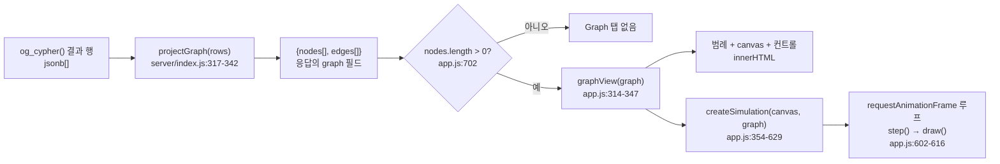
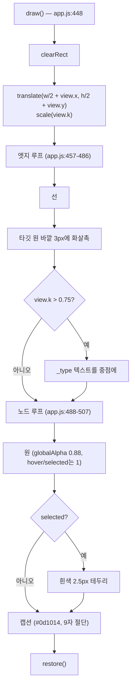
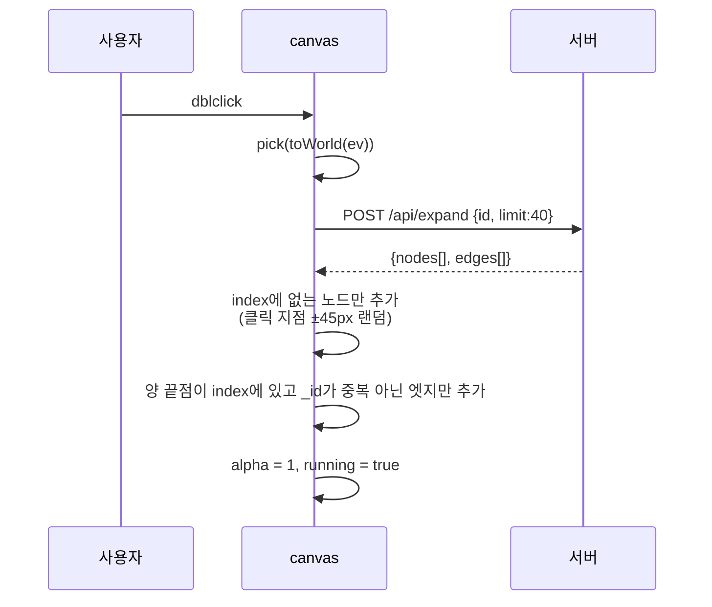

# 그래프 렌더링 — 투영 규칙, force layout, 그리고 그 한계

> **이 문서가 답하는 질문**
> - 질의 결과 행에서 노드와 엣지를 어떻게 추려내나?
> - 색과 라벨은 무엇으로 결정되나?
> - force-directed 시뮬레이션은 어떤 힘을 쓰고 어떤 상수를 쓰나?
> - 노드가 몇 개까지 버티나? 왜 그 이상은 안 되나?
> - 어떤 경우에 그래프 탭이 아예 나타나지 않나?

---

## 1. 파이프라인 전체



---

## 2. 서버 측 투영 — `projectGraph()`

```js
// portal/server/index.js:317-342
function projectGraph(rows) {
  const nodes = new Map();
  const edges = new Map();

  const visit = (v) => {
    if (v == null) return;
    if (Array.isArray(v)) return v.forEach(visit);
    if (typeof v !== 'object') return;
    if (v._id !== undefined) {
      if (v._src !== undefined && v._dst !== undefined) {
        edges.set(String(v._id), v);
      } else {
        nodes.set(String(v._id), v);
      }
      return;
    }
    Object.values(v).forEach(visit);
  };
  rows.forEach(visit);

  // Keep only edges whose endpoints are actually on screen.
  const kept = [...edges.values()].filter(
    (e) => nodes.has(String(e._src)) && nodes.has(String(e._dst))
  );
  return { nodes: [...nodes.values()], edges: kept };
}
```

### 2.1 규칙 (사실)

| # | 규칙 | 근거 |
|---|---|---|
| R-1 | `_id`가 **정의되어 있으면** 그래프 요소다 (`undefined` 검사 — `null`도 통과한다) | `index.js:325` |
| R-2 | `_src`와 `_dst`가 **둘 다** 정의되어 있으면 엣지, 아니면 노드 | `index.js:326-330` |
| R-3 | 그래프 요소를 만나면 **그 내부는 더 이상 파고들지 않는다** (`return`) | `index.js:331` |
| R-4 | 그래프 요소가 아닌 객체는 값들을 재귀 순회한다 | `index.js:333` |
| R-5 | 배열은 원소별로 순회 — `RETURN collect(n)`이 그려지는 이유 | `index.js:323` |
| R-6 | 중복은 `String(_id)` 키의 `Map`으로 제거 | `index.js:327, 329` |
| R-7 | **양 끝점이 모두 `nodes`에 있는 엣지만 남는다** | `index.js:338-340` |

### 2.2 R-7의 결과 — 자주 겪게 될 함정

```cypher
MATCH (a)-[r:CITES]->(b) RETURN r
```

이 질의는 엣지만 반환한다. `projectGraph`는 `nodes`가 비었으므로 R-7에서 모든 엣지를 버리고
`{nodes: [], edges: []}`를 낸다 → **Graph 탭이 아예 생기지 않는다** (`app.js:702`).

Studio가 사이드바에서 만들어 주는 관계 칩 질의가 세 요소를 모두 반환하는 이유다:

```js
// portal/web/app.js:95
data-run="MATCH (a)-[r:${t.name}]->(b) RETURN a, r, b LIMIT 50"
```

빈 그래프일 때 프런트가 내는 안내는 다른 경로에 있다:

```js
// portal/web/app.js:317-320  ← nodes가 있는데 graphView 내부에서 다시 검사
'<div class="empty">no graph in this result — return nodes or relationships to draw one</div>'
```

이 메시지는 `app.js:702`의 가드 때문에 **도달 불가능한 코드**다 —
`graphView`는 `nodes.length > 0`일 때만 호출된다.

### 2.3 상한 없음

`projectGraph`에는 노드/엣지 개수 상한이 없다. 10만 행짜리 `RETURN n`은
10만 개 노드 객체를 `Map`에 넣고 그대로 JSON으로 직렬화해 브라우저로 보낸다.
(→ `FE-04`)

---

## 3. 색 결정 — `colorFor()`

```js
// portal/web/app.js:23-35
const PALETTE = [
  '#18b6a0', '#4c8bf5', '#e0a33e', '#c774e8', '#e0554c',
  '#5fbf6a', '#e07ab0', '#57c7e3', '#d9a441', '#8d8ff5',
];
const colorMemo = new Map();
function colorFor(label) {
  if (!colorMemo.has(label)) {
    let h = 0;
    for (const ch of String(label)) h = (h * 31 + ch.charCodeAt(0)) >>> 0;
    colorMemo.set(label, PALETTE[h % PALETTE.length]);
  }
  return colorMemo.get(label);
}
```

| 사실 | 귀결 |
|---|---|
| 팔레트는 **10색 고정** | 타입이 11개면 반드시 충돌한다 |
| 해시는 결정적 (`h*31 + charCode`) | **같은 타입은 세션 간·프레임 간 항상 같은 색** — 이게 목적 (`app.js:22` 주석) |
| 충돌 회피 로직 없음 | 서로 다른 두 타입이 같은 색을 갖는 것을 막지 않는다 |
| `colorMemo`는 전역 | 노드 타입·엣지 타입·교정 후보(`app.js:298`)가 같은 네임스페이스를 공유 |

색이 쓰이는 곳: 사이드바 칩(`app.js:84, 94`), 계층 루트(`app.js:132`), 테이블 셀 타입 표기
(`app.js:257`), 범례(`app.js:328`), 엣지 선/화살표(`app.js:458`), 노드 원(`app.js:489`),
inspector 제목(`app.js:633`).

---

## 4. 캡션 결정 — `caption()`

```js
// portal/web/app.js:441-446
function caption(d) {
  for (const k of ['name', 'title', 'label', 'model', 'id']) {
    if (d[k] != null) return String(d[k]);
  }
  return d._type || String(d._id);
}
```

- 우선순위: `name` → `title` → `label` → `model` → `id` → `_type` → `_id`.
- 그리기 직전 **9자로 자른다**: `cap.length > 9 ? cap.slice(0, 8) + '…' : cap` (`app.js:506`).
- 여기서 `id`는 사용자 프로퍼티 `id`다. 내부 `_id`가 아니다.

엣지 라벨은 캡션 로직을 쓰지 않고 `_type`을 그대로 찍는다 (`app.js:484`),
그리고 **줌 배율 `view.k > 0.75`일 때만** 그린다 (`app.js:480`).

---

## 5. force-directed 시뮬레이션

### 5.1 초기 배치

```js
// portal/web/app.js:356-364
const nodes = data.nodes.map((n, i) => ({
  d: n,
  id: String(n._id),
  x: Math.cos((i / data.nodes.length) * 6.283) * 120 + (Math.random() - 0.5) * 40,
  y: Math.sin((i / data.nodes.length) * 6.283) * 120 + (Math.random() - 0.5) * 40,
  vx: 0, vy: 0, r: 22,
}));
```

반지름 120의 원 위에 균등 배치 + ±20px 지터. 노드 반지름은 **전부 22 고정** —
차수(degree)를 반영하지 않는다.

### 5.2 힘 3종과 상수

```js
// portal/web/app.js:386-439
const REPULSE = 5200;   // 쿨롱형 반발
const SPRING  = 0.012;  // 후크 상수
const REST    = 130;    // 스프링 자연 길이(px)
```

| 힘 | 대상 | 식 | 라인 |
|---|---|---|---|
| 반발 | **모든 노드 쌍** | `f = REPULSE / d²`, 방향 `(dx/d, dy/d)` | 392-413 |
| 스프링 | 엣지 | `f = (d - REST) * SPRING` | 414-425 |
| 중심 인력 | 각 노드 | `vx -= x * 0.004` | 427-428 |
| 감쇠 | 각 노드 | `vx *= 0.82` | 433-434 |
| 냉각 | 전역 | `alpha *= 0.994`, 정지 임계 `alpha < 0.005` | 438, 387 |

- 두 노드가 겹치면(`d2 < 1`) 무작위 방향으로 밀어낸다 (`app.js:399-403`).
- 드래그 중인 노드는 속도를 0으로 고정하고 적분에서 제외 (`app.js:429-432`).
- 위치 적분은 `n.x += n.vx * alpha` — 즉 **alpha가 시간 스텝 역할**을 겸한다.

`alpha`가 1에서 0.005까지 내려가는 데 필요한 스텝 수:
`log(0.005) / log(0.994) ≈ 880` 스텝 ≈ 60fps에서 약 **15초**.

### 5.3 그리기 순서



캔버스는 DPR을 반영한다: `canvas.width = rect.width * dpr` + `ctx.setTransform(dpr,0,0,dpr,0,0)`
(`app.js:378-384`).

### 5.4 상호작용

| 이벤트 | 대상 | 동작 | 라인 |
|---|---|---|---|
| `mousedown` | **canvas** | 노드 히트 → drag + select + inspector, 아니면 pan 시작 | 522-533 |
| `mousemove` | **window** | drag / pan / hover 갱신 | 534-547 |
| `mouseup` | **window** | drag·pan 해제 | 548-551 |
| `wheel` | canvas (`passive:false`) | `k *= 1.12 / 0.89`, 클램프 `[0.2, 3]` | 552-555 |
| `dblclick` | canvas | `POST /api/expand` → 노드/엣지 추가 | 556-582 |
| `⤢` 버튼 | — | `fit()` — 바운딩 박스를 화면에 맞춤 | 341, 584-593 |
| `❙❙` 버튼 | — | `toggle()` — 라벨이 `▶`/`❙❙`로 바뀜 | 342-345, 624-627 |

히트 테스트는 선형 탐색이다:

```js
// portal/web/app.js:518-520
function pick(p) {
  return nodes.find((n) => (n.x - p.x) ** 2 + (n.y - p.y) ** 2 < n.r * n.r);
}
```

`mousemove`마다 O(n) — 노드 1,000개면 마우스를 움직일 때마다 1,000회 비교.

### 5.5 생명주기

```js
// portal/web/app.js:595-616
resize();
const ro = new ResizeObserver(resize);
ro.observe(canvas);
let wasConnected = false;
(function loop() {
  if (canvas.isConnected) {
    if (!wasConnected) { wasConnected = true; resize(); alpha = 1; }
    step();
    draw();
  } else if (wasConnected) {
    ro.disconnect();
    return;
  }
  requestAnimationFrame(loop);
})();
```

- 캔버스는 `setViews()`가 DOM에 붙이기 **전에** 만들어진다. 그래서 `isConnected === false`가
  초기 몇 프레임의 정상 상태이고, `wasConnected` 플래그로 "붙었다가 떨어진" 경우만
  종료로 판정한다 (`app.js:598-600`의 주석이 명시).
- 프레임을 닫으면(`el.remove()`, `app.js:188`) 다음 rAF에서 `ro.disconnect()` 후 루프가 끝난다.

**누수**: `window`에 등록한 `mousemove` / `mouseup` 리스너(`app.js:534, 548`)는
**절대 제거되지 않는다.** 프레임을 100개 열었다 닫으면 window에 죽은 리스너 200개가 남고,
각 클로저가 그 프레임의 `nodes` 배열 전체를 붙잡고 있다. (`FE-06`)

---

## 6. 이웃 확장 (더블클릭) — 현재 동작하지 않음

의도된 동작 (`app.js:556-582`):



**실제**: `POST /api/expand`의 SQL이 PostgreSQL 문법 오류라 항상 400을 받는다.
`if (!ok) return;` (`app.js:560`)이 이를 삼키므로 화면에 아무 변화도, 아무 오류도 없다.
근거와 검증은 [03_api_contract_rules.md §2.6](03_api_contract_rules.md).

inspector의 `expand neighbours` 버튼(`app.js:651-654`)은 이 경로를 쓰지 않는다.
에디터에 Cypher를 넣고 `run()`을 부르므로 **정상 동작한다.**

---

## 7. 규모 한계 (사실 + 산술)

### 7.1 반발 계산은 매 프레임 O(n²)

```js
// portal/web/app.js:392-394
for (let i = 0; i < nodes.length; i++)
  for (let j = i + 1; j < nodes.length; j++) { ... }
```

| 노드 수 | 프레임당 쌍 연산 |
|---|---|
| 50 | 1,225 |
| 100 | 4,950 |
| 200 | 19,900 |
| 300 | 44,850 |
| 500 | 124,750 |
| 1,000 | 499,500 |
| 2,000 | 1,999,000 |
| 5,000 | 12,497,500 |

저자 자신이 코드 주석에서 상한을 밝혀 두었다:

```js
// portal/web/app.js:349-353
 * Force-directed layout: repulsion between every pair, springs along edges,
 * gentle centring. Velocity-Verlet with damping, drawn on canvas so a few
 * hundred nodes stay smooth.
```

**"a few hundred nodes"가 설계 상한이다.** Barnes-Hut 쿼드트리도, 공간 해싱도,
web worker도 없다. 실제 FPS는 측정하지 않았다(미확인).

### 7.2 한계를 실질적으로 완화하는 것 — LIMIT 50

Studio가 스스로 만드는 질의에는 전부 `LIMIT 50`이 붙어 있다:

| 위치 | 질의 |
|---|---|
| `app.js:85` | `MATCH (n:<Type>) RETURN n LIMIT 50` |
| `app.js:95` | `MATCH (a)-[r:<Type>]->(b) RETURN a, r, b LIMIT 50` |
| `app.js:131` | `MATCH (n:<Type>) RETURN n LIMIT 50` |
| `app.js:652` | `MATCH (n)-[r]-(m) WHERE id(n) = <id> RETURN n, r, m LIMIT 50` |
| `index.html:72` | `MATCH (n) RETURN n LIMIT 25` (Help 패널) |

**하지만 사용자가 직접 친 질의에는 어떤 상한도 없다.** `MATCH (n) RETURN n`은
그래프 전체를 브라우저로 끌어온다.

### 7.3 프레임마다 루프가 따로 돈다

`#stream`은 프레임을 누적한다. 프레임 10개에 각각 그래프 탭이 있으면
**rAF 루프 10개가 동시에** `step()`+`draw()`를 돌린다.
`alpha`가 각각 냉각되므로 15초쯤 뒤에는 `step()`이 즉시 return하지만(`app.js:387`),
`draw()`는 계속 호출된다 (`app.js:610` — `step()` 안에서만 alpha를 검사한다).

즉 **오래된 프레임도 계속 캔버스를 다시 그린다.** 프레임을 닫기 전까지.

### 7.4 DOM/메모리 측면

| 뷰 | 대량 결과에서 |
|---|---|
| Table | `rows.map(...).join('')`으로 **전체 문자열을 만든 뒤** `innerHTML` (`app.js:236-243`). 가상 스크롤 없음. `.tbl-wrap { max-height: 460px; overflow: auto }` (`style.css:168`)는 보이는 영역만 제한할 뿐 DOM은 전부 생성 |
| JSON | `JSON.stringify(data.rows, null, 2)` 전체를 문자열로 (`app.js:707`) |
| Graph | 노드/엣지 객체를 전부 메모리에 |

한 프레임이 세 뷰를 **동시에** 만든다 (`setViews`가 모든 pane을 DOM에 붙인다, `app.js:217-221`).
탭 전환은 `display` 토글일 뿐이므로, 활성이 아닌 뷰도 DOM에 그대로 존재한다.

---

## 8. 규칙

### 필수 (Required)

- 그래프를 그리게 하려면 질의가 **노드와 관계를 모두 반환**해야 한다 (R-7).
  `RETURN r`만으로는 아무것도 안 그려진다.
- 새 시각화 요소를 추가할 때 색은 반드시 `colorFor()`를 거친다.
  타입 색 일관성이 프레임 간 계약이다 (`app.js:22`).
- 시뮬레이션에 이벤트 리스너를 추가하면 `window` 대신 `canvas`에 붙이거나,
  루프 종료 시점(`app.js:611-614`)에 제거 코드를 함께 넣는다.

### 금지 (Forbidden)

- `PALETTE` 배열을 재정렬하지 않는다. `h % PALETTE.length`가 결정적 매핑이므로
  순서를 바꾸면 모든 타입의 색이 바뀐다.
- `projectGraph`의 `_id !== undefined` 검사를 `!= null`로 "고치지" 않는다.
  `_id: null`인 값이 노드로 들어오면 `String(null)` = `"null"` 키로 모두 병합된다.
  (현재 엔진은 `_id`를 널로 내지 않으므로 실害는 없지만, 의미가 다르다.)
- `caption()`의 키 우선순위 배열에 도메인 특화 이름을 추가하지 않는다.
  일반화가 목적인 목록이다.
- 노드 수 상한 없이 force 시뮬레이션을 켜지 않는다 (§7.1).

---

## 9. 미확인

- 실제 프레임률: 노드 수별 FPS를 측정하지 않았다. §7.1은 연산 횟수의 산술이지 벤치마크가 아니다.
- `ResizeObserver`가 없는 브라우저에서의 동작 — 폴리필도 가드도 없다 (`app.js:596`).
- `docs/images/studio.png`가 어느 버전의 UI인지 확인하지 않았다 (참조만 했다).

<!-- affects: frontend -->
<!-- requires-update: docs/04_frontend/03_api_contract_rules.md -->
