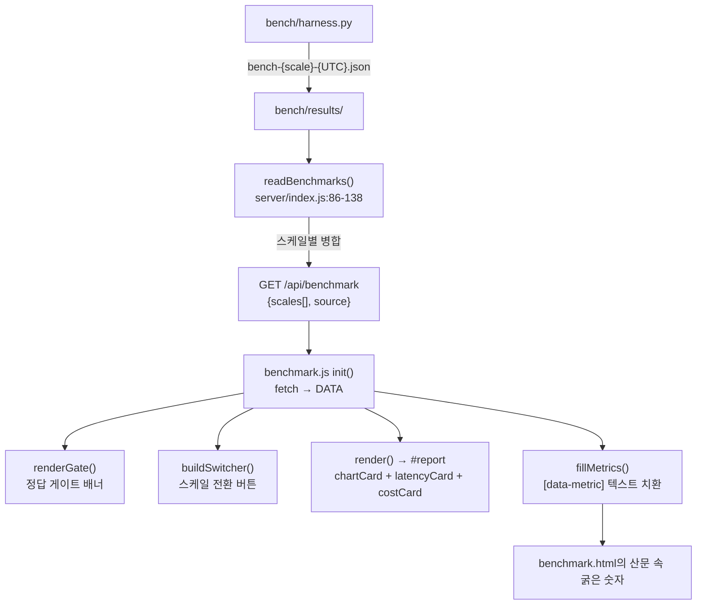

# 벤치마크 리포트 — 측정값에서 페이지까지

> **이 문서가 답하는 질문**
> - `bench/results/`의 JSON이 어떤 경로로 화면에 도달하나?
> - "페이지와 측정값이 어긋날 수 없다"는 주장의 근거는 정확히 무엇인가?
> - 그 주장은 어디까지 참이고, 지금 어디에서 깨져 있나?
> - 하네스의 출력 스키마를 바꾸면 무엇이 깨지나?

---

## 1. 파이프라인



파일에서 화면까지 **사람 손이 개입하는 지점이 없다.** 이것이 설계 의도이고,
두 파일 최상단에 그렇게 적혀 있다:

```js
// portal/server/index.js:80-84
 * The report page renders whatever the harness last wrote — nobody retypes a
 * latency into HTML, so the site cannot drift from the measurements.

// portal/web/benchmark.js:4-6
 * Everything is derived from /api/benchmark, which reads the harness's own
 * result files. No latency is written into this file — if the page and the
 * measurements ever disagree, that is a bug here, not a stale copy.
```

---

## 2. 결정 (Decisions)

### D-1. 수치는 코드에 타이핑하지 않는다

`portal/web/benchmark.js` 전체에 밀리초 리터럴이 **하나도 없다.**
`benchmark.html`의 굵은 숫자도 전부 빈 `<b data-metric="...">` 자리표시자다
(`benchmark.html:40-41, 56-58, 79-80`).

이 원칙이 지켜지는지 확인하는 방법: `grep -E "[0-9]+\s*ms" portal/web/benchmark.js` — 0건.

### D-2. 하드코딩되는 것은 **어휘**뿐

세 개의 상수가 코드에 있다:

```js
// portal/web/benchmark.js:12-20
const SYSTEMS = [
  { key: 'ontological',     label: 'Ontological', note: 'this database', self: true },
  { key: 'ontological_raw', label: 'Ontological', note: 'storage path', self: true, reuses: 'ontological' },
  { key: 'neo4j',           label: 'Neo4j 5',     note: 'native property graph' },
  { key: 'age',             label: 'Apache AGE',  note: 'Cypher on PostgreSQL' },
  { key: 'age_explicit',    label: 'Apache AGE',  note: 'explicit depths, no *1..n', reuses: 'age' },
  { key: 'typedb',          label: 'TypeDB 3',    note: 'typed entity–relation' },
  { key: 'cte',             label: 'recursive CTE', note: 'plain SQL floor' },
];

// portal/web/benchmark.js:22-29
const QUERIES = [ ['1hop','1 hop'], ['2hop','2 hops'], ['3hop','3 hops'], ['prop_scan','property scan'] ];
const HEADLINE = '3hop';
```

**여기가 "어긋날 수 없다"는 주장의 실제 경계다.** 측정값은 어긋날 수 없지만,
**어떤 측정값을 보여줄지는 코드에 박혀 있다.** 하네스가 새 질의 키를 쓰기 시작하면
페이지는 틀린 수치를 보여주는 것이 아니라 **아무 수치도 보여주지 않는다.**
지금이 정확히 그 상태다 (§5).

### D-3. 병합은 "시스템별 최신 우선"

```js
// portal/server/index.js:110-114
for (const [name, v] of Object.entries(r.systems || {})) {
  if (!v || !v.queries) continue;   // skipped or failed systems never overwrite a good run
  acc.systems[name] = v;
  acc.runs[name] = f.replace(/\.json$/, '');
}
```

이유도 주석에 있다 (`index.js:82-84`): TypeDB 적재에 4분이 걸려서 같은 시드 그래프에
대해 별도 실행으로 측정하는 일이 잦다는 것.

`acc.runs[name]`이 컬럼별 출처 파일을 기록하고, 페이지 하단의 `measured in:` 줄이
그것을 노출한다 (`benchmark.js:298-312`).

### D-4. 게이트가 먼저, 수치는 그 다음

`renderGate()`가 `#report`보다 위에 있고(`benchmark.html:28` vs `:32`),
불일치가 있으면 수치 대신 "those timings are void"를 쓴다 (`benchmark.js:107-111`).

---

## 3. 사실 — 파일 스키마

`bench/results/bench-<scale>-<UTC>.json`의 실제 형태 (실측: `bench-250000-20260817T052859Z.json`):

```json
{
  "generated_at": "2026-08-17T05:20:47.292829+00:00",
  "scale": { "nodes": 250000, "edges": 499000, "avg_degree": 2.0, "shape": "grid" },
  "environment": { "postgres": "PostgreSQL 16.14 ...", "host": "localhost:28816" },
  "systems": {
    "ontological": {
      "engine": "PostgreSQL 16.14 (Debian 16.14-1.pgdg12+1)",
      "reuses": null,
      "load_seconds": 4.08,
      "load_edges_per_sec": 122199,
      "queries": {
        "reach10hop": { "median_ms": 6.364, "p95_ms": 6.756, "min_ms": 6.272, "runs": 3, "buffers": 3625 }
      },
      "protocol_floor_ms": 0.047
    }
  },
  "correctness": {
    "reach20hop": {
      "answers": { "ontological": "230", "age": "error: ... statement timeout", "neo4j": "230" },
      "agree": true
    }
  },
  "speedup_vs": { "neo4j": { "reach10hop": 0.21 } },
  "integrity_violations": 0
}
```

### 3.1 필드별 소비처

| 경로 | 소비 | 널 |
|---|---|---|
| `scale.nodes` | 스위처 라벨 + 정렬 키 (`benchmark.js:87`, `index.js:135`) | 아니오 |
| `scale.edges` / `scale.avg_degree` | 스위처 `title` (`benchmark.js:89`) | 아니오 |
| `scale.shape` | **사용 안 함** — `grid`/`chain`을 화면에서 구분할 수 없다 | — |
| `environment` | `readBenchmarks`가 첫 파일에서만 담고(`index.js:105`) 페이지는 안 쓴다 | — |
| `systems[k].queries[q].median_ms` | 차트 막대 + 표 (`benchmark.js:140, 206`) | **예** — `?? null` |
| `systems[k].queries[q].p95_ms` / `min_ms` / `runs` | 툴팁 (`benchmark.js:323-326`) | **예** |
| `systems[k].queries[q].buffers` | 툴팁 + costCard (`benchmark.js:327, 250`) | **예** — PostgreSQL 계열만 |
| `systems[k].protocol_floor_ms` | latencyCard의 `protocol floor` 행 (`benchmark.js:211`) | **예** |
| `systems[k].load_seconds` / `load_edges_per_sec` | costCard (`benchmark.js:244-246`) | **예** |
| `systems[k].reuses` | 파생 시스템 판정 — 적재 수치를 비운다 (`benchmark.js:234-235`) | **예** |
| `systems[k].engine` | 툴팁 하단 (`benchmark.js:328`) | **예** |
| `correctness[q].answers` | 서버가 재계산 (`index.js:115-131`) | 아니오 |
| `correctness[q].agree` | **서버가 버리고 다시 계산한다** (§4.2) | — |
| `speedup_vs` | **사용 안 함** — 서버가 payload에 넣지도 않는다 | — |
| `integrity_violations` | 게이트 배너 꼬리 (`benchmark.js:115-117`) | **예** |
| `generated_at` | `acc.generated_at`에 담기지만 페이지가 안 쓴다 | — |

### 3.2 파일명 규약

```js
// portal/server/index.js:91
.map((f) => ({ f, m: /^bench-(\d+)-(\d{8}T\d{6}Z)\.json$/.exec(f) }))
```

- `bench-<scale>-<YYYYMMDDTHHMMSSZ>.json` 정확히 이 형식만 읽는다.
- `bench/results/baseline.json`은 정규식에 걸리지 않으므로 **무시된다** (의도된 동작).
- 정렬은 타임스탬프 문자열의 `localeCompare` (`index.js:93`) — 형식이 고정폭이라 사전순 = 시간순.
- 스케일 그룹 키는 **파일명의 숫자**(`m[1]`)이고, 표시용 `scale` 객체는
  파일 내용에서 가져온다 (`index.js:103, 108`).

### 3.3 부분 실패에 대한 태도

```js
// portal/server/index.js:98-102
try { r = JSON.parse(fs.readFileSync(...)); }
catch { continue; }   // a half-written file is not worth failing the page over
```

반쯤 쓰인 파일은 조용히 건너뛴다. `BENCH_DIR`가 없으면 `{ scales: [], source: null }`
(`index.js:87`) → 프런트가 `no benchmark results found — run bench/harness.py`를 표시
(`benchmark.js:62-64`).

---

## 4. 서버의 병합 로직 — 정확한 동작

### 4.1 스케일별 누산

```js
// portal/server/index.js:104-118
if (!byScale.has(key)) {
  byScale.set(key, { scale: r.scale, environment: r.environment, systems: {},
                     answers: {}, runs: {}, generated_at: r.generated_at });
}
const acc = byScale.get(key);
acc.scale = r.scale;                 // 최신 파일의 scale이 이긴다
acc.generated_at = r.generated_at;
for (const [name, v] of Object.entries(r.systems || {})) { ... }
for (const [q, v] of Object.entries(r.correctness || {})) {
  acc.answers[q] = { ...(acc.answers[q] || {}), ...v.answers };   // 시스템별 최신 답
}
if (r.integrity_violations !== undefined) acc.integrity_violations = r.integrity_violations;
```

**중요**: `systems[name]`은 **객체 전체가 교체된다.** 부분 병합이 아니다.
따라서 나중 실행이 더 적은 질의만 재면, 앞 실행의 질의 결과는 **사라진다.**

### 4.2 정답 게이트 재계산 — 하네스와 다르다 ⚠

```js
// portal/server/index.js:121-132
acc.correctness = Object.fromEntries(
  Object.entries(acc.answers).map(([q, answers]) => {
    const kept = Object.fromEntries(Object.entries(answers).filter(([n]) => acc.systems[n]));
    const distinct = [...new Set(Object.values(kept))];
    return [q, { answers: kept, agree: distinct.length <= 1, value: distinct[0] ?? null }];
  })
);
```

하네스는 오류 답변을 **먼저 걸러낸 뒤** 비교한다:

```python
# bench/harness.py:1084-1092
# A system that cannot finish inside the cap has no answer to
# disagree with; that is a missing cell, not a wrong one.
...
distinct = {v for v in answers.values() if not v.startswith("error")}
report["correctness"][label] = { "answers": answers, "agree": len(distinct) <= 1 }
```

서버에는 그 필터가 없다. 결과:

`bench-250000-20260817T052859Z.json`에서 `reach20hop`의 답은
`{ontological: "230", ..., age: "error: ... statement timeout", neo4j: "230"}`이고
하네스는 `agree: true`를 기록했다. 그러나 서버는 `distinct = {"230", "error: ..."}` → 크기 2 →
**`agree: false`**로 뒤집는다.

**화면에 나타나는 결과**: 250,000 스케일에서 게이트가 빨간색이 되고
`reach20hop, reach50hop, reach100hop, reach500hop — systems disagreed, those timings are void`가
표시된다. 하네스 자신은 "all systems returned identical answers"라고 보고한 실행인데도.
(`FE-03`)

---

## 5. "어긋날 수 없다"가 지금 깨져 있는 지점 ⚠

### 5.1 하네스는 질의 키를 바꿨고, 렌더러는 따라가지 않았다

`bench/results/`의 실측 (전 파일 스캔):

| 파일 | 시스템 | 질의 키 |
|---|---|---|
| `bench-5000-20260806T042903Z` | ontological, ontological_raw, age, cte, neo4j, **typedb** | `1hop 2hop 3hop prop_scan` |
| `bench-5000-20260806T043214Z` | neo4j, typedb | `1hop 2hop 3hop prop_scan` |
| `bench-5000-20260806T043920Z` | age, age_explicit | `1hop 2hop 3hop prop_scan` |
| `bench-5000-20260817T030411Z` | … + **pggraph** | `reach1hop reach2hop reach3hop reach4hop prop_scan` |
| `bench-50000-20260806T042833Z` | ontological, ontological_raw, age, cte, neo4j | `1hop 2hop 3hop prop_scan` |
| `bench-50000-20260806T043634Z` | neo4j, typedb | `1hop 2hop 3hop prop_scan` |
| `bench-50000-20260817T033001Z` | … + pggraph | `reach1hop … reach8hop prop_scan` |
| `bench-50000-20260817T033525Z` | ontological, age, neo4j | `1hop 2hop 3hop prop_scan` |
| `bench-250000-20260817T051823Z` | … pggraph … | `reach10hop reach100hop reach1000hop reach10000hop prop_scan` |
| `bench-250000-20260817T052859Z` | … pggraph … | `reach10hop reach20hop reach50hop reach100hop reach500hop prop_scan` |

렌더러가 아는 키는 `1hop / 2hop / 3hop / prop_scan`뿐이고 (`benchmark.js:22-27`),
아는 시스템 목록에 **`pggraph`가 없다** (`benchmark.js:12-20`).

### 5.2 병합 후 각 스케일에서 실제로 렌더되는 것

`readBenchmarks`의 "시스템별 최신 우선" 규칙을 위 파일 목록에 적용한 결과:

| 스케일 | 시스템별 최종 출처 | `HEADLINE='3hop'`을 가진 시스템 | 헤드라인 차트 |
|---|---|---|---|
| **5,000** | typedb만 `…043214Z`(1hop 계열), 나머지는 `…030411Z`(reach 계열) | **typedb 하나** | 막대 **1개**짜리 "3 hops — median latency" |
| **50,000** | ontological·age·neo4j → `…033525Z`(1hop 계열), typedb → `…043634Z`, 나머지 → `…033001Z`(reach 계열) | ontological, age, neo4j, typedb | 막대 4개 — **서로 다른 날짜의 실행이 한 차트에** |
| **250,000** (기본 화면) | 전부 `…052859Z`(reach 계열), typedb 없음 | **없음** | **차트가 통째로 비어 있음** (`benchmark.js:150`에서 조기 return) |

그리고 `pggraph`는 세 스케일 모두에서 데이터가 있는데도 `SYSTEMS`에 없어
**모든 표·차트·툴팁에서 제외된다** (`present()`, `benchmark.js:79`).

### 5.3 기본 화면이 가장 나쁘다

```js
// portal/web/benchmark.js:65
active = DATA.scales.length - 1; // lead with the largest graph
```

`scales`는 `scale.nodes` 오름차순 정렬(`index.js:135`)이므로 기본 선택은 **250,000**이다.
그 화면에서 사용자가 보는 것:

- 게이트: **빨강** — `reach20hop, reach50hop, reach100hop, reach500hop — systems disagreed` (§4.2)
- 헤드라인 차트: 제목과 설명만, **막대 0개**
- `Latency, all queries` 표: `1 hop` / `2 hops` / `3 hops` 행이 전부 `—`,
  `property scan`과 `protocol floor` 행만 값이 있음
- `Load and page accesses` 표: `load time` / `edges / second`는 값이 있고 홉별 `pages`는 `—`
- 산문 속 굵은 숫자: `fillMetrics`가 `q(sys,'3hop')`을 찾지 못해 **`neo4j-load`를 뺀 전부가 `—`**
  (`benchmark.js:362-371`) — TypeDB 관련 문단은 `typedb-load`도 `—`

(`FE-02`)

### 5.4 산문과 데이터의 또 다른 결합

`benchmark.html:34-114`의 "What the numbers say" 4개 문단은 **TypeDB와 age_explicit가
측정에 포함되어 있다는 전제**로 쓰여 있다. 최신 250,000 실행에는 둘 다 없다.
자리표시자가 `—`로 채워지므로 문장이 이렇게 렌더된다:

> "Loading the million-edge graph took **—** against **5.6 s** for Neo4j."

수치가 틀린 것은 아니지만, 페이지가 자기 데이터에 대해 **거짓 문장**을 말하게 된다.

### 5.5 `og-vs-neo4j` 비율의 방향

```js
// portal/web/benchmark.js:365
'og-vs-neo4j': times(ratio(q('ontological', '3hop'), q('neo4j', '3hop'))),
```

값은 `ontological ÷ neo4j`, 즉 **"우리가 몇 배 느린가"**다.
문장은 `benchmark.html:40-42`:

> Neo4j answers the three-hop question in `<neo4j-3hop>` against our `<og-3hop>` — `<og-vs-neo4j>` faster

Ontological이 느린 동안에는 자연스럽게 읽힌다 (`bench-5000-20260806T042903Z`의 값으로는
`1.78 ms` 대 `3.62 ms` → `2.0×`). 그러나 Ontological이 더 빨라지면 비율이 1 미만이 되어
`0.5× faster`처럼 무의미한 문장이 된다. **비율의 방향이 산문의 어순에 암묵적으로 묶여 있다.**
(`FE-19`)

---

## 6. 렌더러의 시각화 규칙 (사실)

### 6.1 헤드라인 차트의 축 결정

```js
// portal/web/benchmark.js:152-154
const fastest = rows[0].m.median_ms;
const inScale = rows.filter((r) => r.m.median_ms <= fastest * 25);
const domain  = inScale.length ? inScale[inScale.length - 1].m.median_ms : fastest;
```

- 정렬은 median 오름차순 (`benchmark.js:142`).
- **가장 빠른 값의 25배 이내**에 있는 값 중 가장 큰 것이 축의 최대값이 된다.
- 그것을 넘는 막대는 `off` 클래스로 100% 폭 + 찢어진 끝 + `⟩⟩` 브레이크마크
  (`benchmark.js:158-171`, `benchmark.css:111-122`).
- 잘린 막대가 있으면 **문장으로 값을 명시한다** (`benchmark.js:183-191`) —
  "N bars run off the plot: X at 22,412 ms. The axis stops at … so the rest stay readable."

이 처리의 근거 주석 (`benchmark.js:130-137`): 값이 5자릿수 범위를 넘나들기 때문에
선형 축에 다 넣으면 나머지 막대가 1픽셀이 된다.

> 대비: 랜딩 사이트는 같은 문제를 **로그 축**으로 푼다 (`web/index.html:1862-1868`).
> 두 페이지가 같은 데이터를 다르게 그린다.

### 6.2 파생 시스템의 적재 수치는 비운다

```js
// portal/web/benchmark.js:232-235
// A derived system reads a database another system loaded. Dividing the edge
// count by its ~0-second no-op setup produces a number in the billions, which
// is not a measurement of anything.
const loaded = (c, field) =>
  c.reuses || scale.systems[c.key].reuses ? null : scale.systems[c.key][field] ?? null;
```

`reuses`는 **두 곳**에서 온다: `SYSTEMS` 상수(`benchmark.js:14, 17`)와 결과 파일
(`systems[k].reuses`). 둘 중 하나만 있어도 적재 칸을 비운다.

### 6.3 `best` 강조는 질의 행에만

```js
// portal/web/benchmark.js:204-213
const rows = QUERIES.map(([key, label]) => ({ ..., best: true }));
rows.push({ label: 'protocol floor', values: ..., floor: true });
```

`protocol floor` 행에는 `best`가 없으므로 최소값 강조가 붙지 않는다 (`benchmark.js:285`).
의도적이다 — 프로토콜 바닥값에서 "이긴다"는 개념이 없다.

### 6.4 XSS 관점

`benchmark.js`는 대부분 `el(tag, cls, text)` 헬퍼(`benchmark.js:32-37`)로 `textContent`를 쓴다.
`innerHTML` 사용은 4곳뿐이고 전부 `''`(비우기)다: `benchmark.js:73, 106, 126, 319`.
**측정 데이터가 HTML로 해석되는 경로가 없다.** `app.js`와 대조적이다.

예외 하나: `benchmark.js:271, 332`이 `style.cssText`에 상수 문자열을 쓴다 (안전).

---

## 7. 규칙

### 필수 (Required)

- 벤치마크 수치를 `portal/web/benchmark.js` / `benchmark.html`에 **타이핑하지 않는다.**
  자리표시자는 `<b data-metric="<name>"></b>`이고 값은 `fillMetrics()`가 채운다
  (`benchmark.js:355-377`).
- `bench/harness.py`가 내는 **질의 키를 바꾸면 `QUERIES`와 `HEADLINE`을 같은 커밋에서 갱신**한다
  (`benchmark.js:22-29`).
- 하네스에 **시스템을 추가하면 `SYSTEMS` 배열에 항목을 추가**한다 (`benchmark.js:12-20`).
  추가하지 않으면 그 시스템은 페이지에서 완전히 사라진다 — 오류도 경고도 없이.
- 결과 파일명은 `bench-<scale>-<YYYYMMDDTHHMMSSZ>.json` 형식을 지킨다 (`index.js:91`).
- 정답 판정 로직을 바꾸면 **하네스(`harness.py:1089`)와 서버(`index.js:127`) 양쪽**을 고친다.

### 금지 (Forbidden)

- `readBenchmarks()`의 "시스템별 최신 우선" 규칙을 "질의별 최신 우선"으로 바꾸지 않는다.
  서로 다른 실행의 질의 결과를 한 시스템 안에서 섞으면 §4.1의 안전성이 사라진다.
- `systems[k].queries`가 없는 시스템을 payload에 넣지 않는다 (`index.js:111`의 가드가 전제).
- `benchmark.js`에서 사용자/파일 데이터를 `innerHTML`로 넣지 않는다 (§6.4의 성질을 유지).
- 게이트 배너를 수치 아래로 옮기지 않는다. "게이트 먼저"가 이 페이지의 논지다.

---

## 8. 미확인

- `scale.shape`(`grid` / `chain`)를 화면 어디에서도 구분하지 않는데, 같은 노드 수의
  다른 형태 실행이 한 스케일 키로 병합되는지 실측하지 않았다.
  파일명이 `bench-250000-*`로 같으므로 **병합될 것**으로 보인다 (`index.js:103`).
  이 경우 체인 실행이 격자 실행을 덮어쓴다.
- `bench/results/baseline.json`의 용도는 회귀 게이트(`--compare-baseline`)로 보이나
  이 문서 범위에서 확인하지 않았다.

<!-- affects: frontend, operations -->
<!-- requires-update: docs/04_frontend/03_api_contract_rules.md, docs/benchmark.md -->
