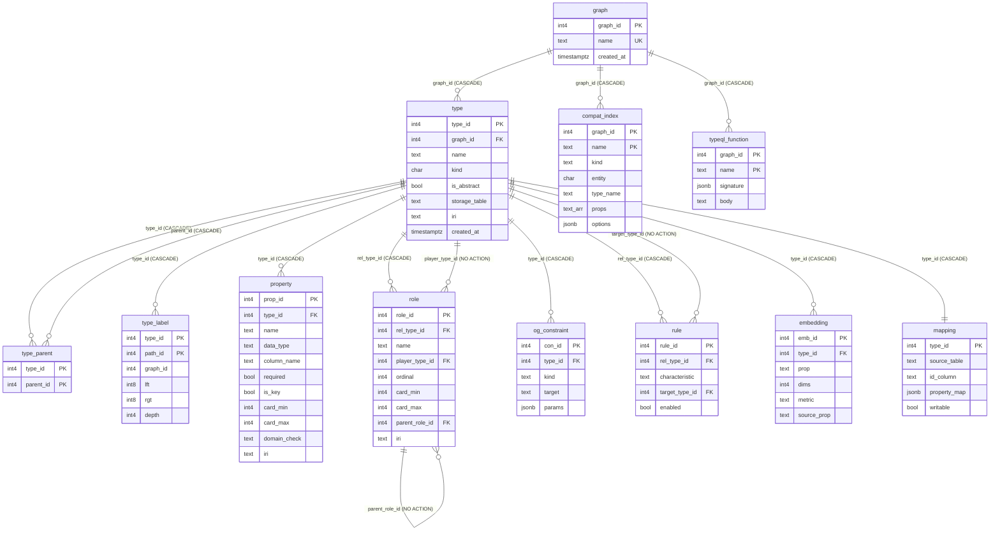
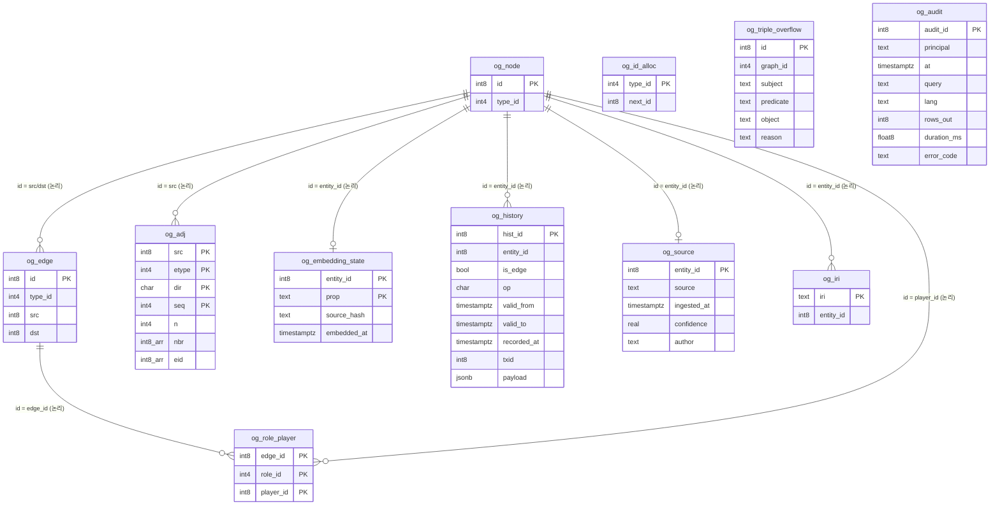

# 01. 물리 스키마 — `og_catalog` / `og_data`

> **이 문서가 답하는 질문**
> - 두 스키마에 정확히 어떤 테이블이 있고, 각 테이블은 **무엇을 의미**하는가?
> - 어떤 컬럼이 무엇을 담고, 어떤 제약과 인덱스가 걸려 있는가?
> - 어떤 테이블이 부트스트랩에서 만들어지고 어떤 것이 런타임에 만들어지는가?
> - `pg_dump`가 무엇을 살리고 무엇을 버리는가?

**정본**: [`engine/sql/bootstrap.sql`](../../engine/sql/bootstrap.sql) (448줄).
아래 표의 컬럼·제약·인덱스는 전부 이 파일에서 옮긴 것이며, 라인 번호를 붙였다.

---

## 사실 — 스키마는 두 개다

```sql
CREATE SCHEMA og_catalog;   -- bootstrap.sql:13
CREATE SCHEMA og_data;      -- bootstrap.sql:14
```

| 스키마 | 담는 것 | 규모 특성 |
|---|---|---|
| `og_catalog` | 타입 시스템 — 타입, 상속, 라벨, 프로퍼티 선언, 역할, 규칙, 임베딩 메타 | **스키마 크기**에 비례. 보통 수십~수천 행 |
| `og_data` | 그래프 인스턴스 — 노드/엣지 레지스트리, 인접 세그먼트, 이력, 감사, IRI | **데이터 크기**에 비례. 수억 행까지 |

경계는 명확하다. `og_catalog`는 "무엇이 존재할 수 있는가", `og_data`는
"무엇이 존재하는가"를 담는다. 유일한 예외가 `og_data.og_role_player`인데,
이것은 카탈로그의 `role`을 참조하지만 행은 인스턴스마다 생기므로 데이터 쪽이다
(`bootstrap.sql:125-131`).

---

## 결정 — `og_data`에는 외래키가 하나도 없다

부트스트랩이 만든 `og_data`의 11개 테이블 중 `REFERENCES` 절을 가진 것은 **없다**.
`og_node.type_id`도, `og_edge.src/dst`도, `og_adj.src/etype`도, `og_role_player.role_id`도
전부 논리적 참조일 뿐 물리적 제약이 아니다(`bootstrap.sql:125-130, 197-247`).

**왜**: 순회 경로에서 참조 무결성 트리거가 도는 비용을 지불하지 않기 위해서다.
엣지 하나를 만들 때마다 `og_node`에 대한 FK 확인 두 번, `og_adj`에 대한 확인 두 번이
붙으면 CSR 세그먼트가 사준 지역성이 사라진다.

**대가**: 정합성이 **코드로만** 보장된다. 그래서
`og_check_integrity()`(`engine/src/storage/stats.rs:172-263`)라는 별도 검사기가 존재하고,
`og_drop_graph()`처럼 카탈로그만 지우고 `og_data`를 남기는 경로가 실제로 존재한다
(→ [`10_improvements_data.md`](10_improvements_data.md) `DATA-06`).

반대로 `og_catalog` 안쪽은 FK와 `ON DELETE CASCADE`로 촘촘히 묶여 있다.

---

## ER 다이어그램 — `og_catalog`



---

## ER 다이어그램 — `og_data` (논리 관계, 물리 FK 없음)



---

## `og_catalog` 테이블 상세

### `og_catalog.graph` — 한 DB 안의 독립 그래프
`bootstrap.sql:22-27`

| 컬럼 | 타입 | 제약 | 의미 |
|---|---|---|---|
| `graph_id` | `int4` | PK | 그래프 식별자. 시퀀스 `og_catalog.graph_id_seq`에서 발급 |
| `name` | `text` | NOT NULL, UNIQUE | 사용자가 부르는 이름. 모든 공개 함수의 첫 인자 |
| `created_at` | `timestamptz` | NOT NULL DEFAULT now() | |

**의미**: 이 테이블의 행 하나가 하나의 독립된 타입 네임스페이스이자 라벨 공간이다.
`og_catalog.type`의 `UNIQUE (graph_id, name)`가 그 경계를 강제한다(`bootstrap.sql:44`).
반면 `og_data.og_node` / `og_edge` / `og_adj`는 `graph_id`를 **들고 있지 않다** —
그래프 소속은 `type_id`를 통해 간접적으로만 알 수 있고, 그래서
`og_graph_stats()`가 매번 `og_catalog.type`과 조인한다(`engine/src/storage/stats.rs:16-19`).

### `og_catalog.type` — 엔티티 / 관계 / 속성 타입
`bootstrap.sql:35-49`

| 컬럼 | 타입 | 제약 | 의미 |
|---|---|---|---|
| `type_id` | `int4` | PK | **id 인코딩에 그대로 박히는 값**. 재사용 금지 → [`02`](02_identifier_encoding.md) |
| `graph_id` | `int4` | NOT NULL, FK→`graph` ON DELETE CASCADE | |
| `name` | `text` | NOT NULL, `UNIQUE (graph_id, name)` | Cypher 라벨 / TypeQL 타입명 |
| `kind` | `"char"` | NOT NULL, `CHECK (kind IN ('e','r','a'))` | `e` 엔티티 / `r` 관계 / `a` 속성 |
| `is_abstract` | `bool` | NOT NULL DEFAULT false | true면 인스턴스화 불가 |
| `storage_table` | `text` | NULL 가능 | `og_data.n_<id>` / `e_<id>` / `a_<id>`. **추상 타입은 NULL** |
| `iri` | `text` | NULL 가능 | RDF/OWL 동일성(spec 006) |
| `created_at` | `timestamptz` | NOT NULL DEFAULT now() | |

**시퀀스**: `og_catalog.type_id_seq START 1 MAXVALUE 262143` — 18비트 상한을
DB 차원에서 못 박아 둔 것이다(`bootstrap.sql:47`).

**인덱스**
| 이름 | 정의 | 왜 존재하는가 |
|---|---|---|
| (PK) | `(type_id)` | 모든 타입 조회의 기본 경로 |
| `type_graph_kind_idx` | `(graph_id, kind)` | 그래프 단위 스캔(`load_dag`, `nearest_type_names`, `og_graph_stats`)의 선두 컬럼 제공 + `graph` FK 캐스케이드 |
| `type_iri_idx` | `(iri) WHERE iri IS NOT NULL` | RDF 로더의 IRI→타입 역인식(`engine/src/adapters/rdf.rs:620`) |
| (UNIQUE) | `(graph_id, name)` | 이름 조회 `try_type_id`(`engine/src/catalog/types.rs:121-127`)의 경로 |

### `og_catalog.type_parent` — 상속 DAG
`bootstrap.sql:52-57`

| 컬럼 | 타입 | 제약 |
|---|---|---|
| `type_id` | `int4` | NOT NULL, FK→`type` CASCADE, PK 일부 |
| `parent_id` | `int4` | NOT NULL, FK→`type` CASCADE, PK 일부 |

**의미**: **다중 상속이면 한 타입에 여러 행**이 생긴다(`bootstrap.sql:51`).
이 테이블이 진실이고 `type_label`은 그로부터 계산된 뷰다.
인덱스 `type_parent_parent_idx (parent_id)`는 `parent_id` FK 캐스케이드를 위한 것이다.

### `og_catalog.type_label` — 구간(nested-set) 라벨 ★
`bootstrap.sql:68-80`

| 컬럼 | 타입 | 제약 | 의미 |
|---|---|---|---|
| `type_id` | `int4` | NOT NULL, FK→`type` CASCADE, PK 일부 | |
| `path_id` | `int4` | NOT NULL, PK 일부 | **0 = 주 경로, 1..n = 추가 부모 경로** |
| `graph_id` | `int4` | NOT NULL | 비정규화. 조인 없이 그래프 안에서만 비교하기 위함 |
| `lft` | `int8` | NOT NULL | 구간 왼쪽 끝 |
| `rgt` | `int8` | NOT NULL, `CHECK (lft < rgt)` | 구간 오른쪽 끝 |
| `depth` | `int4` | NOT NULL | 루트로부터의 깊이 |

**의미**: `X ⊑ Y ⟺ ∃ 라벨행 lx, ly. ly.lft ≤ lx.lft ∧ lx.rgt ≤ ly.rgt`.
재귀 CTE가 아니라 **인덱스 범위 비교 한 번**이다(`bootstrap.sql:59-67`).
자세한 성질은 [`04_type_catalog_model.md`](04_type_catalog_model.md).

**인덱스**
| 이름 | 정의 | 평가 |
|---|---|---|
| (PK) | `(type_id, path_id)` | 특정 타입의 라벨 조회 |
| `type_label_range_idx` | `(graph_id, lft, rgt)` | `og_subtypes` / `og_supertypes`의 핵심 경로 |
| `type_label_lft_idx` | `(graph_id, lft)` | **`range_idx`의 진부분 접두사 — 중복.** → `DATA-04` |

### `og_catalog.property` — 프로퍼티 선언
`bootstrap.sql:87-101`

| 컬럼 | 타입 | 제약 | 의미 |
|---|---|---|---|
| `prop_id` | `int4` | PK | |
| `type_id` | `int4` | NOT NULL, FK→`type` CASCADE, `UNIQUE (type_id, name)` | |
| `name` | `text` | NOT NULL | 사용자가 쓰는 이름 (`title`) |
| `data_type` | `text` | NOT NULL | PostgreSQL 타입명 (`text`, `int8`, `vector(1536)`) |
| `column_name` | `text` | NOT NULL | 물리 컬럼명 (`p_title`) |
| `required` | `bool` | NOT NULL DEFAULT false | → 컬럼 `NOT NULL` |
| `is_key` | `bool` | NOT NULL DEFAULT false | → 컬럼 UNIQUE 인덱스 |
| `card_min` / `card_max` | `int4` | card_max NULL = 무제한 | 현재 저장만 되고 강제되지 않음 (미확인: 강제 지점을 찾지 못함) |
| `domain_check` | `text` | | CHECK 식 조각 |
| `iri` | `text` | | RDF 술어 IRI |

**의미**: 이 테이블은 **선언된 프로퍼티의 목록이자 이름↔컬럼 매핑표**다.
여기 없는 프로퍼티는 물리 컬럼도 없고 `__ext` jsonb에 들어간다.
상속은 "컬럼 복사"로 구현되므로, 부모에 프로퍼티를 선언하면 **자식 타입에도
행이 하나씩 더 생긴다**(`engine/src/catalog/types.rs:578-588`).

### `og_catalog.role` — 관계의 참여자 슬롯
`bootstrap.sql:107-122`

| 컬럼 | 타입 | 제약 | 의미 |
|---|---|---|---|
| `role_id` | `int4` | PK | |
| `rel_type_id` | `int4` | NOT NULL, FK→`type` CASCADE, `UNIQUE (rel_type_id, name)` | 이 역할을 선언한 관계 타입 |
| `name` | `text` | NOT NULL | `author`, `employee` … |
| `player_type_id` | `int4` | FK→`type` (**CASCADE 아님, 인덱스 없음**) | 이 역할을 채울 수 있는 타입 |
| `ordinal` | `int4` | NOT NULL | **0 = src, 1 = dst, 2.. = n항** |
| `card_min` / `card_max` | `int4` | | |
| `parent_role_id` | `int4` | FK→`role` (**인덱스 없음**) | 역할 특수화(spec 010 FR-009) |
| `iri` | `text` | | |

**의미**: Neo4j의 문자열 관계 타입이 표현할 수 없는 것 — "이 관계에서 누가 무엇인가".
`ordinal 0/1`은 `og_edge.src/dst`에 직접 대응되고, `ordinal ≥ 2`는
`og_data.og_role_player` 행이 된다. → [`06`](06_role_and_relation_model.md)

### `og_catalog.og_constraint` — PostgreSQL 제약으로 표현 못 하는 제약
`bootstrap.sql:136-143`. `con_id` PK, `type_id` FK→`type` CASCADE(**인덱스 없음**),
`kind`(`'required'|'key'|'cardinality'|'domain'|'role_player'`), `target`, `params jsonb`.
TypeQL의 `@values` / `@range` 어노테이션이 여기 들어간다
(`engine/src/typeql/write.rs:265-272` 부근의 `kind = 'values'` 조회).

### `og_catalog.rule` — 추론을 이끄는 관계 특성
`bootstrap.sql:148-156`. `characteristic ∈ {transitive, symmetric, reflexive, inverse}`,
`inverse`일 때만 `target_type_id`가 필요하다(`engine/src/catalog/types.rs:670-672`).
`UNIQUE (rel_type_id, characteristic, target_type_id)`.

### `og_catalog.typeql_function` — TypeQL 함수 원문 보관
`bootstrap.sql:165-171`. PK `(graph_id, name)`. `body`를 **원문 그대로** 보관해
평가가 구현되지 않은 상태에서도 스키마 덤프/복원 왕복이 손실 없이 되게 한다
(`bootstrap.sql:159-164`). 스펙 상태표상 010은 `partial`이다.

### `og_catalog.schema_version` — 에이전트 캐시 무효화 키
`bootstrap.sql:177-183`. 구조 변경마다 `bump_schema_version()`이 한 행을 넣는다
(`engine/src/catalog/labeling.rs:172-182`). 같은 함수가 생성된 `v_*` / `ve_*` 뷰를
전부 드롭하므로, 이 테이블의 최신 행은 "생성 뷰가 언제 무효화되었는가"와 동의어다.

### `og_catalog.setting` — 그래프 전역 설정
`bootstrap.sql:252-260`. `key text PK`, `value text`. 부트스트랩이 4개를 시드한다.

| key | 시드값 | 실제로 읽는 곳 |
|---|---|---|
| `chunk_size` | `256` | 미확인 — 코드는 `adjacency::CHUNK` 상수를 쓴다(`engine/src/storage/adjacency.rs:15`) |
| `supernode_threshold` | `4096` | 미확인 |
| `inference_max_depth` | `16` | 미확인 |
| `schema_version` | `1` | 미확인 (실제 버전은 `schema_version` 테이블) |

`og_enable_history()`가 `history.<graph>.<type>` 키를 추가로 쓴다
(`engine/src/agent/mod.rs:462-467`).

> **주의**: 위 네 개의 시드 키는 **설정값으로 읽히는 지점을 찾지 못했다.**
> `chunk_size`를 바꿔도 세그먼트 크기는 바뀌지 않는다. → `DATA-16`

### `og_catalog.embedding` — 임베딩 슬롯 메타데이터
`bootstrap.sql:266-275`. `UNIQUE (type_id, prop)`. `dims`, `metric`(기본 `cosine`),
`source_prop`(무엇에서 파생됐는가 → stale 판정용). 벡터 자체는 여기 없다 —
타입 테이블의 `vector(N)` 컬럼에 있다. → [`07`](07_vector_data_model.md)

### `og_catalog.compat_index` — Neo4j 인덱스 이름 디렉터리
`bootstrap.sql:296-305`. PK `(graph_id, name)`.
Neo4j Cypher는 인덱스를 **이름으로 질의**하는데(`db.index.vector.queryNodes('...')`)
실제 PostgreSQL 인덱스에는 그런 이름이 없다. 이 테이블이 이름 → (타입, 프로퍼티) 역인식표다.

### `og_catalog.prefix` / `og_catalog.mapping` / `og_catalog.agent_role`
- `prefix` (`bootstrap.sql:335-338`): RDF 접두사 → IRI. PK `prefix`.
- `mapping` (`bootstrap.sql:361-367`): 기존 관계형 테이블 → 그래프 타입 매핑.
  `type_id`가 **PK 겸 FK**이므로 타입당 최대 1개. `og_map_table()`이 씀
  (`engine/src/interop/mod.rs:104-112`).
- `agent_role` (`bootstrap.sql:372-375`): 에이전트 역할별 자원 한도 jsonb.

---

## `og_data` 테이블 상세

### `og_data.og_adj` — CSR 인접 세그먼트 ★★
`bootstrap.sql:197-214`

```sql
CREATE TABLE og_data.og_adj (
    src   int8   NOT NULL,
    etype int4   NOT NULL,
    dir   "char" NOT NULL,   -- 'o' outgoing | 'i' incoming
    seq   int4   NOT NULL,
    n     int4   NOT NULL,   -- live element count
    nbr   int8[] NOT NULL,
    eid   int8[] NOT NULL,
    PRIMARY KEY (src, etype, dir, seq)
) WITH (fillfactor = 80);
ALTER TABLE og_data.og_adj ALTER COLUMN nbr SET STORAGE MAIN;
ALTER TABLE og_data.og_adj ALTER COLUMN eid SET STORAGE MAIN;
```

**의미**: 한 행 = **한 노드**의, **한 관계 타입**의, **한 방향** 이웃 최대 256개.
`nbr[i]`와 `eid[i]`는 같은 엣지를 가리키는 정렬된 쌍이다.
이 테이블 하나가 이 제품이 Apache AGE가 아닌 이유다(`bootstrap.sql:186`).
자세한 물리 구조는 [`03_adjacency_model.md`](03_adjacency_model.md).

**인덱스**: PK `(src, etype, dir, seq)` **하나뿐**. `etype`이나 `dir` 단독 조건은
순차 스캔이다. → `DATA-03`

**제약**: `dir`이 `'o'|'i'`인지 확인하는 CHECK가 **없고**, `n = array_length(nbr,1)`을
보장하는 제약도 **없다**. 후자가 `og_check_integrity()`의 검사 3이 존재하는 이유다
(`engine/src/storage/stats.rs:225-241`).

### `og_data.og_node` / `og_data.og_edge` — 얇은 레지스트리
`bootstrap.sql:227-241`

```sql
CREATE TABLE og_data.og_node (id int8 PRIMARY KEY, type_id int4 NOT NULL);
CREATE INDEX og_node_type_idx ON og_data.og_node (type_id, id);

CREATE TABLE og_data.og_edge (id int8 PRIMARY KEY, type_id int4 NOT NULL,
                              src int8 NOT NULL, dst int8 NOT NULL);
CREATE INDEX og_edge_type_idx ON og_data.og_edge (type_id, id);
CREATE INDEX og_edge_src_idx  ON og_data.og_edge (src);
CREATE INDEX og_edge_dst_idx  ON og_data.og_edge (dst);
```

**의미**: 프로퍼티 페이로드가 **전혀 없다**. 존재 여부와 타입만 담는다.
이유가 주석에 명시되어 있다(`bootstrap.sql:216-226`):
① 서브타입이 몇 개든 타입 스캔의 앵커 관계가 하나이고,
② 역할/참조 검증이 인덱스 프로브 한 번이 된다.
그리고 **순회는 이 테이블을 읽지 않는다** — `og_adj`가 이웃 id와 엣지 id를 직접 들고 있다.

`og_node_type_idx (type_id, id)`의 두 번째 컬럼 `id`는 의도적이다.
`SELECT id ... WHERE type_id = ANY(...)`가 index-only scan이 된다.

> `og_edge_dst_idx (dst)`를 사용하는 질의를 이 저장소 안에서 찾지 못했다.
> `og_edge_src_idx (src)`는 TypeQL의 `link_has` 중복 확인
> (`engine/src/typeql/write.rs:384-387`)이 유일한 사용처로 보인다. → `DATA-18`

### `og_data.og_id_alloc` — 타입별 지역 id 발급
`bootstrap.sql:244-247`. `type_id int4 PK`, `next_id int8 NOT NULL DEFAULT 1`.
36비트 지역 공간의 워터마크다. 발급은 `UPSERT` 한 문장이다
(`engine/src/storage/mod.rs:25-32`). 이 한 행이 **동시 삽입의 직렬화 지점**이다 → `DATA-01`.

### `og_data.og_role_player` — n항 역할 참여자
`bootstrap.sql:125-131`. PK `(edge_id, role_id, player_id)`,
인덱스 `og_role_player_player_idx (player_id)`.
`ordinal 0/1`(src/dst)을 넘는 참여자만 여기 들어간다.

### `og_data.og_embedding_state` — 임베딩 신선도 추적
`bootstrap.sql:279-285`. PK `(entity_id, prop)`, `source_hash text NOT NULL`,
`embedded_at`. `source_hash`는 원본 프로퍼티의 `md5(...::text)`이다
(`engine/src/vector/mod.rs:374`). 원본이 바뀌면 해시가 달라지고 stale로 잡힌다.

### `og_data.og_history` — 시점 조회용 이력
`bootstrap.sql:310-322`

| 컬럼 | 의미 |
|---|---|
| `hist_id` | `bigserial` PK |
| `entity_id` | 대상 노드/엣지 |
| `is_edge` | `payload ? 'src'`로 판정(`access.sql:292`) |
| `op` | `'i'` / `'u'` / `'d'` |
| `valid_from` / `valid_to` | 유효 구간. 새 행이 들어올 때 이전 행의 `valid_to`가 채워진다 |
| `recorded_at` | 기록 시각. `og_as_of`가 쓰는 축 |
| `txid` | `txid_current()` |
| `payload` | `to_jsonb(NEW)` — **행 전체** |

인덱스 `og_history_entity_idx (entity_id, recorded_at DESC)`가 `og_history()` /
`og_as_of()`의 경로다. `og_history_valid_idx (valid_from, valid_to)`를 쓰는 질의는
찾지 못했다 → `DATA-14`.

### `og_data.og_source` / `og_iri` / `og_triple_overflow` / `og_audit`
- `og_source` (`bootstrap.sql:324-330`): `entity_id` PK. 출처/신뢰도/작성자.
- `og_iri` (`bootstrap.sql:340-344`): **`iri`가 PK이고 `entity_id`가 아니다.**
  → 한 엔티티가 여러 IRI를 가질 수 있고, 한 IRI는 한 엔티티에만 속한다.
  인덱스 `og_iri_entity_idx (entity_id)`가 역방향 조회를 받는다(`engine/src/adapters/rdf.rs:797-798`).
- `og_triple_overflow` (`bootstrap.sql:350-358`): 프로퍼티 그래프로 무손실 매핑이 안 되는
  트리플의 원문 보관. **질의 경로가 아니다** — 매핑 리포트와 직렬화기만 읽는다(`bootstrap.sql:346-349`).
- `og_audit` (`bootstrap.sql:380-390`): `og_cypher` / `og_typeql` 호출 로그
  (`engine/src/cypher/mod.rs:125`, `engine/src/typeql/mod.rs:118`).
  인덱스 `og_audit_at_idx (at DESC)`는 Studio 콘솔이 쓴다(`portal/server/index.js:287`).
  **보존 정책도 파티셔닝도 없다** → `DATA-21`.

---

## 런타임에 생성되는 관계 (부트스트랩에 없음)

| 이름 패턴 | 무엇 | 생성 지점 |
|---|---|---|
| `og_data.n_<type_id>` | 엔티티 타입 저장 테이블. `(id int8 PK, __ext jsonb)` + 선언된 프로퍼티 컬럼 | `engine/src/catalog/types.rs:412-421` |
| `og_data.e_<type_id>` | 관계 타입 저장 테이블. `(id int8 PK, src int8 NOT NULL, dst int8 NOT NULL, __ext jsonb)` + `(src)`, `(dst)` 인덱스 | `engine/src/catalog/types.rs:416-430` |
| `og_data.a_<type_id>` | TypeQL 속성 타입 테이블. `(id int8 PK, val <T> NOT NULL UNIQUE, __ext jsonb)` | `engine/src/typeql/schema.rs:270-277` |
| `og_data."<TypeName>"` | 타입명 별칭 뷰 (`SELECT * FROM n_<id>`) | `engine/src/catalog/types.rs:89-98` |
| `og_data.v_<type_id>` | 노드 서브타입 합집합 뷰 (`UNION ALL`) | `engine/src/cypher/views.rs:93-138` |
| `og_data.ve_<type_id>` | 엣지 서브타입 합집합 뷰 | 동상 |
| `ix_<sub>_<col>` | 프로퍼티 B-tree 인덱스 | `engine/src/catalog/types.rs:610` |
| `uq_<sub>_<col>` | `is_key` 프로퍼티 UNIQUE 인덱스 | `engine/src/catalog/types.rs:573-575` |
| `hnsw_<sub>_<col>` | 임베딩 HNSW 인덱스 | `engine/src/vector/mod.rs:58-61` |
| `ftx_<sub>_<name>` | 전문 검색 GIN 인덱스 (`to_tsvector('simple', …)`) | `engine/src/compat/ddl.rs:263-267` |
| `og_hist_<sub>` | 이력 캡처 트리거 | `engine/src/agent/mod.rs:454-459` |

**결정**: 물리 테이블 이름이 타입 **이름**이 아니라 **id**인 이유는,
타입 이름을 상수시간에 바꿀 수 있게 하기 위해서다. 대가는 `\dt`가 `n_45`만 보여준다는 것이고,
그 보상이 별칭 뷰다(`engine/src/catalog/types.rs:422-426`).

---

## `pg_dump` 등록 — 무엇이 살아남는가

확장 스크립트가 만든 테이블은 `pg_dump`가 **내용을 건너뛴다**. 그래서 사용자 데이터를
담는 모든 관계를 `pg_extension_config_dump()`로 등록해야 한다(`bootstrap.sql:392-448`).

**검증 결과 (2026-08-22 기준, 파일 읽어 대조)**

| 대상 | 개수 | 등록 여부 |
|---|---|---|
| `og_catalog` 테이블 | 16 | **16 전부 등록** (`setting`은 시드 4키 제외 WHERE 절 포함, `bootstrap.sql:420-422`) |
| `og_data` 테이블 | 11 | **11 전부 등록** (`bootstrap.sql:424-434`) |
| 시퀀스 | 11 | **11 전부 등록** (`bootstrap.sql:436-447`) |

런타임 생성 테이블(`n_*`, `e_*`, `a_*`)과 뷰는 **확장 소유가 아니므로** `pg_dump`가
평범한 사용자 객체로 덤프한다(`bootstrap.sql:400-401`).

> **미확인**: 실제 `pg_dump` → `pg_restore` 왕복을 이 문서 작성 시점에 실행하지 않았다.
> 위 표는 등록 목록과 테이블 목록을 대조한 결과이며, 복원 순서(확장 생성 → 스키마 →
> 런타임 테이블 → 확장 config 데이터)가 실제로 성립하는지는 측정 대상이다.

---

## 금지 / 필수

**금지**
- `og_catalog.type.type_id`를 재사용하는 것. id에 박혀 있으므로 재사용은 곧 데이터 오염이다.
- `og_catalog.type_label`을 직접 `INSERT`/`UPDATE`하는 것.
- `og_data.og_adj`의 `n`과 배열 길이를 어긋나게 만드는 것.
- 새 테이블을 `og_catalog` / `og_data`에 추가하면서 `pg_extension_config_dump()` 등록을
  빠뜨리는 것. **덤프가 조용히 빈 그래프를 복원한다.**

**필수**
- 부트스트랩에 테이블을 추가하면 `bootstrap.sql:392-448` 블록에 등록 줄을 같이 추가할 것.
- `bigserial`을 쓰면 시퀀스도 별도로 등록할 것 (`bootstrap.sql:446-448`이 그 예).
- 새 인덱스를 추가할 때는 [`09_query_access_paths.md`](09_query_access_paths.md)에
  그 인덱스를 타는 질의 형태를 같이 적을 것.

---

<!-- affects: data, backend, ops -->
<!-- requires-update: docs/06_data/09_query_access_paths.md, docs/06_data/10_improvements_data.md -->
