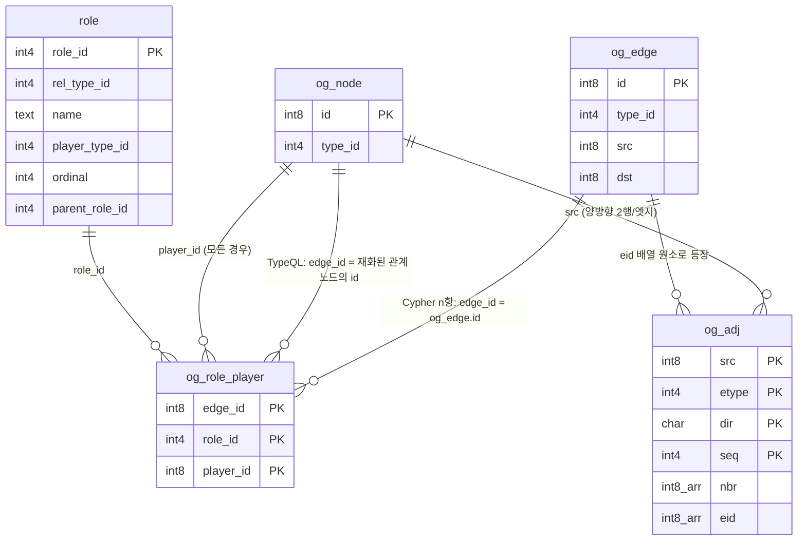

# 06. 역할과 관계 모델 — `role`, `og_role_player`, TypeQL reification

> **이 문서가 답하는 질문**
> - 역할(role)은 어디에 저장되고 언제 검증되는가?
> - 이항 관계와 n항 관계는 물리적으로 어떻게 다른가?
> - TypeQL은 관계와 속성을 어떤 행으로 바꾸는가? (reification / value interning)
> - `og_typeql_attribute` / `og_typeql_role` 뷰는 무엇을 노출하는가?

**정본**: [`engine/sql/bootstrap.sql:103-131`](../../engine/sql/bootstrap.sql),
[`engine/src/storage/mod.rs:454-558`](../../engine/src/storage/mod.rs),
[`engine/src/typeql/schema.rs`](../../engine/src/typeql/schema.rs) (572줄),
[`engine/src/typeql/write.rs`](../../engine/src/typeql/write.rs) (688줄),
[`engine/sql/access.sql:297-338`](../../engine/sql/access.sql).

---

## 결정 — 관계는 두 가지 물리 형태로 존재한다

| | Cypher 관계 | TypeQL 관계 |
|---|---|---|
| 레지스트리 | `og_data.og_edge` | `og_data.og_node` (**reified**) |
| 저장 테이블 | `og_data.e_<tid>` | `og_data.n_<tid>` |
| `type.kind` | `'r'` | `'r'` |
| 참여자 | `og_edge.src` / `dst` (+ `og_role_player` for n≥3) | `og_data.og_role_player` **전부** |
| 인접 세그먼트 | 생성됨 (`og_adj`) | 생성 **안 됨** |
| Cypher가 보는 것 | 엣지 (`ve_<tid>` 뷰) | **노드** (`v_<tid>` 뷰) |

**같은 `kind = 'r'`이 두 개의 다른 물리 형태를 가진다.** 어느 쪽인지 정하는 것은
`storage_table` 이름의 접두사다 — `n_`이면 노드, `e_`면 엣지
(`engine/src/cypher/views.rs:65-70`).

TypeQL 경로:
```rust
if *kind == Kind::Attribute { ensure_attr_storage(...)?; }
else                        { ensure_instance_storage(tid, anns.abstract_); }
```
(`engine/src/typeql/schema.rs:86-90`)

`ensure_instance_storage`는 엔티티든 관계든 `types::node_table(tid)`를 만든다
(`engine/src/typeql/schema.rs:227-235`). 주석이 명시한다:
"Entity and (reified) relation instances live in a skinny node table; their
attributes are separate instances, so there are no property columns here."
(`engine/src/typeql/schema.rs:221-222`)

---

## 사실 — `og_catalog.role` 테이블의 의미

```sql
CREATE TABLE og_catalog.role (
    role_id        int4 PRIMARY KEY,
    rel_type_id    int4 NOT NULL REFERENCES og_catalog.type(type_id) ON DELETE CASCADE,
    name           text NOT NULL,
    player_type_id int4 REFERENCES og_catalog.type(type_id),
    ordinal        int4 NOT NULL,        -- 0 = src, 1 = dst, 2.. = n-ary
    card_min       int4 NOT NULL DEFAULT 0,
    card_max       int4,
    iri            text,
    parent_role_id int4 REFERENCES og_catalog.role(role_id),
    UNIQUE (rel_type_id, name)
);
```
(`engine/sql/bootstrap.sql:107-121`)

**`ordinal`이 물리 저장 위치를 결정한다.**

| `ordinal` | 어디에 저장되는가 |
|---|---|
| 0 | `og_edge.src` (Cypher 관계) — 별도 행 없음 |
| 1 | `og_edge.dst` (Cypher 관계) — 별도 행 없음 |
| ≥ 2 | `og_data.og_role_player` 행 |

TypeQL 관계는 `og_edge`가 없으므로 **모든 역할이 `og_role_player` 행**이다.

### `parent_role_id` — 역할 특수화

TypeQL의 `relation authoring sub contribution, relates author as contributor`
(`engine/sql/bootstrap.sql:116-118`).
상위 역할을 매칭하면 그것을 특수화한 모든 역할에 도달해야 한다.

**인덱스가 없다.** `parent_role_id`를 따라가는 질의는 `og_catalog.role` 전체 스캔이다.
카탈로그 테이블이라 보통 작지만, FK 캐스케이드에도 영향을 준다 → `DATA-05`.

`find_role`은 상위 타입 라인 전체에서 이름으로 찾고, **가장 구체적인 것**(가장 큰
`rel_type_id`)을 고른다:
```sql
SELECT r.role_id FROM og_catalog.role r
 WHERE r.rel_type_id = ANY($1) AND r.name = $2
 ORDER BY r.rel_type_id DESC LIMIT 1
```
(`engine/src/typeql/schema.rs:400-409`)

> `rel_type_id DESC`가 "가장 구체적"과 같다는 것은 **id 순서 = 생성 순서 = 대체로
> 하위 타입이 나중**이라는 가정에 기댄 것이다. 구간 라벨의 `depth`를 쓰지 않는다.
> 상위 타입을 나중에 만든 스키마에서는 잘못된 역할을 고를 수 있다. → `DATA-19`

---

## 사실 — 역할 검증 시점

### 이항 관계 생성 시 (Cypher / `og_create_edge`)

```rust
fn validate_roles(tid: i32, rel_type: &str, src: i64, dst: i64) {
    // SELECT name, ordinal, player_type_id FROM og_catalog.role
    //  WHERE rel_type_id = ANY($1) AND player_type_id IS NOT NULL AND ordinal IN (0,1)
    for (name, ordinal, player) in roles {
        let actual = if ordinal == 0 { id::id_type(src) } else { id::id_type(dst) };
        if !labeling::og_is_subtype(actual, player) {
            error!("role '{name}' of relation '{rel_type}' requires a '{expected}', got '{got}'");
        }
    }
}
```
(`engine/src/storage/mod.rs:454-484`)

- 상위 타입이 선언한 역할도 검사한다 (`rel_type_id = ANY(og_supertypes(tid))`).
- `player_type_id`가 NULL인 역할은 검사하지 않는다.
- 검사는 **id에서 뽑은 타입**으로 한다 — `og_node` 조회가 아니다.
  → [`02_identifier_encoding.md`](02_identifier_encoding.md)의 이득이 여기서 실현된다.
- 서브타입 판정은 `og_is_subtype()` = 구간 범위 비교 한 번
  (`engine/src/catalog/labeling.rs:232-244`).

### n항 참여자 추가 시

```rust
fn og_add_role_player(graph: &str, rel_type: &str, edge_id: i64, role: &str, player: i64) {
    // 역할을 상위 타입 라인에서 이름으로 찾고
    // player_type_id가 있으면 og_is_subtype으로 검증한 뒤
    INSERT INTO og_data.og_role_player (edge_id, role_id, player_id) VALUES ($1,$2,$3)
    ON CONFLICT DO NOTHING
}
```
(`engine/src/storage/mod.rs:531-558`)

`ON CONFLICT DO NOTHING` — 같은 (관계, 역할, 참여자) 삼중항은 멱등이다.

### 검증되지 않는 것

| 항목 | 상태 |
|---|---|
| `card_min` / `card_max` | **강제 지점을 찾지 못함.** 저장만 된다 |
| `ordinal` 중복 | 검사 없음. 같은 관계에 `ordinal = 0`인 역할 두 개를 만들 수 있다 |
| `ordinal` 연속성 | 검사 없음 |
| n항 참여자의 존재 | `og_role_player.player_id`에 FK가 없다. 없는 노드를 넣을 수 있다 |
| `og_role_player`의 고아 행 | `og_check_integrity()`가 검사하지 **않는다** (`engine/src/storage/stats.rs:172-263`의 4개 검사 어디에도 없음) |

---

## 사실 — n항 관계의 물리 형태

3항 관계 `Employment(employer, employee, contract)`를 Cypher 경로로 만든다면:

```text
og_edge  : (id=E, type_id=T, src=<employer>, dst=<employee>)
og_adj   : (src=<employer>, etype=T, dir='o', ...) 에 <employee>/E
           (src=<employee>, etype=T, dir='i', ...) 에 <employer>/E
og_role_player : (edge_id=E, role_id=<contract role>, player_id=<contract>)
e_T      : (id=E, src=<employer>, dst=<employee>, 프로퍼티 컬럼들, __ext)
```

**비대칭이 남는다.** `ordinal 0/1` 참여자는 `og_adj`를 통해 순회 가능하지만,
`ordinal ≥ 2` 참여자는 **인접 세그먼트에 나타나지 않는다.**
`<contract>`에서 `E`로 가는 경로는 `og_role_player_player_idx (player_id)`를
쓰는 인덱스 조회뿐이다(`engine/sql/bootstrap.sql:131`).

즉 **n항 참여자는 그래프 순회의 1급 시민이 아니다.**
Cypher `MATCH`가 3번째 역할을 따라가지 못하며, 그것을 노출하는 것은
`og_typeql_role` 뷰다.

---

## 결정 — TypeQL의 속성 값 인터닝(interning)

TypeQL에서 속성 인스턴스는 **타입과 값**으로 동일성이 정해진다(spec 010 FR-016).
`"fiction"`이라는 `genre`는 그래프 전체에 하나뿐이고, 두 책이 그것을 **공유**한다.

물리적으로:
```sql
CREATE TABLE IF NOT EXISTS og_data.a_<tid>
  (id int8 PRIMARY KEY, val <sql_ty> NOT NULL UNIQUE, __ext jsonb);
```
(`engine/src/typeql/schema.rs:273-276`)

주석: "UNIQUE on the value is load-bearing, not defensive: it is what makes two
owners of \"fiction\" share one instance (FR-016)."
(`engine/src/typeql/schema.rs:271-272`)

`val`은 `og_catalog.property`에도 등록된다 — 이름 `val`, 컬럼 `val`, `required = true`
(`engine/src/typeql/schema.rs:281-288`). 그래서 Cypher가 같은 인스턴스를
`v_<tid>` 뷰의 `val` 컬럼으로 읽는다.

### 인터닝 코드

```rust
if let Some(existing) = crate::spiu::one::<i64>(
    &format!("SELECT id FROM {table} WHERE val = {lit}"), &[])? {
    return Ok((existing, value.clone()));
}
let id = alloc_id(attr_tid);
INSERT INTO og_data.og_node (id, type_id) VALUES ($1, $2);
INSERT INTO {table} (id, val) VALUES ($1, {lit});
```
(`engine/src/typeql/write.rs:242-263`)

**두 가지 문제가 있다.**

1. **SELECT-then-INSERT 경합.** `ON CONFLICT`가 없다. 두 백엔드가 같은 값을 동시에
   인터닝하면 둘 다 SELECT에서 못 찾고 둘 다 INSERT를 시도해, 하나가
   `duplicate key value violates unique constraint`로 트랜잭션 전체를 잃는다. → `DATA-20`

2. **값이 SQL 텍스트에 보간된다.** `{lit}`는 `typed_literal()`이 만든 SQL 리터럴이다
   (`engine/src/typeql/write.rs:245`). 이스케이프는 한곳에 모여 있지만
   (`engine/src/typeql/write.rs:647-648`), 결과적으로 **서로 다른 값마다 서로 다른 SQL
   문자열**이 생겨 준비된 계획을 재사용할 수 없다. 이는 저장소의 명시적 원칙
   ("사용자 값은 절대 SQL 텍스트로 보간하지 않음", `engine/src/storage/mod.rs:44-46`)과
   다른 경로다. → `PERF-13`

### 소유권 링크 `$has`

소유 관계는 `$has`라는 **내부 관계 타입**의 엣지다.

```rust
pub fn ensure_has_type(gid: i32) -> i32 {
    // og_catalog.type 에 name = '$has', kind = 'r' 로 삽입
    // og_data.e_<tid> (id, src, dst) 테이블 생성 (— __ext 컬럼이 없다)
    // CREATE INDEX e_<tid>_src ON ... (src)
    // CREATE INDEX e_<tid>_dst ON ... (dst)
    // og_id_alloc 초기화
    // relabel_graph(gid)
}
```
(`engine/src/typeql/schema.rs:526-552`)

```rust
pub fn link_has(gid: i32, owner: i64, attr: i64) -> WResult<()> {
    // 이미 있으면 no-op
    // og_edge + e_<has_tid> 삽입
    adjacency::append(owner, has_tid, 'o', attr, eid);
    adjacency::append(attr,  has_tid, 'i', owner, eid);
}
```
(`engine/src/typeql/write.rs:381-406`)

**즉 속성 소유는 진짜 엣지이고 인접 세그먼트에도 들어간다.**
`MATCH (b)-[:`$has`]->(g)` 같은 Cypher 순회가 성립한다.

**주의**: `$has`의 저장 테이블에는 `__ext` 컬럼이 **없다**
(`engine/src/typeql/schema.rs:538-540`).
반면 `og_data.ve_<tid>` 뷰 빌더는 모든 엣지 테이블에서 `__ext`를 투영한다
(`engine/src/cypher/views.rs:117`). `$has` 타입이 Cypher 뷰에 포함되면
컬럼이 없어 뷰 생성이 실패한다.
> **미확인**: `$has`가 어떤 뷰의 서브타입 집합에 실제로 포함되는지 확인하지 않았다.
> `$has`는 부모가 없는 루트 타입이므로 다른 관계 타입의 `ve_<tid>` 뷰에는 안 들어가지만,
> `og_data.ve_<$has tid>`를 직접 만들면 어떻게 되는지는 측정 대상이다. → `DATA-22`

### 인터닝의 데이터 모델적 함의

- 그래프 안에서 값이 **de-duplicate 된다**. `genre = "fiction"` 책 100만 권이
  `a_<tid>` 행 하나를 공유한다.
- 대신 그 하나의 노드가 **100만 개의 들어오는 `$has` 엣지**를 갖는다.
  → 인터닝된 인기 값은 **필연적으로 슈퍼노드**다.
  100만 이웃 = `og_adj` 세그먼트 3,907개 = 최소 3,907 페이지.
- Cypher에서 `MATCH (g:genre {val:"fiction"})<-[:`$has`]-(b)`는 그 전부를 훑는다.
- 값 갱신은 "인스턴스를 고치는 것"이 아니라 "`$has` 링크를 옮기는 것"이다
  (`engine/src/typeql/write.rs:499-507`의 `update ... has` 경로).

---

## 사실 — 매핑 뷰 두 개

이 매핑은 숨기지 않고 SQL로 드러낸다(`engine/sql/access.sql:297-304`).

### `og_typeql_attribute` — 소유권 하나당 한 행

```sql
CREATE VIEW og_typeql_attribute AS
    SELECT e.src                     AS owner_id,
           ot.name                   AS owner_type,
           at.name                   AS attribute_type,
           og_node_json(e.dst) ->> 'val' AS value,
           e.dst                     AS attribute_id
      FROM og_data.og_edge  e
      JOIN og_catalog.type  ht ON ht.type_id = e.type_id AND ht.name = '$has'
      JOIN og_data.og_node  o  ON o.id  = e.src
      JOIN og_catalog.type  ot ON ot.type_id = o.type_id
      JOIN og_data.og_node  a  ON a.id  = e.dst
      JOIN og_catalog.type  at ON at.type_id = a.type_id;
```
(`engine/sql/access.sql:307-318`)

**성능 주의 두 가지**
1. `ht.name = '$has'` — `og_catalog.type`의 UNIQUE 인덱스는 `(graph_id, name)`이라
   `name` 단독 조건은 접두사가 아니다. **`og_catalog.type` 순차 스캔**으로 시작한다.
   (카탈로그 테이블이라 대개 작지만, 그래프가 여럿이면 `$has`도 여럿이다.)
2. `og_node_json(e.dst) ->> 'val'` — **행마다 plpgsql 함수 호출**이고,
   그 안에서 다시 동적 EXECUTE + `og_catalog.property` 조인이 돈다
   (`engine/sql/access.sql:208-235`). 이 뷰를 큰 범위로 스캔하면 매우 비싸다.
   → `PERF-08`

   `a_<tid>.val`을 직접 읽는 것이 훨씬 싸다. 대신 속성 타입마다 다른 테이블이라
   하나의 뷰로 쓰려면 이 우회가 필요하다.

### `og_typeql_role` — 역할 배정 하나당 한 행

```sql
CREATE VIEW og_typeql_role AS
    SELECT rp.edge_id AS relation_id, rt.name AS relation_type, r.name AS role,
           rp.player_id AS player_id, pt.name AS player_type
      FROM og_data.og_role_player rp
      JOIN og_catalog.role  r  ON r.role_id = rp.role_id
      JOIN og_data.og_node  rn ON rn.id = rp.edge_id      -- ★ 노드다
      JOIN og_catalog.type  rt ON rt.type_id = rn.type_id
      JOIN og_data.og_node  p  ON p.id  = rp.player_id
      JOIN og_catalog.type  pt ON pt.type_id = p.type_id;
```
(`engine/sql/access.sql:324-335`)

**`rp.edge_id`를 `og_data.og_node`와 조인한다.** 컬럼 이름이 `edge_id`인데
노드를 참조한다 — reification 때문이다. 주석이 이를 명시한다:
"Relations are reified as nodes, so relation_id is a node id"(`engine/sql/access.sql:337-338`).

**함의**: Cypher 경로로 만든 n항 관계(진짜 엣지)의 참여자는 이 뷰에 **나타나지 않는다.**
`rp.edge_id`가 `og_edge.id`이고 `og_node`에는 그 id가 없기 때문에 조인이 탈락한다.
`og_typeql_role`은 이름 그대로 **TypeQL 관계 전용**이다.

---

## ER — 두 관계 형태의 대조



---

## 금지 / 필수

**금지**
- `og_data.og_role_player`에 직접 INSERT 하는 것. `role_id`가 그 관계 타입 라인에
  속하는지, `player_id`의 타입이 `player_type_id`를 만족하는지 아무것도 검증되지 않는다.
- 같은 관계 타입에 `ordinal = 0`인 역할을 두 개 이상 선언하는 것 (엔진이 막지 않는다).
- `og_typeql_attribute` 뷰를 큰 범위로 스캔하는 것. 행마다 plpgsql 호출이 돈다.
- 인터닝된 속성 값을 그래프 순회의 시작점으로 삼는 것.
  인기 값은 슈퍼노드이며, 그 방향 확장은 수천 세그먼트를 읽는다.
- 카디널리티(`card_min` / `card_max`)가 강제된다고 가정하는 것. **강제되지 않는다.**

**필수**
- n항 관계를 만들 때는 `og_add_role_player()`를 쓸 것. 검증이 거기 있다.
- TypeQL 속성 인터닝을 동시에 수행하는 워크로드는 **유니크 위반 재시도**를
  애플리케이션 쪽에 두어야 한다.
- 속성 인스턴스의 차수를 주기적으로 볼 것:
  ```sql
  SELECT a.src, sum(a.n) AS in_degree
    FROM og_data.og_adj a
   WHERE a.dir = 'i'
   GROUP BY a.src
   ORDER BY 2 DESC LIMIT 20;
  ```
  상위에 속성 인스턴스가 올라오면 인터닝이 슈퍼노드를 만들고 있다는 뜻이다.

---

<!-- affects: data, backend -->
<!-- requires-update: docs/06_data/03_adjacency_model.md, docs/06_data/10_improvements_data.md -->
