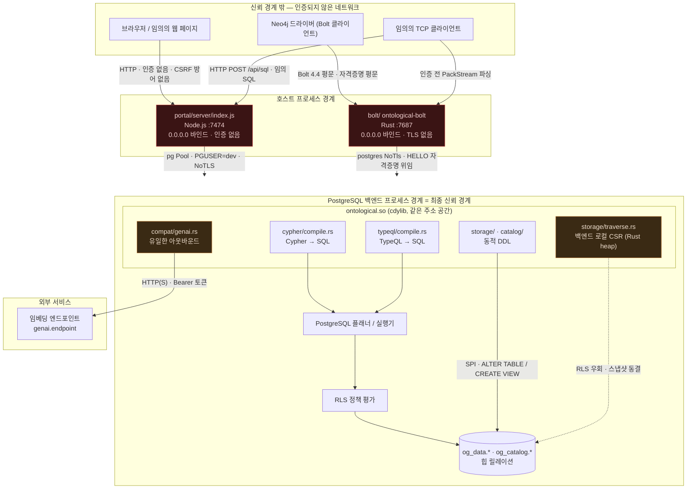

# 위협 모델 — 신뢰 경계와 공격자

> ⚠️ **이 문서는 감사 커밋 `7d60c82` 시점의 스냅샷이다.** 이후 Critical 5건과
> High 8건(4건 수정 · 4건 부분)이 반영되었으므로, 여기 서술된 결함 중 일부는 **현재 코드에 더 이상
> 존재하지 않는다.** 현재 상태는 [10_fixed.md](10_fixed.md) 를 볼 것.

> **이 문서가 답하는 질문**
> - 이 시스템의 신뢰 경계는 어디에 있는가?
> - 보호해야 할 자산은 무엇인가?
> - 어떤 공격자를 상정하는가? 상정하지 **않는** 공격자는 누구인가?
> - 각 진입점은 어느 수준까지 신뢰되는가?

---

## 1. 신뢰 경계 (사실)

**경계 판정 (사실)**

| 경계 | 어디서 검증되는가 | 근거 |
|---|---|---|
| 네트워크 → Studio | **검증 없음** | `portal/server/index.js:344-355` — 라우팅 전 인증 훅이 없다 |
| 네트워크 → Bolt | 인증 **후에만** 검증. 파싱은 인증 전 | `bolt/src/session.rs:113` 가 HELLO 이전에 `read_message` 호출 |
| Bolt → PostgreSQL | PostgreSQL 인증에 완전 위임 | `bolt/src/session.rs:168-193` |
| Studio → PostgreSQL | 고정 풀 자격증명 (`PGUSER`) | `portal/server/index.js:21-29` |
| 질의 → 데이터 | PostgreSQL 권한 + (선택적) RLS | `engine/src/cypher/compile.rs` 가 뱉는 SQL이 호출자 권한으로 실행 |
| 확장 → OS | **경계 없음** — 같은 프로세스 | `engine/ontological.control` `trusted = false` |

---

## 2. 자산 (사실)

| 자산 | 어디에 있는가 | 손상 시 영향 |
|---|---|---|
| 그래프 데이터 | `og_data.n_*`, `og_data.e_*`, `og_data.a_*` | 기밀성·무결성 |
| 인접 구조(토폴로지) | `og_data.og_adj` (RLS 없음) | **기밀성 — 관계 존재 자체가 정보** |
| 노드/엣지 레지스트리 | `og_data.og_node`, `og_data.og_edge` (RLS 없음) | 식별자·타입 노출 |
| 타입 카탈로그 | `og_catalog.type`, `.property`, `.role` | **무결성 — 2차 주입의 원천** ([`04`](04_injection_surface.md) SEC-20) |
| 히스토리 페이로드 | `og_data.og_history.payload` (RLS 없음) | **RLS로 가린 값의 과거 스냅샷** |
| 감사 로그 | `og_data.og_audit.query` | 질의 원문에 포함된 리터럴 = PII 가능 |
| 임베딩 API 토큰 | `og_catalog.setting` 의 `genai.token` 행 | **평문 저장 + pg_dump 포함** |
| PostgreSQL 역할 자격증명 | Bolt HELLO 페이로드 / `PGPASSWORD` | 전 시스템 |
| PostgreSQL 백엔드 프로세스 | — | **가용성 — 크래시 시 클러스터 전체 복구** |

---

## 3. 공격자 모델

### 3.1 상정하는 공격자 (In scope)

| 코드 | 공격자 | 보유 능력 | 대표 위협 |
|---|---|---|---|
| **A1** | 네트워크상의 익명 사용자 | Studio/Bolt 포트에 TCP 도달 | `POST /api/sql` 임의 SQL, PackStream 자원 고갈 |
| **A2** | 피해자 브라우저를 유인한 웹 공격자 | 피해자가 임의 페이지 방문 | CSRF로 `POST /api/sql` 블라인드 실행 |
| **A3** | 유효한 PostgreSQL 역할을 가진 저권한 테넌트 | `og_cypher` 실행 권한 | RLS 우회로 타 테넌트 행 열람, 순회로 토폴로지 열람 |
| **A4** | 악의적/부주의한 애플리케이션(또는 LLM 에이전트) | Cypher/TypeQL 작성 가능 | 쓰기 시점 DDL 유발 DoS, 깊은 순회 자원 고갈 |
| **A5** | 카탈로그 쓰기 권한을 얻은 내부자 | `og_catalog.*` UPDATE | 2차 SQL 주입으로 권한 상승 |
| **A6** | 네트워크 경로상의 수동 도청자 | 트래픽 관찰 | Bolt 평문 자격증명, PG 평문 세션 탈취 |

### 3.2 상정하지 **않는** 공격자 (Out of scope)

- **PostgreSQL 슈퍼유저.** 슈퍼유저는 정의상 모든 경계를 넘는다. `CREATE EXTENSION`
  자체가 슈퍼유저를 요구한다(`engine/ontological.control` `trusted = false`).
- **호스트 OS 루트 / 컨테이너 탈출.**
- **PostgreSQL 자체의 0-day.**
- **물리 접근 및 저장 매체 탈취** (디스크 암호화는 이 시스템의 책임이 아니다).
- **공급망 공격** (의존성 CVE 스캔은 미수행 — [`00_index.md`](00_index.md) "미확인" 참조).

---

## 4. 진입점별 신뢰 수준 (사실)

| # | 진입점 | 리스너/함수 | 인증 | 신뢰 수준 | 근거 |
|---|---|---|---|---|---|
| E1 | HTTP `:7474` — Studio API 전체 | `portal/server/index.js:344` | **없음** | **신뢰 불가** | 라우팅 테이블에 인증 미들웨어 없음 |
| E2 | HTTP `:7474` `POST /api/sql` | `portal/server/index.js:296-308` | **없음** | **신뢰 불가 · 임의 SQL** | `pool.query(sql)` 무검증 |
| E3 | TCP `:7687` — Bolt 핸드셰이크 | `bolt/src/main.rs:46`, `session.rs:85-100` | 없음(프로토콜상 불가) | 신뢰 불가 | 20바이트 프리앰블 |
| E4 | TCP `:7687` — HELLO 이전 PackStream | `bolt/src/session.rs:113` | **없음** | **신뢰 불가 · 파서 도달** | `run()` 루프가 HELLO 전에 파싱 |
| E5 | TCP `:7687` — HELLO 이후 RUN | `bolt/src/session.rs:242-329` | PostgreSQL 역할 | 역할 권한만큼 | 자격증명 위임 |
| E6 | SQL `og_cypher(graph, query, params)` | `engine/src/cypher/mod.rs:83` | 호출자 역할 | 역할 권한만큼 | SECURITY DEFINER 아님 |
| E7 | SQL `og_typeql(...)` | `engine/src/typeql/mod.rs` | 호출자 역할 | 역할 권한만큼 | 동일 |
| E8 | SQL `og_vector_search(..., filter)` | `engine/src/vector/mod.rs:95-101` | 호출자 역할 | **원시 SQL 조각 수용** | `filter`가 그대로 보간됨(:116) |
| E9 | SQL `og_enable_rls(..., policy_expr)` | `engine/src/interop/mod.rs:19` | 호출자 역할 | **원시 SQL 조각 수용** | 설계 의도이나 문서화 부족 |
| E10 | SQL `og_map_table(...)` | `engine/src/interop/mod.rs:61` | 호출자 역할 | **원시 SQL 식별자 수용** | `source_table`, `id_column` 보간 |
| E11 | SQL `og_load_rdf(graph, document, format)` | `engine/src/adapters/mod.rs:40` | 호출자 역할 | 텍스트만 | **파일/URL을 읽지 않음 — 확인된 방어** |
| E12 | SQL `og_set_setting(key, value)` | `engine/src/compat/genai.rs:56` | 호출자 역할 | **아웃바운드 URL 변경 가능** | SSRF 연쇄의 시작점 |
| E13 | 아웃바운드 HTTP → `genai.endpoint` | `engine/src/compat/genai.rs:139-149` | 없음(발신) | 스킴/호스트 검증 없음 | ureq에 URL 그대로 전달 |
| E14 | `og_csr_build()` / `og_csr_reach()` | `engine/src/storage/traverse.rs:295, 359` | 호출자 역할 | **RLS 미조회 (문서화됨)** | `traverse.rs:19-23` 주석이 명시 |

---

## 5. STRIDE 요약 (감사 결과 기준)

| 위협 | 대표 사례 | 상태 |
|---|---|---|
| **S**poofing | Bolt 자격증명 평문 전송(`session.rs:182` `NoTls`) → 재사용 가능 | 미완화 |
| **T**ampering | Studio `POST /api/sql` 로 임의 DML/DDL | 미완화 |
| **R**epudiation | 실패한 질의는 트랜잭션 롤백으로 감사 로그에 남지 않음(`cypher/mod.rs:96-98`) | 미완화 |
| **I**nformation disclosure | 생성 뷰 `security_invoker` 누락으로 RLS 우회(`views.rs:135`) | 미완화 |
| **D**enial of service | PackStream 길이 필드로 대용량 할당(`packstream.rs:224-225`) | 미완화 |
| **E**levation of privilege | `og_catalog` 2차 주입 → 뷰 소유자 권한 실행(`access.sql:220`) | 미완화 |

---

## 6. 결정 (Decisions)

이 문서가 **결정한** 것 — 코드가 아니라 이 문서가 정한 정책이다.

| ID | 결정 | 근거 |
|---|---|---|
| TM-D1 | **Studio(`portal/`)는 "로컬 전용 개발 도구"로 분류한다.** 프로덕션 배포 대상이 아니다. | `POST /api/sql`(`index.js:296`)이 설계상 "escape hatch" 주석과 함께 존재하고, 인증 훅이 애초에 없다. 인증을 붙이는 것보다 노출을 막는 것이 현재 코드에 맞는 조치다. |
| TM-D2 | **Bolt 게이트웨이는 신뢰된 네트워크 세그먼트 안에서만 운용한다.** | TLS 미지원이 `README.md:153`에 이미 명시되어 있다. |
| TM-D3 | **RLS를 다중 테넌트 격리의 유일한 수단으로 쓰지 않는다.** | [`03_rls_and_isolation.md`](03_rls_and_isolation.md)의 우회 경로 표. |
| TM-D4 | **`og_vector_search(filter)`, `og_enable_rls(policy_expr)`, `og_map_table(...)`은 "신뢰된 SQL을 받는 관리 함수"로 분류한다.** 최종 사용자 입력을 넘겨서는 안 된다. | 코드가 이미 그렇게 동작하며, 파라미터화로 바꾸면 기능을 잃는다. |

> TM-D1~D4는 **이 문서의 판단**이지 코드에 박힌 사실이 아니다.
> 코드나 `README.md`에 "로컬 전용"이라는 문구는 **존재하지 않는다** (확인함:
> `README.md:190`은 `http://localhost:7474`를 안내할 뿐 제약을 선언하지 않는다).

---

## Forbidden (금지)

- **Studio 포트(`:7474`)를 공개 인터페이스나 리버스 프록시 뒤에 노출하지 말 것.**
  인증이 전혀 없고 임의 SQL 엔드포인트가 열려 있다(`portal/server/index.js:296-308`).
- **Bolt 포트(`:7687`)를 공용 네트워크에 노출하지 말 것.** TLS가 없어
  PostgreSQL 자격증명이 평문으로 흐른다(`bolt/src/session.rs:169-182`).
- **최종 사용자 입력을 `og_vector_search`의 `filter`, `og_enable_rls`의
  `policy_expr`, `og_map_table`의 `source_table`/`id_column`에 전달하지 말 것.**
- **`og_catalog.*` 테이블에 애플리케이션 역할의 `UPDATE`/`INSERT` 권한을 주지 말 것.**
  이 테이블들의 값이 동적 SQL로 보간된다([`04`](04_injection_surface.md) SEC-20).
- **슈퍼유저 역할로 애플리케이션을 접속시키지 말 것.** RLS는 `FORCE` 없이는
  테이블 소유자에게 적용되지 않는다([`03`](03_rls_and_isolation.md)).

## Required (필수)

- 새 진입점(포트·HTTP 라우트·`#[pg_extern]`)을 추가하면 §4 표에 행을 추가할 것.
- 공격자 능력이 바뀌면(예: Studio에 인증 도입) §3 표와 TM-D1~D4를 재검토할 것.
- 이 문서의 mermaid 다이어그램은 `bolt/src/main.rs`, `portal/server/index.js`,
  `engine/src/compat/genai.rs` 중 하나가 바뀌면 함께 갱신할 것.

<!-- affects: security, backend, api, ops -->
<!-- requires-update: 07_security/03_rls_and_isolation.md, 07_security/06_network_exposure.md, 07_security/09_improvements_security.md -->
