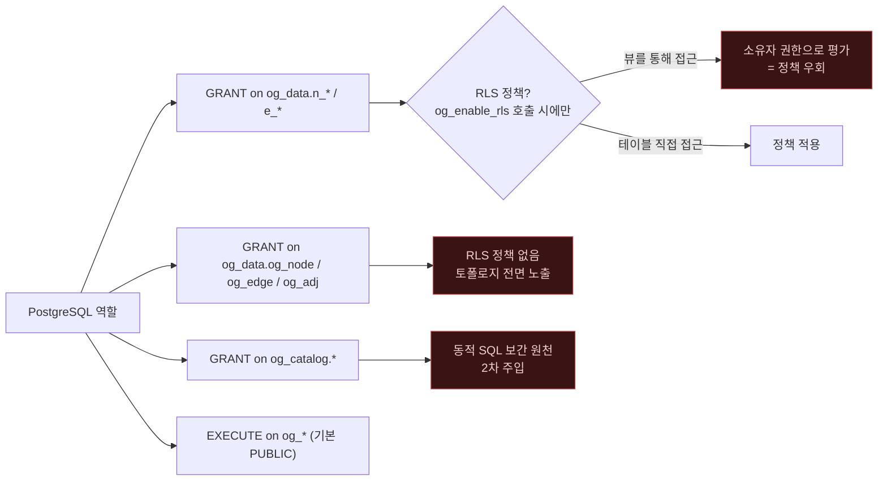

# 인증과 인가

> ⚠️ **이 문서는 감사 커밋 `7d60c82` 시점의 스냅샷이다.** 이후 Critical 5건과
> High 8건(4건 수정 · 4건 부분)이 반영되었으므로, 여기 서술된 결함 중 일부는 **현재 코드에 더 이상
> 존재하지 않는다.** 현재 상태는 [10_fixed.md](10_fixed.md) 를 볼 것.


> **이 문서가 답하는 질문**
> - 이 시스템에 "사용자"는 어디에 존재하는가?
> - Bolt로 접속할 때 무엇이 인증을 수행하는가?
> - Studio에는 왜 로그인이 없는가? 그것은 의도인가?
> - 어떤 함수를 누가 실행할 수 있는가? 기본값은 무엇인가?

---

## 1. 핵심 설계 결정 (Decisions — 코드에 박힌 것)

| ID | 결정 | 근거 |
|---|---|---|
| AZ-1 | **자체 사용자 저장소를 두지 않는다.** 주체(principal)는 PostgreSQL 역할이다. | `bolt/src/session.rs:165-167` 주석: "Authentication is PostgreSQL's… No second user store (FR-015)" |
| AZ-2 | **어떤 함수도 `SECURITY DEFINER`가 아니다.** 모든 `#[pg_extern]`과 `access.sql`의 함수는 호출자 권한으로 실행된다. | 저장소 전체 `grep -i "security definer"` → **0건** |
| AZ-3 | **확장은 `trusted = false`, `superuser = false`.** `CREATE EXTENSION`은 슈퍼유저를 요구한다. | `engine/ontological.control` |
| AZ-4 | **부트스트랩 SQL에 `GRANT`/`REVOKE`가 하나도 없다.** | `engine/sql/bootstrap.sql`, `engine/sql/access.sql` 전체 → **0건** |

AZ-2와 AZ-4의 조합이 이 시스템의 인가 모델 전부다. 설명하면:

- 확장이 만드는 테이블(`og_catalog.*`, `og_data.*`)의 소유자는 **`CREATE EXTENSION`을
  실행한 역할**(보통 슈퍼유저)이다. 명시적 `GRANT`가 없으므로 다른 역할은
  기본적으로 아무것도 읽고 쓸 수 없다.
- 반면 함수의 `EXECUTE`는 PostgreSQL 기본값에 따라 **`PUBLIC`에 부여**된다.
  즉 아무 역할이나 `og_cypher(...)`를 **호출할 수는 있다**.
- 하지만 함수 본문의 SPI가 호출자 권한으로 돌기 때문에, 권한 없는 역할은
  `permission denied for table og_node` 로 실패한다.

**따라서 인가 결정은 전부 `GRANT`에 있다.** 이것이 이 설계의 강점이자,
[`03_rls_and_isolation.md`](03_rls_and_isolation.md)에서 뒤집히는 지점이다
(생성 뷰는 소유자 권한으로 기반 테이블을 읽으므로 이 모델을 우회한다).

---

## 2. 인증 경로별 사실

### 2.1 직접 SQL (psql / libpq / PostgREST)

인증은 전적으로 PostgreSQL의 `pg_hba.conf`가 담당한다. 이 저장소에는
`pg_hba.conf`가 없으므로 **배포 환경의 설정에 전적으로 의존한다(미확인)**.

`start.sh:36-40`은 `cargo pgrx start pg16`으로 개발용 클러스터를 띄운다. pgrx가
`initdb`에 인증 방식을 지정하는지는 이 저장소에서 확인할 수 없다(미확인). 다만
저장소 어디에도 `-A scram-sha-256`, `scram`, `md5` 문자열이 없다.
→ [`08_secure_deployment.md`](08_secure_deployment.md)에서 명시적으로 설정할 것을
요구한다.

### 2.2 Bolt 게이트웨이 — 위임 인증

```rust
// bolt/src/session.rs:168-185
fn hello(&mut self, extra: Value) -> Result<Value, Failure> {
    let user = extra.map_get("principal").and_then(Value::as_str).unwrap_or("").to_string();
    let password =
        extra.map_get("credentials").and_then(Value::as_str).unwrap_or("").to_string();

    let mut cfg = postgres::Config::new();
    cfg.host(&self.config.pg_host)
        .port(self.config.pg_port)
        .dbname(&self.config.pg_database)
        .user(&user)
        .application_name("ontological-bolt");
    if !password.is_empty() {
        cfg.password(&password);
    }
    let client = cfg.connect(NoTls).map_err(|e| {
        Failure::client("Neo.ClientError.Security.Unauthorized", pg_message(&e))
    })?;
```

사실 관계:

| 사실 | 근거 | 보안적 함의 |
|---|---|---|
| Bolt의 `principal`/`credentials`가 PostgreSQL 역할/암호로 그대로 쓰인다 | `session.rs:169-171, 177, 180` | 이중 사용자 저장소가 없다 — **확인된 방어** |
| 접속은 `NoTls` | `session.rs:182` | 암호가 게이트웨이↔PG 구간에서 **평문** |
| 암호가 비면 `cfg.password()`를 아예 호출하지 않는다 | `session.rs:179-181` | `pg_hba`가 `trust`면 자격증명 없이 통과 |
| 실패 시 PostgreSQL 오류 메시지를 그대로 반환 | `session.rs:182-184`, `session.rs:604-606` | `role "x" does not exist` vs `password authentication failed` 구분 → **계정 열거** |
| HELLO 시도 횟수 제한이 없다 | `bolt/src/main.rs:60-79` 루프에 제한 없음 | **무제한 암호 추측 오라클** |
| HELLO 이전에도 메시지 파싱이 수행된다 | `session.rs:111-128` (`run()`이 HELLO 전에 `read_message`) | 파서 결함이 **인증 전**에 도달 가능 ([`05`](05_process_safety.md)) |
| `ROUTE` 메시지는 인증 없이 응답한다 | `session.rs:148` → `routing_table()`(`:388-407`)에 `client()` 검사 없음 | `OG_BOLT_ADVERTISED` 값 노출(경미) |

### 2.3 Studio (`portal/server/index.js`) — 인증 없음

**사실**: 라우트 테이블(`portal/server/index.js:140-309`)과 HTTP 핸들러
(`:344-355`) 어디에도 인증·세션·토큰·Basic Auth 검사가 없다. 모든 요청은
고정 풀 자격증명으로 실행된다.

```js
// portal/server/index.js:21-29
const pool = new Pool({
  host: process.env.PGHOST || 'localhost',
  port: Number(process.env.PGPORT || 28816),
  database: process.env.PGDATABASE || 'og',
  user: process.env.PGUSER || 'dev',
  password: process.env.PGPASSWORD || undefined,
  max: 8,
  idleTimeoutMillis: 30_000,
});
```

이 중 가장 강력한 라우트:

```js
// portal/server/index.js:295-308
  /** Raw SQL escape hatch — this is still PostgreSQL underneath. */
  async 'POST /api/sql'(req, res) {
    const { sql = '' } = await readBody(req);
    try {
      const r = await pool.query(sql);
```

#### "로컬 전용"은 의도인가? — 검증 결과

| 확인 항목 | 결과 |
|---|---|
| 코드에 로컬 전용 제약이 있는가 | **없음.** `server.listen(PORT, ...)` (`index.js:368`)에 호스트 인자가 없어 Node는 모든 인터페이스(`::` / `0.0.0.0`)에 바인드한다 |
| 로그 메시지는 무엇을 말하는가 | `index.js:370` 이 `http://localhost:${PORT}` 를 출력한다 — **실제 바인드 범위와 불일치** |
| `README.md`가 제약을 선언하는가 | **선언하지 않는다.** `README.md:190`은 `# http://localhost:7474` 주석뿐 |
| `start.sh`가 제약을 거는가 | **걸지 않는다.** `start.sh:79-80`은 `PORT="$PORT"` 만 넘긴다 |
| 소스 주석이 의도를 밝히는가 | `index.js:2-9` 는 "Deliberately thin… anything this server can do, a psql session can do too" — **의도는 개발 도구이나, 그 전제(신뢰된 로컬)가 코드로 강제되지 않는다** |

**판정 (사실)**: 로컬 전용 사용은 **의도로 보이지만 코드·문서 어디에도 명시되어
있지 않고, 기본 바인드는 로컬이 아니다.** 이것이 SEC-01/SEC-02의 근거다.

### 2.4 PostgREST / Supabase RPC

`og_cypher_json(graph, query, params)` (`engine/src/interop/mod.rs:36`)가 진입점으로
문서화되어 있다(`docs/api.md:150` 근처의 `rpc_entry_point`). 이 경로에서는
PostgREST가 JWT를 검증하고 `SET LOCAL ROLE`을 수행하므로, 인가는 다시
PostgreSQL 역할로 귀결된다 — **AZ-1과 일관된 확인된 설계**. 다만 이때에도
[`03_rls_and_isolation.md`](03_rls_and_isolation.md)의 뷰 소유자 문제가 그대로
적용된다.

---

## 3. 함수 실행 권한 현황 (사실)

`engine/sql/bootstrap.sql`과 `access.sql`에 `REVOKE ... FROM PUBLIC`이 없으므로,
아래 함수들은 **모든 역할이 호출할 수 있다**. 실제 효과는 SPI가 만나는 테이블
권한에서 결정되지만, 일부는 테이블 권한과 무관하게 부작용을 낸다.

| 함수 | 테이블 권한 없이도 효과가 있는가 | 근거 |
|---|---|---|
| `og_cypher_check(query)` | 예 — 순수 파서 | `cypher/mod.rs:699-709` (`immutable, parallel_safe`) |
| `og_cypher_columns(query)` | 예 — 순수 파서 | `cypher/mod.rs:717` |
| `ontological_version()` | 예 | `lib.rs:41` |
| `og_csr_drop()` / `og_csr_stats()` | 예 — 백엔드 로컬 상태 | `traverse.rs:317, 323` |
| `og_apply_role(name)` | 부분 — `og_catalog.agent_role` SELECT 필요 | `agent/mod.rs:416` |
| `og_genai_encode(...)` | 부분 — `og_catalog.setting` SELECT 필요, 성공 시 **아웃바운드 HTTP 발생** | `compat/genai.rs:96` |
| `og_csr_build(...)` | 부분 — `og_data.og_adj` SELECT 필요, 성공 시 **백엔드 힙에 무제한 할당** | `traverse.rs:295` |

---

## 4. "가드레일"은 인가 통제가 아니다 (사실)

spec 008 FR-024..FR-029의 리소스 한도는 `og_apply_role`로 구현되어 있다.

```rust
// engine/src/agent/mod.rs:415-441
#[pg_extern]
fn og_apply_role(name: &str) -> JsonB {
    let limits = /* SELECT limits FROM og_catalog.agent_role WHERE name = $1 */;
    if let Some(ms) = limits.get("statement_timeout_ms").and_then(|v| v.as_i64()) {
        Spi::run(&format!("SET statement_timeout = {ms}")).ok();
    }
    if let Some(mem) = limits.get("work_mem_kb").and_then(|v| v.as_i64()) {
        Spi::run(&format!("SET work_mem = {mem}")).ok();
    }
    if let Some(ro) = limits.get("read_only").and_then(|v| v.as_bool()) {
        if ro { Spi::run("SET default_transaction_read_only = on").ok(); }
    }
    if let Some(rows) = limits.get("max_rows").and_then(|v| v.as_i64()) {
        Spi::run(&format!("SET og.max_rows = {rows}")).ok();
    }
```

감사 결과:

| 사실 | 근거 |
|---|---|
| 값은 `as_i64()`/`as_bool()`로 추출되어 숫자·불리언만 보간된다 | `agent/mod.rs:426, 429, 432, 437` — **확인된 방어: GUC 주입 불가** |
| 전부 세션 GUC이므로 호출자가 `RESET statement_timeout` 등으로 즉시 해제할 수 있다 | `SET` (not `SET LOCAL`), 트리거·훅 없음 |
| `og.max_rows`는 **설정만 되고 코드 어디에서도 읽히지 않는다** | 저장소 전체 검색 결과 `max_rows` 참조는 `agent/mod.rs:437-438`, `docs/agents.md:133`, `bench/*` 뿐 — **읽는 코드 없음** |
| `og_create_role(name, limits)`에 권한 검사가 없다 | `agent/mod.rs:404-412` |
| `og_apply_role`을 **호출하지 않으면** 아무 한도도 적용되지 않는다 | 강제 호출 지점 없음 |

**판정**: `og_apply_role`은 협조적(cooperative) 편의 기능이지 인가 통제가 아니다.
실제 한도는 PostgreSQL 역할 수준의 `ALTER ROLE ... SET statement_timeout` 으로
걸어야 한다([`08_secure_deployment.md`](08_secure_deployment.md)).

---

## 5. 인가 경계 요약



---

## Forbidden (금지)

- **애플리케이션을 PostgreSQL 슈퍼유저나 테이블 소유자 역할로 접속시키지 말 것.**
  둘 다 RLS를 우회한다(`FORCE ROW LEVEL SECURITY` 미사용 — [`03`](03_rls_and_isolation.md)).
- **`og_apply_role`을 보안 경계로 취급하지 말 것.** 호출자가 해제할 수 있고,
  `og.max_rows`는 아무 효과가 없다.
- **Bolt 게이트웨이를 인증 계층으로 취급하지 말 것.** 그것은 위임 프록시이며,
  실패 메시지가 계정 존재 여부를 노출한다(`bolt/src/session.rs:604-606`).
- **Studio에 리버스 프록시 인증만 붙이고 노출하지 말 것.**
  `POST /api/sql`은 CSRF로도 도달한다([`06`](06_network_exposure.md) SEC-02).
- **`og_catalog.type` / `og_catalog.property` 에 애플리케이션 역할의 쓰기 권한을
  부여하지 말 것.**

## Required (필수)

- 애플리케이션 역할에는 `og_data.n_*`, `og_data.e_*`, `og_data.a_*`,
  `og_data.og_node`, `og_data.og_edge`, `og_data.og_adj`, `og_data.og_id_alloc`,
  `og_data.og_audit` 에 대해 **최소 필요 권한만** 명시적으로 부여할 것.
  구체적 스크립트는 [`08_secure_deployment.md`](08_secure_deployment.md).
- 새 `#[pg_extern]` 함수가 테이블 권한과 무관한 부작용(네트워크·메모리·GUC)을
  가지면 §3 표에 등록하고 `REVOKE EXECUTE ... FROM PUBLIC`을 검토할 것.
- 리소스 한도는 `ALTER ROLE`로 걸 것. `og_apply_role`은 보조 수단이다.
- Bolt를 쓴다면 PostgreSQL 쪽에 `pg_hba.conf` 인증 방식을 `scram-sha-256`으로
  명시할 것 (저장소에 기본값이 없다 — 미확인 상태로 두지 말 것).

<!-- affects: security, backend, api, ops -->
<!-- requires-update: 07_security/03_rls_and_isolation.md, 07_security/08_secure_deployment.md -->
