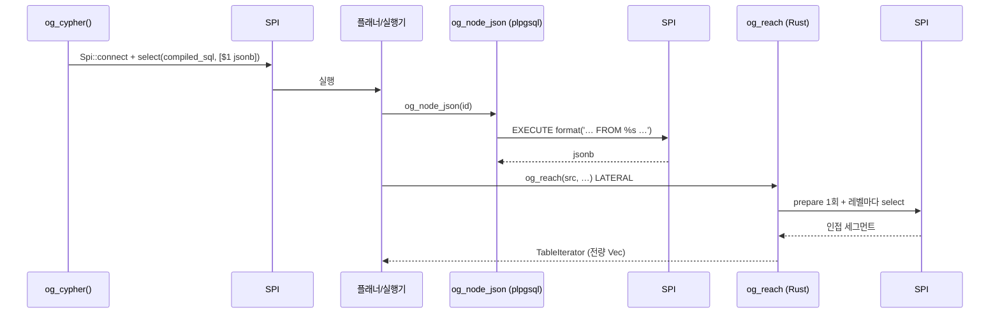

# 프로세스 안전성 — 확장이 DB 프로세스 안에서 돈다는 것

> **이 문서가 답하는 질문**
> - 이 확장에서 발생한 오류가 데이터베이스를 죽일 수 있는가?
> - panic / unwrap 으로 백엔드가 종료되는 경로가 있는가?
> - 메모리는 어디에 할당되고 언제 해제되는가?
> - SPI 재진입과 트랜잭션 상태에 문제가 있는가?

---

## 0. 왜 이 문서가 필요한가 (사실)

`engine/`은 `crate-type = ["cdylib"]`(`engine/Cargo.toml:7-8`)로 빌드되어
PostgreSQL 백엔드 프로세스에 로드된다. 이 프로세스에서:

| 사건 | 결과 |
|---|---|
| Rust `panic!` | pgrx가 잡아 `ereport(ERROR)`로 변환 → **트랜잭션 중단, 백엔드 생존** |
| PostgreSQL `ERROR` | 트랜잭션 중단, 백엔드 생존 |
| PostgreSQL `FATAL` | **해당 백엔드 종료**, 클러스터 생존 |
| SIGSEGV / `abort()` / OOM kill | **postmaster가 전 백엔드를 강제 종료하고 크래시 복구 수행** — 모든 연결 단절 |

프로젝트 헌법도 이를 명시한다:

> `.specify/memory/constitution.md:155`
> "어느 쪽이든 PostgreSQL 메모리 컨텍스트·에러 처리(elog/ereport) 규약을 따른다.
> 확장 안에서의 panic/unwind가 서버를 죽여서는 안 된다."

---

## 1. 확인된 방어

### P-D1. `panic = "unwind"` 가 두 프로파일 모두에 명시되어 있다

```toml
# engine/Cargo.toml:37-45
[profile.dev]
panic = "unwind"

[profile.release]
panic = "unwind"
opt-level = 3
lto = "fat"
codegen-units = 1
```

`panic = "abort"` 였다면 모든 `unwrap()` 실패가 프로세스 `abort()` → 클러스터
크래시 복구였을 것이다. **명시적으로 `unwind`로 고정한 것은 이 프로젝트에서
가장 중요한 단일 안전 결정이다.**

### P-D2. 식별자 인코딩이 오버플로 대신 `ereport`를 낸다

```rust
// engine/src/id.rs:31-45
/// Compose an identifier. Panics (→ `ereport(ERROR)` via pgrx) on overflow so a
/// silently truncated id can never reach storage.
#[inline]
pub fn make_id(shard: i32, type_id: i32, local: i64) -> i64 {
    if !(0..=MAX_SHARD_ID).contains(&shard) { error!("shard id {shard} out of range …"); }
    if !(0..=MAX_TYPE_ID).contains(&type_id) { error!("type id {type_id} out of range …"); }
    if !(0..=MAX_LOCAL_ID).contains(&local) { error!("local id {local} exhausted …"); }
    ((shard as i64) << SHARD_SHIFT) | ((type_id as i64) << TYPE_SHIFT) | local
}
```

세 필드 모두 범위 검사를 거친다. **확인된 방어.**

### P-D3. `og_reach` / `og_csr_*` 는 `PARALLEL RESTRICTED`

```rust
// engine/src/storage/traverse.rs:80
#[pg_extern(stable, parallel_restricted)]
fn og_reach(…)
// engine/src/storage/traverse.rs:359, 442
#[pg_extern(stable, parallel_restricted)]
```

전자는 SPI를, 후자는 백엔드 로컬 `thread_local` 상태를 쓴다. 병렬 워커에는
둘 다 없으므로 `parallel_restricted` 는 **올바른 선언이다.** `docs/api.md:78-79`가
이를 문서화하고 있다.

### P-D4. 쓰기 경로 함수는 전부 기본 `VOLATILE`

`engine/src/storage/mod.rs`의 6개 `#[pg_extern]`, `engine/src/catalog/types.rs`의
8개, `engine/src/interop/mod.rs`의 4개 — 모두 속성 없이 선언되어 pgrx 기본값인
`VOLATILE, PARALLEL UNSAFE`가 적용된다. 쓰기 함수를 `STABLE`로 잘못 선언한
사례는 §4의 하나뿐이다.

### P-D5. PackStream은 잘못된 UTF-8에 panic하지 않는다

```rust
// bolt/src/packstream.rs:219-222
fn string(&mut self, n: usize) -> io::Result<Value> {
    let b = self.bytes(n)?;
    Ok(Value::String(String::from_utf8_lossy(b).into_owned()))
}
```
`from_utf8_lossy`는 실패하지 않는다. 또 `bytes(n)`(`:155-163`)이 길이를 먼저
검사하므로 문자열 경로에는 선할당이 없다. **확인된 방어.**

---

## 2. 확인된 결함 — 오류 상태를 삼키는 `catch_unwind`

```rust
// engine/src/agent/mod.rs:261-292
#[pg_extern(stable)]
fn og_explain_error(graph: &str, query: &str) -> JsonB {
    match crate::cypher::parser::parse(query) {
        Err(e) => JsonB(json!({ … })),
        Ok(_) => {
            let compiled = std::panic::catch_unwind(|| {
                crate::cypher::compile_for_diagnostics(graph, query)
            });
            match compiled {
                Ok(Ok(_)) => JsonB(json!({ "ok": true })),
                Ok(Err(msg)) => JsonB(json!({ … })),
                Err(_) => JsonB(json!({
                    "ok": false,
                    "code": "INTERNAL",
                    "message": "compilation aborted",
                    "stage": "compile",
                })),
            }
        }
    }
}
```

`compile_for_diagnostics` → `compile_cached` → `Compiler::compile_read` 는
PostgreSQL `ERROR`를 낼 수 있는 경로를 여럿 통과한다:

| 경로 | ereport 발생 지점 |
|---|---|
| `types::graph_id(graph)` | `engine/src/catalog/types.rs:118` — 존재하지 않는 그래프 |
| `views::ensure_view(...)` | `engine/src/cypher/views.rs:136` — 뷰 생성 실패 |
| `types::type_kind(tid)` | `engine/src/catalog/types.rs:293` |
| `labeling::*` SPI 호출 | 권한 오류 등 |

pgrx는 PostgreSQL `ERROR`를 Rust unwind로 전파한다. `std::panic::catch_unwind`는
그것을 **잡을 수는 있지만 PostgreSQL의 오류 스택을 비우지(`FlushErrorState`)
않는다.** pgrx가 제공하는 올바른 도구는 `PgTryBuilder` / `pgrx::pg_try()`이며,
이들은 오류 스택 정리와 메모리 컨텍스트 복원을 함께 수행한다.

**재현 조건**: `SELECT og_explain_error('존재하지-않는-그래프', 'MATCH (n) RETURN n');`
`graph_id()`가 `error!("graph '…' does not exist")`를 발생시키고, 그 unwind가
`catch_unwind`에 잡혀 `"compilation aborted"` JSON이 정상 반환된다 — 즉
**PostgreSQL은 오류를 냈다고 생각하는데 함수는 성공적으로 값을 돌려준다.**
이후 같은 트랜잭션에서 수행되는 SPI 호출의 동작은 정의되지 않는다.

**영향 범위**: Studio의 `POST /api/diagnose`가 이 함수를 무조건 호출한다
(`portal/server/index.js:237`). 즉 UI에서 오타 하나로 도달한다.

> 정확한 귀결(백엔드 크래시 여부, `ERRORDATA_STACK_SIZE exceeded`)은 pgrx 0.19.2
> 내부 구현에 달려 있어 **동적으로 검증하지 않았다(미확인)**. 그러나 "PostgreSQL
> 오류를 `FlushErrorState` 없이 삼킨다"는 사실 자체는 코드로 확정된다.

---

## 3. 확인된 결함 — PostgreSQL 메모리 컨텍스트 밖의 무제한 할당

### 3.1 백엔드 로컬 CSR

```rust
// engine/src/storage/traverse.rs:205-210
thread_local! {
    /// One compiled graph per backend. Rust-heap allocated on purpose: a
    /// PostgreSQL memory context would free it at end of transaction, and the
    /// whole point is that the next statement finds it already built.
    static CSR: RefCell<Option<Csr>> = const { RefCell::new(None) };
}
```

주석이 의도를 명시한다. 결과적인 사실:

| 사실 | 근거 |
|---|---|
| 할당 크기에 상한이 없다 | `compile()`(`traverse.rs:241-292`)이 `og_data.og_adj` 전체를 읽어 `ids`/`fwd`/`rev`를 만든다 |
| `work_mem`·`maintenance_work_mem`이 적용되지 않는다 | Rust `Vec`이므로 PostgreSQL 할당자를 거치지 않는다 |
| 트랜잭션 종료·`ROLLBACK`으로 해제되지 않는다 | `thread_local`, 해제는 `og_csr_drop()`(`:317`)이나 백엔드 종료뿐 |
| 커넥션 풀에서는 **연결마다** 유지된다 | 같은 이유 |
| 크기 보고는 있으나 강제는 없다 | `og_csr_stats()`(`:323`)가 바이트 수를 보고할 뿐 |

**결과**: 큰 그래프에서 `og_csr_build()`를 반복 호출하면 백엔드 RSS가
PostgreSQL이 모르는 채로 증가한다. Linux OOM killer가 백엔드를 죽이면
postmaster는 이를 비정상 종료로 보고 **클러스터 전체를 크래시 복구 모드로
재시작한다.** CWE-770.

### 3.2 질의 결과 전량 물질화

| 지점 | 코드 | 상한 |
|---|---|---|
| `og_cypher` 결과 | `engine/src/cypher/mod.rs:150` `.collect()` | 없음 |
| `og_reach` 결과 | `engine/src/storage/traverse.rs:121, 157, 160` | 방문 노드 수 |
| `og_reach` 방문 집합 | `engine/src/storage/traverse.rs:118` `HashSet::with_capacity(1024)` | 없음 |
| `og_csr_reach` 결과 | `engine/src/storage/traverse.rs:371` | 없음 |
| Bolt 결과 버퍼 | `bolt/src/session.rs:291-320` | 없음 — `PULL n`이 **전송량만** 제한하고 인출은 전량 |

`SetOfIterator`/`TableIterator`가 스트리밍처럼 보이지만, 세 경우 모두 `Vec`을
먼저 다 채운 뒤 반환한다.

---

## 4. 확인된 결함 — 휘발성(volatility) 오선언

```rust
// engine/src/cypher/mod.rs:69-80
/// Show the SQL a Cypher query compiles to.
#[pg_extern(stable)]
fn og_cypher_sql(graph: &str, query: &str) -> String {
    match compile_cached(graph, query) {
        Ok((sql, _)) => sql,
        Err(e) => error!("{e}"),
    }
}
```

`compile_cached` → `Compiler::compile_read` → `views::ensure_view` →
`Spi::run("CREATE OR REPLACE VIEW …")` (`engine/src/cypher/views.rs:135`).

즉 **`STABLE`로 선언된 함수가 DDL을 실행한다.** `STABLE`은 "같은 문장 안에서
같은 인자에 같은 값을 돌려주며 데이터베이스를 수정하지 않는다"는 계약이다.

| 결과 | 설명 |
|---|---|
| 읽기 전용 트랜잭션에서 실패 | `SET default_transaction_read_only = on` 상태에서 첫 호출이 뷰를 만들려다 오류 — `og_apply_role`의 `read_only` 한도(`agent/mod.rs:432-436`)와 정면 충돌 |
| 읽기 복제본(spec 007)에서 실패 | 핫 스탠바이에서 DDL 불가 |
| Studio가 매 질의마다 호출한다 | `portal/server/index.js:198` |

같은 문제가 `og_vector_search`·`og_similar`·`og_hybrid_search`·
`og_vector_search_exact`(`engine/src/vector/mod.rs:112, 171, 247, 425`)와
`compat/procs.rs:226`에도 있다 — 모두 `ensure_view`를 부른다. 이 중
`og_stale_embeddings`(`vector/mod.rs:299-300`)와 `og_embedding_stats`(`:383-384`)만
`stable`이며 뷰를 만들지 않아 문제없다.

---

## 5. 쓰기 시점 DDL — 잠금과 자원 소모

```rust
// engine/src/storage/mod.rs:127-153
Some((_, col, dtype))
    if WIDENABLE.contains(&dtype.as_str()) && !type_accepts(dtype, want) =>
{
    let name = types::try_type_name(type_id);
    for sub in labeling::og_subtypes(type_id) {
        if let Some(table) = types::storage_table(sub) {
            if let Some(n) = types::try_type_name(sub) { types::drop_alias_view(&n); }
            let _ = Spi::run(&format!(
                "ALTER TABLE {table} ALTER COLUMN {col} TYPE text USING {col}::text"
            ));
            if let Some(n) = types::try_type_name(sub) { types::ensure_alias_view(sub, &n, &table); }
        }
    }
```

이 코드는 **평범한 Cypher 쓰기**에서 실행된다:
`create_node_inner` → `plan_props`(`:180`) → `declare_new_props`(`:87`).

| 사실 | 근거 | 함의 |
|---|---|---|
| `ALTER COLUMN … TYPE text USING …` 은 테이블 **전체 재작성**이다 | PostgreSQL 동작 | 대형 타입에서 수 분 단위 정지 |
| `ACCESS EXCLUSIVE` 잠금을 잡는다 | 동상 | 해당 타입과 **모든 하위 타입**의 읽기·쓰기 전면 차단 |
| 하위 타입 전체에 반복 적용된다 | `for sub in labeling::og_subtypes(type_id)` (`:131`) | 계층 전체 정지 |
| 트리거 조건은 값 하나의 타입 불일치다 | `type_accepts`(`:67-73`) | `SET n.age = 'x'` 한 줄로 유발 |
| 뷰를 지웠다 다시 만든다 | `:136-142` | 그동안 뷰 부재 |
| 결과를 `let _ =` 로 버린다 | `:138` | 실패해도 후속 쓰기가 진행 |

또한 새 프로퍼티 이름마다 `og_add_property` → `ALTER TABLE … ADD COLUMN`
(`engine/src/catalog/types.rs:550`)이 실행된다. PostgreSQL의 테이블당 컬럼
한도(1600)에 도달하면 이후 쓰기가 전부 실패한다.

**재현 조건**: 어떤 애플리케이션이든 `int8`로 승격된 프로퍼티에 문자열을
한 번 쓰면 된다. 인증된 저권한 사용자(A4)로 충분하다.

---

## 6. SPI 재진입

컴파일된 Cypher SQL은 확장 함수를 다시 호출한다. 실행 중첩은 다음과 같다.



감사 결과:

| 항목 | 상태 | 근거 |
|---|---|---|
| SPI 중첩 자체 | 허용됨 — PostgreSQL이 지원 | `engine/src/spiu.rs` 가 `Spi::connect` 로 매 호출 진입 |
| `og_reach` 는 레벨마다 재계획하지 않는다 | **확인된 방어** | `traverse.rs:99-116` 주석과 `client.prepare(...)` 1회 |
| 쓰기 경로에서 SPI 안에 DDL이 들어간다 | **위험** (§5) | `storage/mod.rs:112-118` 이 `og_add_property`를 SPI로 호출 |
| `og_capture_history` 트리거가 다시 SPI를 쓴다 | 트리거→`UPDATE og_history`+`INSERT og_history` | `access.sql:288-292` |
| 트리거 재귀 가능성 | 없음 — `og_history`는 타입 테이블이 아니라 트리거가 붙지 않는다 | `agent/mod.rs:452-461` 이 `og_subtypes` 의 storage table에만 부착 |

---

## 7. 컴파일 캐시의 무효화 부재

```rust
// engine/src/cypher/mod.rs:26-31
thread_local! {
    /// Compiled-SQL cache. …
    static PLAN_CACHE: RefCell<HashMap<(String, String), (String, Vec<String>)>> =
        RefCell::new(HashMap::new());
}
```
```rust
// engine/src/cypher/mod.rs:47-67
fn compile_cached(graph: &str, query: &str) -> Result<(String, Vec<String>), String> {
    let key = (graph.to_string(), query.to_string());
    if let Some(hit) = PLAN_CACHE.with(|c| c.borrow().get(&key).cloned()) {
        return Ok(hit);
    }
    …
    PLAN_CACHE.with(|cache| {
        let mut m = cache.borrow_mut();
        if m.len() > 512 { m.clear(); }
        m.insert(key, out.clone());
    });
```

한편 스키마가 바뀌면 뷰가 전부 삭제된다:

```rust
// engine/src/catalog/labeling.rs:172-182
pub fn bump_schema_version(graph_id: i32, description: &str) {
    // Generated per-type union views encode the descendant set, so any schema
    // change invalidates them (spec 003 / cypher::views).
    crate::cypher::views::drop_all_views();
```

**캐시는 무효화되지 않는다.** 결과:

| 상황 | 결과 |
|---|---|
| 스키마 변경 후 같은 백엔드에서 캐시된 질의 재실행 | 캐시된 SQL이 삭제된 `og_data.v_<tid>`를 참조 → `relation … does not exist` |
| 캐시 키에 스키마 버전이 없다 | `(graph, query)` 뿐 (`:48`) |
| 캐시 키에 `session_user`가 없다 | `SET ROLE` 이후에도 같은 SQL 재사용 (실행 권한은 실행 시점에 검사되므로 인가 우회는 아님) |
| 512개 초과 시 전체 비움 | LRU가 아니라 `clear()` — 캐시 스톰 |
| Studio는 커넥션 풀(`max: 8`)을 쓴다 | 8개 백엔드가 각자 낡은 캐시를 들고 있다 |

---

## 8. 정수·경계 관련 (낮은 위험, 기록용)

| 지점 | 문제 | 실현 가능성 |
|---|---|---|
| `engine/src/storage/traverse.rs:224-238` `pack()` | `offs`가 `u32` — 간선 40억 초과 시 랩어라운드 | 극히 낮음 |
| `engine/src/storage/traverse.rs:272` `pos()` | `as u32` 절단 — 노드 40억 초과 | 극히 낮음 |
| `engine/src/storage/traverse.rs:272` `.expect("id present by construction")` | 배열 불변식 위반 시 panic → ERROR | 낮음 (P-D1로 완화) |
| `engine/src/vector/mod.rs:249` `(k * 10).max(50)` | `k` 가 크면 `i32` 오버플로 → 음수 `LIMIT` | 낮음 — ERROR로 귀결 |
| `bolt/src/packstream.rs:156` `self.pos + n` | 32비트 플랫폼에서 `usize` 오버플로 → 경계 검사 우회 | 64비트에서는 불가 |
| `bolt/src/packstream.rs:165-171` `marker - base` | `u8` 언더플로 — 호출부(`:187-199`)가 범위를 보장 | 불가 |
| `bolt/src/packstream.rs:87` `fields.len() as u8 & 0x0F` | 필드 16개 이상이면 개수가 조용히 절단 → 프로토콜 desync | 서버 생성 값이라 낮음 |

---

## 9. 별도 프로세스 — Bolt 게이트웨이

Bolt 게이트웨이는 **PostgreSQL과 다른 프로세스**이므로 여기서의 크래시는
데이터베이스를 죽이지 않는다. 그러나 게이트웨이 자체는 인증 전에 죽는다.

| # | 결함 | 코드 | 결과 |
|---|---|---|---|
| B-1 | 길이 필드로 선할당 | `bolt/src/packstream.rs:192-195, 224-225` — `self.size(m, 0xD4)?` 가 최대 `u32::MAX`를 돌려주고 `Vec::with_capacity(n)`에 그대로 들어간다 | Rust 할당 실패 → `handle_alloc_error` → **`abort()`** (인증 전) |
| B-2 | 메시지 총 길이 상한 없음 | `bolt/src/packstream.rs:266-283` — 종료 청크가 올 때까지 `body.resize` 반복 | 메모리 고갈 (인증 전) |
| B-3 | 재귀 깊이 제한 없음 | `bolt/src/packstream.rs:173-217` — `value()` → `list()`/`dict()`/Struct → `value()` | 스택 오버플로 → **SIGSEGV** (인증 전) |
| B-4 | 연결·스레드 수 제한 없음 | `bolt/src/main.rs:60-79` — `thread::spawn` 무제한 | 스레드/메모리 고갈 |
| B-5 | 읽기 타임아웃 없음 | `set_read_timeout` 호출 없음 (`main.rs`, `session.rs` 전체) | 유휴 연결이 스레드를 영구 점유 |

B-1의 재현 조건: 핸드셰이크 20바이트를 보낸 뒤, 하나의 청크 안에
리스트 32비트 헤더(`0xD6`)와 최대 길이를 담아 보내면 된다. HELLO는 필요 없다
(`bolt/src/session.rs:113`이 인증 이전에 `read_message`를 호출한다).

---

## 10. `unwrap` / `expect` 분포 (참고)

`unwrap()`, `expect(`, `panic!`, `unreachable!`, 직접 인덱싱(`[0]`) 합계:

| 파일 | 건수 |
|---|---|
| `engine/src/catalog/types.rs` | 39 |
| `engine/src/cypher/compile.rs` | 32 |
| `engine/src/storage/mod.rs` | 25 |
| `engine/src/typeql/parser.rs` | 22 |
| `engine/src/storage/stats.rs` | 20 |
| `engine/src/agent/mod.rs` | 14 |
| `bolt/src/packstream.rs` | 9 |

P-D1(`panic = "unwind"`) 덕분에 이들은 모두 **PostgreSQL ERROR로 귀결되며
백엔드를 죽이지 않는다.** 다만 §2의 `catch_unwind`가 그 규약을 깨는
유일한 지점이라는 점이 중요하다. Bolt 프로세스에는 그런 안전망이 없다(§9).

---

## Forbidden (금지)

- **`std::panic::catch_unwind` 를 PostgreSQL `ERROR`가 발생할 수 있는 코드
  주위에 쓰지 말 것.** `pgrx::PgTryBuilder` 를 쓸 것 (`agent/mod.rs:271`이 반례).
- **`engine/Cargo.toml` 의 `panic = "unwind"` 를 제거하거나 `"abort"`로 바꾸지 말 것.**
  헌법 원칙(`.specify/memory/constitution.md:155`) 위반이며 클러스터 크래시로 직결된다.
- **PostgreSQL 메모리 컨텍스트 밖에 상한 없는 자료구조를 새로 만들지 말 것.**
  기존 예외는 `traverse.rs:205-210`의 CSR 하나이며, 상한이 필요하다.
- **`STABLE` / `IMMUTABLE` 로 선언한 함수 안에서 DDL이나 쓰기를 하지 말 것**
  (`cypher/mod.rs:74`가 반례).
- **PackStream 파서에 길이 필드를 그대로 `with_capacity`에 넘기는 코드를
  추가하지 말 것** (`packstream.rs:225`가 반례).
- **RLS를 쓰는 배포에서 `og_csr_build`를 실행 가능한 상태로 두지 말 것**
  ([`03_rls_and_isolation.md`](03_rls_and_isolation.md) B6, 그리고 §3.1의 메모리 문제).

## Required (필수)

- 새 `#[pg_extern]`을 추가할 때 휘발성을 명시적으로 선언할 것.
  뷰를 생성하거나 SPI 쓰기를 하면 `VOLATILE`이어야 한다.
- `og_csr_build`에 크기 상한을 도입할 것 — 최소한
  `og_catalog.setting` 의 키(예: `csr.max_bytes`)로 읽어 초과 시 `error!`.
- Bolt 파서에 (a) 메시지 총 길이 상한, (b) 컬렉션 길이 상한, (c) 재귀 깊이
  상한을 도입할 것. 세 가지 모두 인증 이전 경로에 있다.
- `PLAN_CACHE` 키에 `og_catalog.schema_version` 의 현재 값을 포함시킬 것.
- 스키마 변경 후 기존 커넥션에서 캐시된 질의가 동작하는지 회귀 테스트를
  `engine/tests/sql/` 에 추가할 것.

<!-- affects: security, backend, ops -->
<!-- requires-update: 07_security/09_improvements_security.md, 07_security/06_network_exposure.md -->
