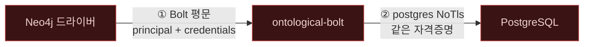
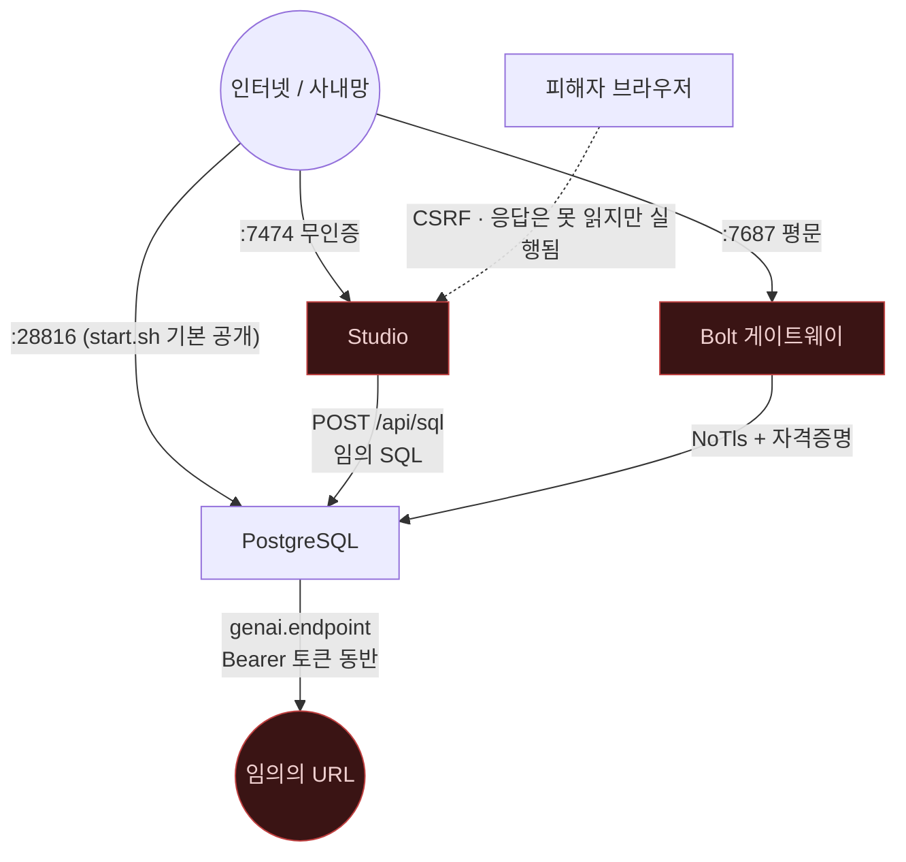

# 네트워크 노출과 비밀 관리

> ⚠️ **이 문서는 감사 커밋 `7d60c82` 시점의 스냅샷이다.** 이후 Critical 5건과
> High 8건(4건 수정 · 4건 부분)이 반영되었으므로, 여기 서술된 결함 중 일부는 **현재 코드에 더 이상
> 존재하지 않는다.** 현재 상태는 [10_fixed.md](10_fixed.md) 를 볼 것.


> **이 문서가 답하는 질문**
> - 이 시스템은 어떤 포트를 열고, 기본값은 무엇에 바인드되는가?
> - TLS는 어디에 있고 어디에 없는가?
> - 데이터베이스가 바깥으로 나가는 통신은 무엇이며 SSRF가 가능한가?
> - 비밀(자격증명·API 토큰)은 어디에 저장되는가?

---

## 1. 열리는 포트 (사실)

| 포트 | 프로세스 | 기본 바인드 | TLS | 인증 | 근거 |
|---|---|---|---|---|---|
| `5432` (또는 `OG_PGPORT`, 개발 기본 `28816`) | PostgreSQL | 배포 설정에 의존 (미확인) | PostgreSQL 설정 | `pg_hba.conf` (저장소에 없음) | `start.sh:9` |
| `7687` (`OG_BOLT_LISTEN`) | `ontological-bolt` | **`0.0.0.0:7687`** | **없음** | HELLO 시 PostgreSQL 위임 | `bolt/src/main.rs:37` |
| `7474` (`PORT`) | `portal/server/index.js` | **모든 인터페이스** | **없음** | **없음** | `portal/server/index.js:17, 368` |

### 1.1 Bolt 게이트웨이

```rust
// bolt/src/main.rs:36-52
fn main() {
    let listen = env_or("OG_BOLT_LISTEN", "0.0.0.0:7687");
    …
    let listener = match TcpListener::bind(&listen) {
```

`TcpListener`는 평문이다. TLS 래퍼가 없다(`bolt/Cargo.toml` 의존성:
`postgres`, `serde_json` 뿐 — rustls/native-tls 없음).
`README.md:153`이 "Bolt 5.x, `Path` and TLS not yet"라고 이미 밝히고 있다.

### 1.2 Studio

```js
// portal/server/index.js:368-372
server.listen(PORT, () => {
  process.stdout.write(
    `Ontological Studio on http://localhost:${PORT}  (postgres ${pool.options.host}:${pool.options.port}/${pool.options.database})\n`
  );
});
```

`listen(port, callback)` 형태에는 호스트 인자가 없다. Node.js는 이 경우
**사용 가능한 모든 IPv6/IPv4 주소에 바인드**한다. 그런데 로그는
`http://localhost:${PORT}` 라고 출력한다 — **표시와 실제가 불일치한다.**

### 1.3 컨테이너 포트 공개

```bash
# start.sh:26-27
        -v ontological-cargo:/home/dev/.cargo/registry \
            -p "$PGPORT":"$PGPORT" -p "$BOLTPORT":7687 \
```

`-p 28816:28816` 은 바인드 주소가 없으므로 Docker가 `0.0.0.0`에 게시한다.
즉 개발 스크립트 하나로 **PostgreSQL과 Bolt가 호스트의 모든 인터페이스에서
도달 가능해진다.** 안전한 형태는 `-p 127.0.0.1:28816:28816` 이다.

PostgreSQL 자체는 `cargo pgrx start pg16`(`start.sh:38`)으로 뜬다.
그 클러스터의 `pg_hba.conf` 인증 방식은 저장소에서 확인할 수 없다(**미확인**).
저장소 전체에서 `scram-sha-256`, `md5`, `-A ` 문자열이 검색되지 않는다.

---

## 2. Studio — 인증 없는 임의 SQL 실행

가장 심각한 단일 결함이다.

```js
// portal/server/index.js:295-308
  /** Raw SQL escape hatch — this is still PostgreSQL underneath. */
  async 'POST /api/sql'(req, res) {
    const { sql = '' } = await readBody(req);
    try {
      const r = await pool.query(sql);
      json(res, 200, {
        rows: r.rows,
        columns: r.fields ? r.fields.map((f) => f.name) : [],
        rowCount: r.rowCount,
      });
    } catch (e) {
      json(res, 400, pgError(e));
    }
  },
```

| 사실 | 근거 |
|---|---|
| 인증·인가 검사가 없다 | `portal/server/index.js:344-355` 의 디스패처에 훅이 없다 |
| SQL 검증이 없다 | `pool.query(sql)` 직접 호출 |
| 고정 풀 자격증명으로 실행된다 | `portal/server/index.js:21-29` (`PGUSER` 기본 `dev`) |
| 모든 인터페이스에서 도달 가능 | §1.2 |
| 풀 사용자가 슈퍼유저면 파일 읽기·`COPY … FROM PROGRAM` 도 가능 | PostgreSQL 동작 |

### 2.1 CSRF로도 도달한다

CORS 헤더가 없으므로 브라우저는 **응답을 읽지 못한다.** 그러나 요청 자체는
전송된다. `readBody`는 `content-type`을 확인하지 않는다:

```js
// portal/server/index.js:48-64
function readBody(req) {
  return new Promise((resolve, reject) => {
    let data = '';
    req.on('data', (c) => {
      data += c;
      if (data.length > 4e6) reject(new Error('request too large'));
    });
    req.on('end', () => {
      try {
        resolve(data ? JSON.parse(data) : {});
```

따라서 `text/plain` 본문으로 보내는 "단순 요청(simple request)"은 프리플라이트
없이 통과하고, 서버는 그것을 JSON으로 파싱한다. 즉 **임의의 웹 페이지가
피해자 브라우저를 통해 블라인드로 SQL을 실행시킬 수 있다** (CWE-352).
`localhost`에서만 돈다는 사실은 이 공격을 막지 못한다 — 브라우저는
`http://localhost:7474`에 접근할 수 있다.

### 2.2 `readBody`의 크기 제한이 실제로 제한하지 않는다

`data.length > 4e6`에서 `reject`하지만 **요청 스트림을 파괴하지 않는다.**
`req.on('data')` 핸들러는 계속 실행되어 `data`가 계속 자란다. 즉 4 MB 제한은
Promise 결과만 바꿀 뿐 메모리 증가를 멈추지 않는다 (CWE-400).

### 2.3 무인증 정보 노출 라우트

| 라우트 | 노출 내용 | 근거 |
|---|---|---|
| `GET /api/audit` | 최근 100건의 **모든 주체의 질의 원문**·주체명·시각 | `portal/server/index.js:283-293` |
| `GET /api/health` | 확장 버전, DB명, `version()` 전체 문자열, 그래프 목록 | `:151-165` |
| `GET /api/schema` | 전체 온톨로지 + 인스턴스 카운트 | `:168-179` |
| `POST /api/explain` | **컴파일된 SQL 전문과 실행 계획** | `:218-230` |
| `POST /api/cypher` | 결과 + `compiled_sql` | `:198-208` |
| `POST /api/diagnose` | 내부 진단 | `:233-253` |

### 2.4 정적 파일 서빙 — 경로 순회는 막혀 있다 (확인된 방어)

```js
// portal/server/index.js:357-363
  let file = url.pathname === '/' ? '/index.html' : url.pathname;
  const full = path.join(WEB_DIR, path.normalize(file).replace(/^(\.\.[/\\])+/, ''));
  if (!full.startsWith(WEB_DIR) || !fs.existsSync(full)) {
```

`url.pathname`은 항상 `/`로 시작하므로 `path.normalize`가 선행 `..`를 흡수하고,
`path.join(WEB_DIR, …)`이 항상 `WEB_DIR` + 구분자로 시작하는 경로를 만든다.
`startsWith` 검사는 그 위에서 중복 방어로 동작한다.
**경로 순회는 발견되지 않았다.**
(개선 여지: `full.startsWith(WEB_DIR + path.sep)`가 더 견고하고,
`WEB_DIR` 안의 심볼릭 링크는 여전히 따라간다.)

### 2.5 보안 응답 헤더 없음

`json()`(`:39-46`)과 정적 응답(`:364`) 어디에도 `Content-Security-Policy`,
`X-Content-Type-Options`, `X-Frame-Options`, `Referrer-Policy`가 없다.

---

## 3. Bolt — 평문 자격증명과 무제한 시도

### 3.1 자격증명이 두 구간 모두에서 평문으로 흐른다



① `bolt/src/main.rs:46` — 평문 `TcpListener`.
② `bolt/src/session.rs:182` — `cfg.connect(NoTls)`.

`NoTls`는 단순히 TLS를 쓰지 않는 것이 아니라, **PostgreSQL이 TLS를 요구하면
접속이 실패**하게 만든다. 즉 게이트웨이를 쓰려면 PostgreSQL 쪽에서
`hostssl`이 아닌 `host` 규칙을 열어야 한다.

### 3.2 계정 열거와 무제한 추측

```rust
// bolt/src/session.rs:182-184
let client = cfg.connect(NoTls).map_err(|e| {
    Failure::client("Neo.ClientError.Security.Unauthorized", pg_message(&e))
})?;
```
```rust
// bolt/src/session.rs:604-606
fn pg_message(e: &postgres::Error) -> String {
    e.as_db_error().map(|d| d.message().to_string()).unwrap_or_else(|| e.to_string())
}
```

PostgreSQL의 원문 메시지가 그대로 클라이언트로 간다.
`role "alice" does not exist` 와 `password authentication failed for user "alice"`는
서로 다른 문자열이므로 **계정 존재 여부가 구분된다** (CWE-204).
시도 횟수 제한·지연·잠금이 없다(`bolt/src/main.rs:60-79`) — PostgreSQL 자체에도
계정 잠금 기능이 없다. 결과적으로 **네트워크에 노출된 무제한 암호 추측 오라클**이다.

### 3.3 인증 전에 도달하는 파서

```rust
// bolt/src/session.rs:111-124
fn run(&mut self, stream: &mut TcpStream) -> io::Result<()> {
    loop {
        let msg = ps::read_message(stream)?;
        let Value::Struct(sig, fields) = msg else { … };
        if sig == GOODBYE { return Ok(()); }
        …
        let reply = self.dispatch(sig, fields, stream)?;
```

`dispatch`가 HELLO를 요구하기 **전에** `read_message`가 완료되어야 한다.
따라서 [`05_process_safety.md`](05_process_safety.md) §9의 B-1·B-2·B-3
(선할당 abort / 무제한 버퍼 / 스택 오버플로)이 전부 **인증 전에 도달 가능**하다.

또한 `ROUTE`는 인증 검사 없이 응답한다(`session.rs:148` → `:388-407`) —
`OG_BOLT_ADVERTISED` 값이 익명 클라이언트에게 노출된다(경미).

### 3.4 결과 전량 물질화

```rust
// bolt/src/session.rs:291-320
let rows = { … pg.query("SELECT og_cypher($1::text, $2::text, $3::text::jsonb)::text", …)? };
let mut records = Vec::with_capacity(rows.len());
…
self.pending = records;
```

`PULL n`은 `self.pending`에서 꺼내는 개수만 제한한다(`session.rs:347-357`).
인출 자체는 전량이다. 인증된 사용자가 대형 결과를 요구하면 게이트웨이
프로세스의 메모리가 결과 크기만큼 필요하다.

---

## 4. 아웃바운드 — `genai.vector.encode`

### 4.1 확인된 방어

`engine/src/compat/genai.rs:13-25` 의 모듈 주석이 설계를 명시한다:

```rust
//! - **Off unless turned on.** `genai.enabled` must be `on`.
//! - **The endpoint is configuration, never an argument.** Neo4j lets the call
//!   name its own endpoint. Here it cannot: the URL comes from
//!   `genai.endpoint`, so a caller who can write Cypher cannot make the server
//!   fetch a URL of their choosing. Query rights are not fetch rights.
//! - **Bounded.** `genai.timeout_ms` caps the wait; the default is short.
```

코드로 검증한 결과:

| 주장 | 검증 결과 |
|---|---|
| 기본 비활성 | **참** — `genai.rs:101-107`, `setting("genai.enabled") != Some("on")` 이면 `error!` |
| 엔드포인트가 인자가 아님 | **참** — `og_genai_encode`의 인자는 `resource`, `provider`, `configuration` 뿐(`:96-100`). `configuration`에서 읽는 키는 `model`(`:128-133`)과 `dimensions`(`:160-163`) 뿐 |
| 타임아웃 존재 | **참** — `:135-139`, 기본 5,000 ms (`DEFAULT_TIMEOUT_MS`, `:41`) |
| 프로바이더 화이트리스트 | **참** — `:121-126`, `ollama` / `openai` / `azureopenai` 만 |
| 함수 휘발성 | **적절** — 속성 없음 = `VOLATILE, PARALLEL UNSAFE` |
| TLS 검증 | ureq의 `tls` 피처 사용(`engine/Cargo.toml:29`). 인증서 검증은 ureq 기본값에 의존하며 **명시적으로 끄는 코드는 없다**. 루트 저장소가 시스템 것인지 번들 것인지는 **미확인** |

### 4.2 확인된 결함 — 우회 경로

"Cypher를 쓸 수 있는 호출자가 서버로 하여금 임의 URL을 가져오게 만들 수 없다"는
주장은 **`og_genai_encode` 한 함수에 대해서만 참**이다. 같은 파일에 설정을
바꾸는 함수가 함께 있다:

```rust
// engine/src/compat/genai.rs:53-63
/// Write one setting. Exists so configuring this does not mean knowing the
/// catalog's table layout.
#[pg_extern]
fn og_set_setting(key: &str, value: &str) {
    Spi::run_with_args(
        "INSERT INTO og_catalog.setting (key, value) VALUES ($1, $2)
         ON CONFLICT (key) DO UPDATE SET value = EXCLUDED.value",
        &[key.into(), value.into()],
    )
```

| 사실 | 결과 |
|---|---|
| `og_set_setting`에 권한 검사가 없다 | `og_catalog.setting` 에 `INSERT`/`UPDATE` 권한만 있으면 누구나 호출 |
| 키 화이트리스트가 없다 | `genai.endpoint`, `genai.enabled`, `genai.token` 전부 변경 가능 |
| `endpoint` 문자열에 스킴·호스트 검증이 없다 | `ureq::post(&endpoint)`(`:139`)에 그대로 전달 |
| 그 요청에 저장된 `Bearer` 토큰이 붙는다 | `:140-142` |

**SSRF 연쇄 (재현 조건)**:
1. 공격자가 `og_set_setting('genai.enabled','on')` 및
   `og_set_setting('genai.endpoint', <내부 주소 또는 공격자 서버>)` 호출.
2. `og_genai_encode('x')` 호출.
3. 데이터베이스 백엔드가 그 주소로 POST를 보내며 **저장된 `genai.token`을
   `Authorization: Bearer` 헤더에 실어 보낸다.**

즉 하나의 결함으로 (a) 내부망 스캔/접근(CWE-918)과
(b) API 토큰 유출(CWE-522)이 동시에 성립한다.
클라우드 메타데이터 주소(`169.254.169.254`)도 차단되지 않는다.

### 4.3 오류 메시지에 엔드포인트가 포함된다

```rust
// engine/src/compat/genai.rs:148
Err(e) => error!("embedding request to '{endpoint}' failed: {e}"),
```
내부 호스트명·포트가 오류 메시지로 새어 나가며, 이는 SSRF 탐침의 응답 채널로도
쓰인다(블라인드가 아닌 SSRF).

---

## 5. 비밀 관리 (사실)

| 비밀 | 저장 위치 | 상태 |
|---|---|---|
| 임베딩 API 토큰 | `og_catalog.setting` 의 `genai.token` 행 (`engine/src/compat/genai.rs:140`) | **평문 text 컬럼** |
| 같은 토큰 | `pg_dump` 출력 | **포함됨** — `bootstrap.sql:420-422` 가 `og_catalog.setting` 을 확장 설정 데이터로 등록하며, 제외 조건은 시드 키 4개(`chunk_size`, `supernode_threshold`, `inference_max_depth`, `schema_version`)뿐 |
| PostgreSQL 암호 (Bolt) | 클라이언트 → 게이트웨이 → PG, **양 구간 평문** | `session.rs:171, 182` |
| PostgreSQL 암호 (Studio) | `PGPASSWORD` 환경변수, 기본값 없음 | `portal/server/index.js:26` — `undefined` 이면 암호 없이 접속 시도 |
| Bolt 접속 설정 | 환경변수 `OG_BOLT_*` | `bolt/src/main.rs:32-44` |
| 개발 컨테이너 sudo | `dev ALL=(ALL) NOPASSWD:ALL` | `docker/Dockerfile.dev:13` |

`bootstrap.sql:420-422`:

```sql
-- The extension script seeds these keys, so restoring them again would collide.
SELECT pg_catalog.pg_extension_config_dump('og_catalog.setting',
    'WHERE key NOT IN (''chunk_size'', ''supernode_threshold'',
                       ''inference_max_depth'', ''schema_version'')');
```

`genai.token` 은 이 예외 목록에 없으므로 **모든 백업에 평문으로 들어간다.**
토큰을 마스킹해 읽는 함수도 없다 — `og_catalog.setting` 에 `SELECT` 권한이 있는
모든 역할이 토큰을 그대로 읽는다.

---

## 6. 노출 요약 다이어그램



---

## Forbidden (금지)

- **Studio(`:7474`)를 `127.0.0.1` 이외에 바인드하지 말 것.** 인증이 없고
  `POST /api/sql`이 임의 SQL을 실행한다(`portal/server/index.js:296-308`).
- **Studio를 인증 프록시 뒤에 두는 것으로 충분하다고 여기지 말 것.**
  CSRF로 피해자 브라우저를 경유해 도달한다(§2.1).
- **Studio를 실행한 채로 신뢰할 수 없는 웹사이트를 같은 브라우저에서 열지 말 것.**
- **Bolt 포트를 공용 네트워크에 노출하지 말 것.** TLS가 없다.
- **`start.sh`를 공유 호스트나 공용 IP를 가진 머신에서 그대로 실행하지 말 것.**
  `-p` 게시가 `0.0.0.0`이다(`start.sh:26-27`).
- **`og_set_setting` 실행 권한을 애플리케이션 역할에 남겨두지 말 것.**
  아웃바운드 URL과 API 토큰을 모두 바꿀 수 있다.
- **`og_catalog.setting` 에 `SELECT` 권한을 넓게 부여하지 말 것.**
  `genai.token` 이 평문으로 들어 있다.
- **`genai.token` 이 설정된 데이터베이스의 `pg_dump` 출력을 비밀 관리 없이
  보관·전송하지 말 것.**
- **`docker/Dockerfile.dev` 를 프로덕션 이미지의 기반으로 쓰지 말 것.**
  `dev` 사용자에게 무암호 sudo가 부여되어 있다.

## Required (필수)

- Studio를 실행할 때는 반드시 `server.listen(PORT, '127.0.0.1')` 로 고정하거나,
  최소한 방화벽으로 외부 접근을 차단할 것.
- `start.sh` 의 포트 게시를 `-p 127.0.0.1:$PGPORT:$PGPORT -p 127.0.0.1:$BOLTPORT:7687`
  로 바꿀 것.
- Bolt를 쓴다면 상호 TLS를 제공하는 터널(WireGuard/stunnel/서비스 메시) 안에
  둘 것. 애플리케이션 계층에는 TLS가 없다.
- PostgreSQL `pg_hba.conf` 에 `scram-sha-256` 을 명시할 것 — 저장소가
  기본값을 제공하지 않는다.
- `genai.endpoint` 를 쓰는 배포에서는 데이터베이스 호스트의 아웃바운드를
  임베딩 서비스 주소로만 허용하는 방화벽 규칙을 둘 것. 코드에는 허용 목록이 없다.
- 새 포트를 여는 코드를 추가하면 §1 표와 §6 다이어그램을 함께 갱신할 것.

<!-- affects: security, backend, frontend, ops -->
<!-- requires-update: 07_security/08_secure_deployment.md, 07_security/09_improvements_security.md -->
