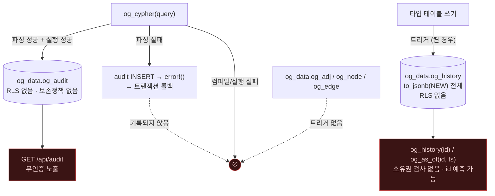

# 감사 로그, 히스토리, 시점 조회의 보안적 의미

> ⚠️ **이 문서는 감사 커밋 `7d60c82` 시점의 스냅샷이다.** 이후 Critical 5건과
> High 8건(4건 수정 · 4건 부분)이 반영되었으므로, 여기 서술된 결함 중 일부는 **현재 코드에 더 이상
> 존재하지 않는다.** 현재 상태는 [10_fixed.md](10_fixed.md) 를 볼 것.


> **이 문서가 답하는 질문**
> - 무엇이 감사 로그에 기록되고, 무엇이 기록되지 않는가?
> - 실패한 질의는 왜 감사 로그에 남지 않는가?
> - 히스토리 캡처는 RLS·기밀성에 어떤 영향을 주는가?
> - 시점 조회(`og_as_of`)를 규정 준수 근거로 쓸 수 있는가?

---

## 1. 감사 로그 — 무엇이 기록되는가 (사실)

스키마:

```sql
-- engine/sql/bootstrap.sql:377-390
CREATE TABLE og_data.og_audit (
    audit_id    bigserial PRIMARY KEY,
    principal   text        NOT NULL DEFAULT session_user,
    at          timestamptz NOT NULL DEFAULT now(),
    query       text,
    lang        text,                 -- 'cypher' | 'sparql' | 'sql'
    rows_out    int8,
    duration_ms double precision,
    error_code  text
);
CREATE INDEX og_audit_at_idx ON og_data.og_audit (at DESC);
```

기록 지점:

```rust
// engine/src/cypher/mod.rs:122-135
fn audit(graph: &str, query: &str, rows: i64, started: std::time::Instant, err: Option<&str>) {
    let ms = started.elapsed().as_secs_f64() * 1000.0;
    Spi::run_with_args(
        "INSERT INTO og_data.og_audit (query, lang, rows_out, duration_ms, error_code)
         VALUES ($1, 'cypher', $2, $3, $4)",
        &[
            format!("[{graph}] {query}").into(),
            rows.into(),
            ms.into(),
            err.map(|e| e.chars().take(200).collect::<String>()).into(),
        ],
    )
    .ok();
}
```

호출부는 두 군데다:

```rust
// engine/src/cypher/mod.rs:93-108
    let ast = match parser::parse(query) {
        Ok(a) => a,
        Err(e) => {
            audit(graph, query, 0, started, Some(&e));
            error!("cypher parse error: {e}")     // ← 트랜잭션 중단
        }
    };

    let rows = if is_write(&ast) { run_write(graph, &ast, &params.0) }
               else { run_read(graph, query, &params.0) };

    audit(graph, query, rows.len() as i64, started, None);
```

TypeQL 쪽도 같은 형태다(`engine/src/typeql/mod.rs:115-128`, `lang` 값만 `'typeql').

---

## 2. 확인된 결함

### A-1. 실패한 질의는 절대 기록되지 않는다 (CWE-778)

`engine/src/cypher/mod.rs:96-97` 의 순서를 보라.

```
audit(...)      ← INSERT 를 호출자의 트랜잭션 안에서 수행
error!(...)     ← ereport(ERROR) → 트랜잭션 중단 → 방금 INSERT 한 행이 롤백
```

**파서 오류 경로에서 감사 행은 항상 롤백된다.** 그리고 컴파일·실행 단계의
오류(`run_read` → `exec_json` → `error!`, `engine/src/cypher/mod.rs:149`;
`compile_cached` 실패 → `:140`)는 아예 `audit()`을 거치지 않는다.

결과: **`og_audit`에는 성공한 질의만 남는다.** `error_code` 컬럼은 스키마에
존재하지만 실질적으로 항상 `NULL`이다. 침해 조사에서 가장 필요한 신호 —
실패한 접근 시도 — 가 통째로 없다.

### A-2. 감사 실패가 조용히 무시된다

`Spi::run_with_args(...).ok()` — `engine/src/cypher/mod.rs:134`.
`og_data.og_audit`에 `INSERT` 권한이 없으면 감사만 사라지고 질의는 정상 수행된다.
즉 **감사를 끄는 방법이 `REVOKE INSERT` 한 줄이며, 그 사실이 아무 곳에도
드러나지 않는다** (CWE-778).

### A-3. 질의 원문이 리터럴째 저장된다 (CWE-532)

`format!("[{graph}] {query}")` — 파라미터화되지 않은 Cypher 리터럴
(예: `MATCH (u:User {ssn: '123-45-6789'}) …`)이 그대로 들어간다.
`params`(jsonb)는 저장되지 않으므로, **파라미터를 쓴 애플리케이션은 감사가
빈약하고, 리터럴을 쓴 애플리케이션은 감사에 PII가 쌓인다.**

### A-4. `og_audit` 에 RLS도 보존 기간도 없다

| 사실 | 근거 |
|---|---|
| RLS 정책이 걸리지 않는다 | `og_enable_rls`(`engine/src/interop/mod.rs:22-23`)는 타입 저장 테이블만 대상으로 한다 |
| 정리(retention) 코드가 없다 | 저장소 전체에서 `og_audit` 에 대한 `DELETE`가 검색되지 않는다 |
| 백업에 포함된다 | `engine/sql/bootstrap.sql:431` `pg_extension_config_dump('og_data.og_audit', '')` |
| 무인증으로 노출된다 | `portal/server/index.js:283-293` `GET /api/audit` |

즉 `og_data.og_audit` 에 `SELECT` 권한이 있는 모든 역할이 **다른 주체의 질의
원문 전체**를 읽는다. 다중 테넌트에서는 이 자체가 데이터 유출이다.

### A-5. `principal` 은 `session_user` 다

`bootstrap.sql:382` `principal text NOT NULL DEFAULT session_user`.
PostgREST처럼 `SET LOCAL ROLE`로 역할을 바꾸는 아키텍처에서는
`session_user`가 **연결 역할**(예: `authenticator`)이고 `current_user`가
실제 주체다. 따라서 이 컬럼은 그 배포에서 잘못된 주체를 기록한다.
Bolt 게이트웨이는 세션마다 별도 접속을 만드므로(`bolt/src/session.rs:173-185`)
Bolt 경로에서는 올바르다.

### A-6. 직접 SQL은 감사되지 않는다

`og_audit`는 `og_cypher`/`og_typeql` 함수 안에서만 기록된다. Studio의
`POST /api/sql`(`portal/server/index.js:299`)이나 psql로 직접 실행한
`SELECT * FROM og_data.n_5` 는 아무 흔적도 남기지 않는다.
`lang` 컬럼에 `'sql'` 값이 예정되어 있으나(`bootstrap.sql:385` 주석)
그 값을 쓰는 코드는 없다.

---

## 3. 히스토리 캡처 (spec 008 FR-018..FR-023)

### 3.1 어떻게 켜지는가

```rust
// engine/src/agent/mod.rs:447-468
#[pg_extern]
fn og_enable_history(graph: &str, type_name: &str) {
    let gid = types::graph_id(graph);
    let tid = types::type_id(gid, type_name);
    for sub in crate::catalog::labeling::og_subtypes(tid) {
        let Some(table) = types::storage_table(sub) else { continue };
        let trig = format!("og_hist_{sub}");
        Spi::run(&format!(
            "CREATE OR REPLACE TRIGGER {trig}
               AFTER INSERT OR UPDATE OR DELETE ON {table}
               FOR EACH ROW EXECUTE FUNCTION og_capture_history()"
        ))
```

트리거 본문:

```sql
-- engine/sql/access.sql:274-295
CREATE FUNCTION og_capture_history() RETURNS trigger LANGUAGE plpgsql AS $$
…
    IF TG_OP = 'DELETE' THEN
        eid := OLD.id; op := 'd'; doc := to_jsonb(OLD);
    ELSE
        eid := NEW.id;
        op  := CASE TG_OP WHEN 'INSERT' THEN 'i'::"char" ELSE 'u'::"char" END;
        doc := to_jsonb(NEW);
    END IF;

    UPDATE og_data.og_history SET valid_to = now()
     WHERE entity_id = eid AND valid_to IS NULL;

    INSERT INTO og_data.og_history (entity_id, is_edge, op, payload)
    VALUES (eid, doc ? 'src', op, doc);
```

### 3.2 보안적 의미

| 사실 | 근거 | 함의 |
|---|---|---|
| `to_jsonb(NEW)` 는 **행 전체**를 복사한다 | `access.sql:281, 285` | RLS로 가리려던 컬럼이 그대로 복제된다 |
| `og_data.og_history` 에 RLS가 없다 | `bootstrap.sql:310-322`, `og_enable_rls`는 이 테이블을 건드리지 않는다 | **정책 우회 사본이 생긴다** |
| `og_history(id)` 가 그 테이블을 직접 읽는다 | `engine/src/agent/mod.rs:471-499` | 임의 id로 과거 값 조회 |
| `og_as_of(id, ts)` 도 마찬가지 | `engine/src/agent/mod.rs:502-526` | 동상 |
| 식별자가 예측 가능하다 | `alloc_id`(`engine/src/storage/mod.rs:24-34`)가 타입별 1부터 증가, `og_make_id`가 결정적 | **열거 공격 가능** |
| 트리거 함수 이름이 스키마 한정이 아니다 | `agent/mod.rs:458` `EXECUTE FUNCTION og_capture_history()` | `search_path` 하이재킹 표면 ([`04`](04_injection_surface.md) §8) |
| 삭제(`op='d'`)도 페이로드를 남긴다 | `access.sql:281` | **삭제 요청(GDPR 등)이 이 테이블에서 완결되지 않는다** |
| 정리 함수가 없다 | 저장소에 `og_history` 를 지우는 코드 없음 | 무기한 증가 |
| 백업에 포함된다 | `bootstrap.sql:429` | |

**결론**: 히스토리를 켜는 것은 "RLS로 가린 값을 RLS 없는 테이블에 복제하는 것"과
같다. RLS 격리를 쓰는 배포에서 `og_enable_history`는 격리를 무효화한다.

### 3.3 히스토리로 감시할 수 없는 것

| 사건 | 히스토리에 남는가 | 이유 |
|---|---|---|
| 노드/엣지 프로퍼티 변경 | 예 (해당 타입에 켜 두었을 때) | 트리거 |
| 인접 구조 변경 | **아니오** | `og_data.og_adj` 에 트리거를 붙이지 않는다 |
| 노드/엣지 레지스트리 변경 | **아니오** | `og_data.og_node` / `og_edge` 에 붙이지 않는다 |
| 스키마 변경 (타입/프로퍼티 추가·삭제) | 부분 | `og_catalog.schema_version` 에 설명 문자열만 (`labeling.rs:176-181`) |
| 라벨 이름 변경 | 부분 | `bump_schema_version(gid, "rename {old} -> {new}")` (`cypher/mod.rs:572`) |
| 권한/RLS 정책 변경 | **아니오** | 어디에도 기록되지 않는다 |
| 읽기(조회) | **아니오** | `og_audit` 에만, 그것도 성공한 것만 |

즉 **엣지 생성·삭제는 히스토리에 남지 않는다** — `create_edge_inner`는
타입 테이블에 INSERT 하므로 그 타입에 히스토리가 켜져 있으면 남지만
(`engine/src/storage/mod.rs:435-442`), `og_adj` 갱신(`:445-446`)과
레지스트리(`:429-433`)는 남지 않는다.

---

## 4. 시점 조회 `og_as_of` 의 한계 (사실)

```rust
// engine/src/agent/mod.rs:502-526
#[pg_extern(stable)]
fn og_as_of(id: i64, at: pgrx::datum::TimestampWithTimeZone) -> JsonB {
    let tracked = crate::spiu::one::<bool>(
        "SELECT true FROM og_data.og_history WHERE entity_id = $1 LIMIT 1", …)…;
    if !tracked {
        error!(
            "no history is retained for entity {id}. enable it with \
             og_enable_history(graph, type) — returning the current value would be a lie"
        );
    }
    crate::spiu::one::<JsonB>(
        "SELECT payload FROM og_data.og_history
          WHERE entity_id = $1 AND recorded_at <= $2
          ORDER BY recorded_at DESC LIMIT 1", …)
```

| 확인된 방어 | 근거 |
|---|---|
| 히스토리가 없으면 현재 값을 반환하지 않고 명시적으로 실패한다 | `agent/mod.rs:511-516` — "returning the current value instead would be a lie" |

| 확인된 한계 | 근거 | 규정 준수상 함의 |
|---|---|---|
| `recorded_at`은 트리거 실행 시각(`now()` = 트랜잭션 시작 시각)이다 | `bootstrap.sql:317` | 커밋 순서와 다를 수 있어 **엄밀한 시점 일관성이 아니다** |
| 히스토리를 켜기 **전**의 상태는 존재하지 않는다 | 트리거는 부착 시점부터 | 소급 감사 불가 |
| 조회 자체가 감사되지 않는다 | `og_as_of`는 `audit()`을 호출하지 않는다 | "누가 과거 값을 열람했는가"가 남지 않는다 |
| 페이로드가 물리 컬럼명 기준이다 (`p_*`) | `to_jsonb(NEW)` (`access.sql:285`) | 프로퍼티 이름과 다르며, `column_name` 충돌([`04`](04_injection_surface.md) §5)이 있으면 모호해진다 |
| 페이로드가 변경 불가 보장(WORM/append-only)이 아니다 | 평범한 힙 테이블, `UPDATE`/`DELETE` 가능 | **감사 증적(tamper-evidence)이 없다** |
| 삭제된 엔티티의 히스토리는 남는다 | `access.sql:280-282` | 삭제 요청 이행 시 별도 처리 필요 |

**판정**: `og_history`/`og_as_of`는 디버깅·데이터 계보 추적용으로는 유용하나,
**규정 준수의 감사 증적으로 쓸 수 없다.** 무결성 보호도, 조회 감사도,
삭제 정책도 없다.

---

## 5. 요약 다이어그램



---

## Forbidden (금지)

- **`og_data.og_audit` 를 규정 준수 감사 증적으로 제시하지 말 것.**
  실패한 질의가 없고(A-1), 직접 SQL이 없고(A-6), 무결성 보호가 없다.
- **`og_history` / `og_as_of` 를 법적 증거나 개인정보 삭제 이행의 근거로
  쓰지 말 것.** 삭제된 값이 페이로드에 남고 변조 방지가 없다(§4).
- **RLS로 격리하는 배포에서 `og_enable_history` 를 호출하지 말 것.**
  정책 밖 테이블에 같은 값을 복제한다(§3.2).
- **`og_data.og_history` / `og_data.og_audit` 에 `SELECT` 권한을 애플리케이션
  역할에 부여하지 말 것.**
- **`GET /api/audit` 를 노출한 채 Studio를 실행하지 말 것**
  ([`06_network_exposure.md`](06_network_exposure.md) §2.3).
- **파라미터화 대신 Cypher 리터럴에 민감 값을 넣지 말 것.** 감사 테이블에
  평문으로 남는다(A-3).

## Required (필수)

- 감사가 반드시 필요하면 **PostgreSQL 수준의 로깅**(`pgaudit` 또는
  `log_statement = 'all'`)을 병행할 것. `og_audit` 만으로는 부족하다.
- `og_data.og_audit` / `og_data.og_history` 에 보존 기간 정책(주기적 `DELETE`)을
  운영자가 직접 마련할 것 — 코드에 없다.
- 히스토리를 켠 타입의 목록을 별도 관리할 것.
  `og_catalog.setting` 의 `history.<graph>.<type>` 키가 표식이다
  (`engine/src/agent/mod.rs:462-467`).
- `audit()` 를 수정하는 PR에서는 "실패 경로가 기록되는가"를 회귀 테스트로
  검증할 것 (현재는 기록되지 않는다).
- 새 쓰기 경로(`storage/`, `typeql/write.rs`)를 추가하면 §3.3 표의
  "히스토리에 남는가" 열을 갱신할 것.

<!-- affects: security, backend, data, ops -->
<!-- requires-update: 07_security/03_rls_and_isolation.md, 07_security/09_improvements_security.md -->
