# 보안 개선 포인트 — SEC-01 ~ SEC-33

> **이 문서가 답하는 질문**
> - 이 저장소에서 실제로 확인된 보안 결함은 무엇인가?
> - 각각 얼마나 심각하고, 어떻게 재현되며, 어떻게 고치는가?
> - 반대로, **잘 방어되어 있는 지점**은 어디인가?

> **이 문서는 단일 진실 원천이다.** 다른 07_security 문서는 여기의 SEC 번호를
> 참조한다. 수정된 항목은 삭제하지 말고 심각도 열 옆에 `fixed (커밋)` 를 붙일 것.

> **작성 원칙**: 감사 커밋 `7d60c82` 기준으로 **소스를 직접 읽어 확인한 것만**
> 기록했다. 동적 익스플로잇은 실행하지 않았으므로 "재현 조건"은 코드 경로
> 서술이다. 확인하지 못한 것은 해당 항목에 "미확인"이라고 적었다.

---

## 0. 요약

| 심각도 | 건수 | ID |
|---|---|---|
| Critical | 5 | SEC-01 ~ SEC-05 |
| High | 13 | SEC-06 ~ SEC-18 |
| Medium | 12 | SEC-19 ~ SEC-30 |
| Low | 3 | SEC-31 ~ SEC-33 |
| **합계** | **33** | |

배포를 막아야 하는 항목: **SEC-01, SEC-02**(Studio를 노출한 경우),
**SEC-03, SEC-04, SEC-05**(Bolt를 노출한 경우),
**SEC-06, SEC-07, SEC-08**(RLS로 격리한다고 주장하는 경우).

---

## 1. Critical

| ID | 제목 | 심각도 | CWE | 근거 (파일:라인) | 현상 | 재현 조건 | 수정 제안 | 예상 효과 | 리스크 |
|---|---|---|---|---|---|---|---|---|---|
| SEC-01 | Studio `POST /api/sql` — 인증 없는 임의 SQL 실행 | **Critical** | CWE-306, CWE-89 | `portal/server/index.js:296-308`, 바인드 `:368`, 풀 자격증명 `:21-29` | `pool.query(sql)` 를 검증·인증 없이 실행. 라우터(`:344-355`)에 인증 훅이 없고, `server.listen(PORT, cb)` 에 호스트 인자가 없어 모든 인터페이스에 바인드된다. 로그(`:370`)는 `http://localhost` 라고 표시해 실제와 다르다 | Studio 프로세스가 떠 있고 7474 포트에 TCP 도달 가능하면 즉시. HELLO·토큰·쿠키 불필요 | (a) 즉시: `server.listen(PORT, '127.0.0.1', …)`. (b) `POST /api/sql` 라우트를 `process.env.OG_STUDIO_ALLOW_RAW_SQL === '1'` 로 게이트. (c) 세션 토큰(기동 시 생성해 stdout 출력)을 모든 `/api/*` 에 요구 | 무인증 원격 SQL 실행 제거 | 낮음 — 기능 자체가 개발 편의용 |
| SEC-02 | Studio CSRF — 피해자 브라우저 경유 블라인드 SQL 실행 | **Critical** | CWE-352 | `portal/server/index.js:48-64`(`readBody` 가 `content-type` 미검사), `:344-355`(CSRF 토큰 없음) | CORS 헤더가 없어 응답은 못 읽지만, `text/plain` 본문의 "단순 요청"은 프리플라이트 없이 전송되고 서버가 JSON으로 파싱한다. 즉 루프백 바인드로도 막히지 않는다 | Studio가 떠 있는 머신에서 사용자가 임의 웹 페이지를 방문 | (a) `Origin` 헤더가 없거나 기대값과 다르면 거부. (b) `content-type: application/json` 강제 + `Sec-Fetch-Site: same-origin` 확인. (c) 기동 시 생성한 토큰을 헤더로 요구 | drive-by 공격 차단 | 낮음 |
| SEC-03 | Bolt PackStream — 인증 전 길이 필드 기반 대용량 선할당 | **Critical** | CWE-789, CWE-400 | `bolt/src/packstream.rs:165-171`(`size()` 최대 `u32::MAX`), `:192-195`, `:224-225`(`Vec::with_capacity(n)`), 인증 전 도달 `bolt/src/session.rs:113` | 리스트 32비트 헤더(`0xD6`)의 길이가 그대로 `Vec::<Value>::with_capacity` 에 들어간다. `Value` 는 열거형이라 원소당 수십 바이트 → 수십~수백 GB 요청. Rust 할당 실패는 `handle_alloc_error` → **`abort()`** | 핸드셰이크 20바이트 후 리스트 헤더 + 최대 길이를 한 청크에 담아 전송. HELLO 불필요 | `size()` 반환값을 상한(예: 1,048,576)과 비교해 초과 시 `InvalidData` 오류. 또는 `with_capacity(n.min(1024))` 후 점진 확장 | 인증 전 원격 프로세스 종료 제거 | 매우 낮음 — 상한은 프로토콜 실사용 범위를 넘어선다 |
| SEC-04 | Bolt `read_message` — 메시지 총 길이 상한 없음 | **Critical** | CWE-400, CWE-770 | `bolt/src/packstream.rs:266-283` | 종료 청크(`0x0000`)가 올 때까지 `body.resize(start + n, 0)` 를 무한 반복한다. 청크당 최대 65,535바이트를 계속 보내면 게이트웨이 메모리가 무한 증가 | 인증 전. 65,535바이트 청크를 종료 없이 반복 전송 | 루프에 누적 상한(예: 16 MiB)을 두고 초과 시 `InvalidData` 반환 | 인증 전 메모리 고갈 제거 | 매우 낮음 |
| SEC-05 | Bolt PackStream — 재귀 깊이 제한 없음 | **Critical** | CWE-674 | `bolt/src/packstream.rs:173-217`(`value()` → `list()`/`dict()`/Struct → `value()`) | 중첩 컨테이너 마커를 연속으로 보내면 파서가 그 깊이만큼 재귀한다. 스택 소진 시 **SIGSEGV** — Rust는 스택 오버플로를 잡지 않는다 | 인증 전. 1바이트 마커(예: `0x91`)를 수만 번 반복하는 단일 메시지 | `Reader` 에 `depth: u32` 필드를 두고 `value()` 진입 시 증가, 상한(예: 64) 초과 시 오류 반환 | 인증 전 프로세스 크래시 제거 | 매우 낮음 |

---

## 2. High

| ID | 제목 | 심각도 | CWE | 근거 (파일:라인) | 현상 | 재현 조건 | 수정 제안 | 예상 효과 | 리스크 |
|---|---|---|---|---|---|---|---|---|---|
| SEC-06 | 생성 뷰에 `security_invoker` 미설정 — RLS·권한 우회 | **High** | CWE-863, CWE-282 | `engine/src/cypher/views.rs:135`, 별칭 뷰 `engine/src/catalog/types.rs:93`, 사용처 `engine/src/cypher/compile.rs:773` | `CREATE OR REPLACE VIEW og_data.v_<tid> AS …` 에 `WITH (security_invoker = true)` 가 없다. PostgreSQL 기본 뷰는 기반 테이블을 **뷰 소유자 권한으로** 읽고, 기반 테이블의 RLS 정책도 소유자 기준으로 평가한다. 라벨이 붙은 모든 `MATCH` 가 이 뷰를 지난다. 저장소 전체 `grep security_invoker` → 0건 | `og_enable_rls` 로 정책을 건 뒤, 관리자가 먼저 그 라벨을 질의해 뷰가 관리자 소유로 만들어지고, 이후 저권한 역할이 같은 라벨을 질의한다 | `views.rs:135` 와 `types.rs:93` 의 DDL에 `WITH (security_invoker = true)` 를 추가. PG15 미만 지원이 필요하면 버전 분기 | `docs/architecture.md:264` 의 "RLS 가 순회 중간에 적용된다"는 주장이 실제로 성립 | 중간 — 뷰가 기존 소유자 권한에 의존하던 배포는 권한을 다시 부여해야 한다 |
| SEC-07 | `og_enable_rls` 가 `FORCE ROW LEVEL SECURITY` 를 걸지 않음 | **High** | CWE-863 | `engine/src/interop/mod.rs:24-31`. 저장소 전체 `grep -i "force row level"` → 0건 | `ALTER TABLE … ENABLE ROW LEVEL SECURITY` 만 실행한다. PostgreSQL에서 정책은 **테이블 소유자에게 적용되지 않는다**(`FORCE` 필요). 확장이 만든 테이블의 소유자는 `CREATE EXTENSION` 실행 역할이므로, 그 역할로 접속한 애플리케이션은 정책을 전혀 받지 않는다 | 테이블 소유자 역할(또는 슈퍼유저)로 접속해 정책이 걸린 타입을 조회 | 반복문(`interop/mod.rs:22-31`) 안에 `ALTER TABLE {table} FORCE ROW LEVEL SECURITY` 를 추가 | 소유자 우회 차단 | 중간 — 관리 작업이 정책에 걸리게 되므로 `BYPASSRLS` 를 가진 관리 역할이 필요 |
| SEC-08 | 레지스트리·인접 테이블에 RLS 없음 — 토폴로지 전면 노출 | **High** | CWE-200 | `engine/sql/bootstrap.sql:197-241`(`og_adj`/`og_node`/`og_edge` 에 테넌트 컬럼 없음), 순회 `engine/src/cypher/compile.rs:901`, 라벨 없는 매치 `:735, 774`, `engine/sql/access.sql:14-37, 138-187` | `og_enable_rls` 는 타입 저장 테이블만 대상으로 한다. 모든 관계 홉과 가변 길이 순회는 `og_data.og_adj` 를 직접 읽고, `MATCH (n)` 은 `og_data.og_node` 를 읽는다. 두 테이블 모두 정책이 없고, **정책을 걸 컬럼조차 없다** | `og_data.og_adj` 에 `SELECT` 권한이 있는 아무 역할. 그런데 그 권한이 없으면 순회 자체가 불가능하다 | (a) 단기: 다중 테넌트를 데이터베이스 단위로 분리(문서화). (b) 중기: `og_adj`/`og_node`/`og_edge` 에 `graph_id` 또는 `tenant` 컬럼을 추가하고 `og_enable_rls` 가 함께 정책을 걸도록 확장 | 토폴로지 기밀성 확보 | **높음** — 스키마 변경이며 CSR 성능 특성에 영향. 별도 스펙이 필요 |
| SEC-09 | `og_vector_search(filter)` — 원시 SQL 조각 보간 | **High** | CWE-89 | `engine/src/vector/mod.rs:115-118`, 사용 `:126-132`, 문서화 `:88-90` | `filter` 인자가 `format!("AND ({f})")` 로 `WHERE` 절에 삽입된다. 설계 의도(푸시다운)지만 `#[pg_extern]` 이라 `PUBLIC` 이 실행 가능하고, PostgREST RPC·Bolt·Studio를 통해 도달한다 | `og_vector_search` 를 호출할 수 있고 `filter` 값을 제어할 수 있는 주체. 스칼라 서브쿼리를 불리언으로 관측하는 블라인드 추출이 성립. (다중 문장 실행 가능 여부는 pgrx의 준비된 문 사용에 달려 있어 **미확인**) | (a) `REVOKE EXECUTE … FROM PUBLIC` 후 전용 역할에만 부여. (b) 함수 문서와 `docs/api.md` 에 "신뢰된 SQL만" 명시. (c) 장기: 구조화된 필터(jsonb 조건 객체)로 대체 | 임의 SQL 조각 수용 경로 축소 | 낮음(a·b) / 중간(c — API 변경) |
| SEC-10 | `og_stale_embeddings` — 이스케이프 없는 문자열 보간 | **High** | CWE-89 | `engine/src/vector/mod.rs:335-341`, 특히 `:338` `AND s.prop = '{prop}'`. 값의 출처 `engine/src/vector/mod.rs:66-73`(`og_add_embedding` 의 `prop` 인자를 원문 저장) | 저장소에서 **유일하게 `sql_str()` 을 거치지 않는 문자열 리터럴 보간**이다. 다른 모든 지점은 `compile::sql_str` 또는 `typeql::compile::lit_str` 을 쓴다 | 작은따옴표를 포함한 프로퍼티 이름으로 `og_add_embedding(...)` 을 호출한 뒤 `og_stale_embeddings(graph)` 를 호출. 컬럼명은 `column_name()` 이 정규화하지만 **프로퍼티 이름 자체는 원문 저장**되므로 따옴표가 카탈로그에 들어간다 | `'{prop}'` → `{}` + `crate::cypher::compile::sql_str(&prop)`. 더 나은 형태는 SPI 인자 바인딩으로 전환 | 2차 주입 제거 | 매우 낮음 — 한 줄 수정 |
| SEC-11 | `og_map_table` / `og_enable_rls` — 식별자·표현식 원시 보간 + 파괴적 `DROP TABLE` | **High** | CWE-89, CWE-284 | `engine/src/interop/mod.rs:74-101`(`{id_column}`, `{src_col}`, `{source_table}`), `:97`(`DROP TABLE IF EXISTS {table} CASCADE`), `:27-29`(`policy_expr`) | 세 값이 인용 없이 `CREATE VIEW … SELECT … FROM …` 에 들어간다. 추가로 `:97` 이 대상 타입의 **기존 네이티브 테이블을 확인 없이 삭제**한다 | `og_map_table` 실행 권한 보유자. 데이터 손실은 정상 사용에서도 발생 가능 | (a) `source_table`/`id_column` 을 `pg_class`/`pg_attribute` 조회로 검증한 뒤 `quote_ident` 로 재구성. (b) `:97` 을 "테이블에 행이 있으면 거부" 로 바꾸거나 `cascade` 인자를 요구. (c) 두 함수 모두 `REVOKE EXECUTE … FROM PUBLIC` | 관리 함수의 안전한 실패 | 낮음 |
| SEC-12 | `og_explain_error` 의 `std::panic::catch_unwind` — PostgreSQL 오류 상태를 정리 없이 삼킴 | **High** | CWE-248, CWE-755 | `engine/src/agent/mod.rs:271-289`. 내부에서 `error!` 가 발생하는 경로: `engine/src/catalog/types.rs:118`, `engine/src/cypher/views.rs:136`, `engine/src/catalog/types.rs:293` | pgrx는 PostgreSQL `ERROR` 를 Rust unwind로 전파한다. `catch_unwind` 는 그것을 잡지만 `FlushErrorState` 와 메모리 컨텍스트 복원을 하지 않는다. 결과적으로 **PostgreSQL은 오류가 났다고 보는데 함수는 성공 값을 반환**한다 | `SELECT og_explain_error('없는그래프', 'MATCH (n) RETURN n');` — Studio의 `POST /api/diagnose`(`portal/server/index.js:237`)가 무조건 호출하므로 UI 오타로 도달 | `std::panic::catch_unwind` → `pgrx::PgTryBuilder::new(...).catch_others(...)` 로 교체. 또는 `graph_id` 같은 선행 검증을 `Result` 반환형으로 바꿔 애초에 ereport가 나지 않게 | 백엔드 오류 상태 일관성 확보 | 낮음 — 반환 JSON 형태는 유지 가능 |
| SEC-13 | 쓰기 시점 자동 DDL — 한 번의 Cypher 쓰기로 테이블 전체 재작성 | **High** | CWE-400, CWE-770 | `engine/src/storage/mod.rs:127-153`, 특히 `:138-140` `ALTER TABLE {table} ALTER COLUMN {col} TYPE text USING {col}::text`. 호출 경로 `:180` → `:87`. 컬럼 추가 `engine/src/catalog/types.rs:550` | 프로퍼티 값의 타입이 기존 컬럼과 충돌하면 **모든 하위 타입 테이블**에 대해 타입 변경을 실행한다. `ACCESS EXCLUSIVE` 잠금 + 전체 재작성이다. 결과를 `let _ =`(`:138`)로 버려 실패해도 계속 진행한다. 새 프로퍼티마다 `ADD COLUMN` 이 실행되어 1600 컬럼 한도에 도달할 수 있다 | `int8` 로 승격된 프로퍼티에 문자열을 한 번 쓴다. 예: `age` 가 정수로 승격된 뒤 `SET n.age = 'unknown'` | (a) `og_catalog.setting` 의 스위치(`schema.auto_widen`)로 자동 확장을 끌 수 있게 하고 기본값을 `off` 로. (b) 확장 대신 `__ext` 로 폴백. (c) 최소한 `lock_timeout` 을 설정한 뒤 DDL을 시도하고 실패 시 `__ext` 로 폴백 | 단일 질의로 인한 서비스 정지 제거 | 중간 — 자동 승격은 Neo4j 호환성의 일부(`storage/mod.rs:75-86` 참조) |
| SEC-14 | `og_csr_build` — PostgreSQL 메모리 컨텍스트 밖 무제한 할당 | **High** | CWE-770, CWE-400 | `engine/src/storage/traverse.rs:205-210`(thread_local), `:241-292`(`compile()`), 해제 `:317` | `og_data.og_adj` 전체를 Rust 힙으로 컴파일한다. `work_mem` 이 적용되지 않고, 트랜잭션 종료·롤백으로 해제되지 않으며, 커넥션 풀에서는 연결마다 유지된다. 크기 상한이 없다 | `og_csr_build()` 실행 권한 보유자. 큰 그래프에서 반복 호출 | (a) `og_catalog.setting` 의 `csr.max_bytes` 를 읽어 초과 시 `error!`. (b) `og_csr_stats()` 가 이미 바이트를 계산하므로(`:200-202`) 빌드 중 추정치로 조기 중단. (c) 기본적으로 `REVOKE EXECUTE … FROM PUBLIC` | 백엔드 OOM → 클러스터 크래시 복구 방지 | 낮음 |
| SEC-15 | Bolt — 양 구간 평문, 기본 바인드 `0.0.0.0` | **High** | CWE-319, CWE-1327 | `bolt/src/main.rs:37`(기본 `0.0.0.0:7687`), `:46`(평문 `TcpListener`), `bolt/src/session.rs:182`(`cfg.connect(NoTls)`), 자격증명 `:169-171` | 클라이언트→게이트웨이, 게이트웨이→PostgreSQL 두 구간 모두 암호화가 없다. `NoTls` 는 PostgreSQL이 TLS를 요구하면 접속 실패까지 유발해 `hostssl` 사용을 막는다. `README.md:153` 이 TLS 미지원을 이미 밝히고 있다 | 네트워크 경로상의 수동 도청. 기본 설정으로 즉시 | (a) 기본 바인드를 `127.0.0.1:7687` 로 변경. (b) `postgres` 크레이트의 `postgres-native-tls`/`postgres-openssl` 로 `OG_BOLT_PGSSLMODE` 지원. (c) 리스너 측 rustls 옵션(`bolt+s://`) 추가 | 자격증명 평문 노출 제거 | 중간(b·c — 의존성 추가) / 매우 낮음(a) |
| SEC-16 | Bolt — 연결·시도 무제한, 오류 메시지로 계정 열거 | **High** | CWE-307, CWE-204, CWE-770 | `bolt/src/main.rs:60-79`(무제한 `thread::spawn`, 타임아웃 없음), `bolt/src/session.rs:182-184`, `:604-606`(`pg_message` 원문 전달) | 소스 IP당 연결 제한, 인증 시도 제한, 읽기 타임아웃이 모두 없다. 실패 메시지가 `role "x" does not exist` 와 `password authentication failed` 를 구분해 전달한다 | 익명 TCP 클라이언트 | (a) `stream.set_read_timeout(Some(30s))` 를 `serve()` 진입 시 설정. (b) 활성 연결 수를 세마포어로 제한. (c) HELLO 실패 시 고정 문자열(`"authentication failed"`)만 반환하고 상세는 stderr 로그로. (d) 실패 후 지연(예: 1초) | 열거·무차별 대입·슬로로리스 완화 | 낮음 — (c)는 진단성이 약간 저하 |
| SEC-17 | `genai` — 설정 경유 SSRF 및 API 토큰 평문 저장·백업 유출 | **High** | CWE-918, CWE-522, CWE-312 | `engine/src/compat/genai.rs:55-63`(`og_set_setting` 무제한), `:108-113`(엔드포인트 출처), `:139`(URL 검증 없음), `:140-142`(Bearer 토큰 부착), `:148`(오류에 엔드포인트 노출), 백업 `engine/sql/bootstrap.sql:420-422` | 모듈 주석(`genai.rs:20-25`)은 "질의 권한이 fetch 권한이 아니다"라고 선언하지만, 같은 파일의 `og_set_setting` 이 `genai.endpoint` 를 자유롭게 바꾼다. 스킴·호스트 허용 목록이 없어 `169.254.169.254` 등 내부 주소가 그대로 요청된다. 토큰은 `og_catalog.setting` 에 평문으로 있고 `pg_extension_config_dump` 예외 목록(시드 키 4개)에 없어 **모든 `pg_dump` 에 포함**된다 | `og_set_setting` 실행 권한 + `og_catalog.setting` 쓰기 권한 보유자가 엔드포인트를 바꾼 뒤 `og_genai_encode('x')` 호출 | (a) `og_set_setting` 에 키 화이트리스트를 두고 `genai.endpoint`/`genai.token` 은 별도 권한 필요. (b) 엔드포인트에 스킴(`https` 만)·호스트 허용 목록 검증 추가. (c) 토큰을 `setting` 대신 서버 파일/환경변수에서 읽고, 최소한 `pg_extension_config_dump` 의 `WHERE` 절에 `genai.token` 을 제외 추가. (d) 오류 메시지에서 엔드포인트 제거 | 내부망 탐색·토큰 유출 차단 | 낮음 |
| SEC-18 | 감사 로그가 실패를 기록하지 않고, 실패해도 조용히 넘어감 | **High** | CWE-778, CWE-532 | `engine/src/cypher/mod.rs:93-98`(audit 직후 `error!` → 롤백), `:107`(성공 경로만), `:134`(`.ok()`), `:140, 149`(오류 경로는 audit 미호출), `engine/src/typeql/mod.rs:115-128`. 스키마 `engine/sql/bootstrap.sql:377-390` | 파싱 실패 경로는 `audit()` 를 호출한 **직후** `error!` 로 트랜잭션을 중단시키므로 방금 넣은 감사 행이 롤백된다. 컴파일·실행 실패는 아예 기록되지 않는다. 결과적으로 `error_code` 컬럼은 항상 `NULL` 이고 실패한 접근 시도가 전혀 남지 않는다. 감사 INSERT 실패는 `.ok()` 로 무시되므로 `REVOKE INSERT` 한 줄로 감사가 조용히 꺼진다 | `SELECT og_cypher('default', 'MATCH (' );` 실행 후 `SELECT * FROM og_data.og_audit;` — 행이 없다 | (a) 실패 경로의 감사는 `pg_background`/`dblink` 또는 오토노머스 트랜잭션으로 분리. (b) 최소한 실패 시 `ereport(LOG, …)` 를 함께 남겨 PostgreSQL 로그에 기록. (c) 감사 INSERT 실패를 `WARNING` 으로 승격 | 침해 조사에 필요한 신호 확보 | 중간 — PostgreSQL에는 오토노머스 트랜잭션이 없어 우회 설계가 필요 |

---

## 3. Medium

| ID | 제목 | 심각도 | CWE | 근거 (파일:라인) | 현상 | 재현 조건 | 수정 제안 | 예상 효과 | 리스크 |
|---|---|---|---|---|---|---|---|---|---|
| SEC-19 | `search_path` 미고정 + 컴파일된 SQL의 비한정 함수 호출 | Medium | CWE-426, CWE-427 | 어떤 함수도 `SET search_path` 없음(`engine/sql/access.sql` 전체, 모든 `#[pg_extern]`). 비한정 호출: `engine/src/cypher/compile.rs:745, 870, 872, 991, 1013, 1101, 1111, 1119`, `engine/src/interop/mod.rs:75`, 트리거 바인딩 `engine/src/agent/mod.rs:458` | 확장이 `public` 에 설치되고 `public` 의 `CREATE` 가 열려 있으면(PG15 미만 기본값), 공격자가 `og_node_json(int8)` 등을 자기 스키마에 만들고 `search_path` 앞에 두어 관리자 세션에서 실행시킬 수 있다. `CREATE TRIGGER … EXECUTE FUNCTION og_capture_history()` 는 생성 시점 OID를 고정하므로 잘못 바인딩되면 이후 모든 쓰기가 그 함수를 거친다 | PG15 미만 또는 `public` 의 `CREATE` 가 `PUBLIC` 에 남아 있는 배포 | (a) `access.sql` 의 plpgsql 함수에 `SET search_path = og_catalog, og_data, pg_catalog` 선언. (b) 컴파일러가 뱉는 함수 이름을 확장 설치 스키마로 한정. (c) 배포 가이드로 `REVOKE CREATE ON SCHEMA public FROM PUBLIC` ([`08`](08_secure_deployment.md) §3.3) | CVE-2018-1058 계열 차단 | 낮음(a·c) / 중간(b — 확장 스키마를 런타임에 알아내야 함) |
| SEC-20 | 카탈로그 값이 동적 SQL로 보간 — 2차 주입 | Medium | CWE-89 | `engine/sql/access.sql:220, 249`(`format('… FROM %s …', t.storage_table)` — `%I` 아님), `engine/src/storage/mod.rs:209-217`, `engine/src/catalog/types.rs:482-488`, `engine/src/cypher/views.rs:114`. 컬럼 제약 부재 `engine/sql/bootstrap.sql:41, 91-92` | `og_catalog.type.storage_table`, `og_catalog.property.column_name`/`data_type` 은 제약 없는 `text` 이며 그 값이 SQL 텍스트가 된다. 즉 **`og_catalog` 쓰기 권한 = SQL 실행 권한**이다 | `og_catalog.type` 에 `UPDATE` 권한을 가진 주체가 값을 조작한 뒤 다른(더 높은 권한의) 역할이 `og_cypher`/`og_node_json` 을 호출 | (a) `access.sql:220, 249` 를 `format('SELECT to_jsonb(x) FROM %I.%I x WHERE x.id = $1', 'og_data', 'n_' \|\| t.type_id)` 형태로. (b) `og_catalog.property.data_type` 에 `CHECK` 제약 추가. (c) `storage_table` 에 `CHECK (storage_table ~ '^og_data\.[nea]_[0-9]+$')` 추가. (d) 배포 가이드로 카탈로그 읽기 전용화 | 2차 주입 경로 봉쇄 | 낮음 — (c)는 기존 데이터 검증 필요 |
| SEC-21 | `og_apply_role` 가드레일이 강제되지 않고 `og.max_rows` 는 무시됨 | Medium | CWE-807, CWE-1220 | `engine/src/agent/mod.rs:404-441`, 특히 `:437-438`. 저장소 전체에서 `og.max_rows` 를 **읽는 코드 없음**(참조는 `agent/mod.rs:437-438`, `docs/agents.md:133`, `bench/*` 뿐) | spec 008 FR-024..029의 리소스 한도가 세션 GUC 로만 구현되어 호출자가 `RESET` 으로 해제할 수 있고, 강제 호출 지점이 없으며, `og_create_role` 에 권한 검사가 없다. `og.max_rows` 는 설정만 되고 아무 효과가 없다 | `SELECT og_apply_role('limited'); RESET statement_timeout;` | (a) `og.max_rows` 를 실제로 적용하거나(컴파일 시 `LIMIT` 주입) 제거하고 문서에서 삭제. (b) `SET` → `SET LOCAL` 로 변경해 트랜잭션 범위로 한정. (c) `og_create_role` 에 권한 검사 추가. (d) 문서에 "협조적 편의 기능이며 보안 경계가 아니다" 명시 | 존재하지 않는 통제에 대한 오해 제거 | 낮음 |
| SEC-22 | `column_name()` 충돌로 서로 다른 프로퍼티가 같은 컬럼을 공유 | Medium | CWE-694, CWE-1023 | `engine/src/catalog/types.rs:53-66`, `ADD COLUMN IF NOT EXISTS` `:550`, 유일 제약 부재 `engine/sql/bootstrap.sql:99`(`UNIQUE (type_id, name)` 만) | `a b`, `a-b`, `a.b`, `A_B` 가 모두 `p_a_b` 로 매핑된다. 두 번째 프로퍼티는 조용히 첫 번째의 컬럼을 재사용하므로 **한 프로퍼티에 쓴 값이 다른 프로퍼티로 읽힌다**. 주석(`:46-52`)은 유니코드 충돌만 다루고 ASCII 구두점 충돌은 언급하지 않는다 | `og_add_property(g,'T','a b','string')` 후 `og_add_property(g,'T','a-b','string')`, 이어서 각각에 다른 값을 쓰고 읽는다 | (a) `og_catalog.property` 에 `UNIQUE (type_id, column_name)` 추가. (b) 충돌 시 접미사(`p_a_b_2`)를 붙이도록 `column_name` 을 카탈로그 조회 기반으로 변경. (c) 최소한 충돌 감지 시 `error!` | 프로퍼티 간 값 혼입 방지 | 중간 — 기존 데이터에 충돌이 있으면 마이그레이션 필요 |
| SEC-23 | `og_cypher_sql` 등이 `STABLE` 로 선언되었으나 DDL을 수행 | Medium | CWE-670 | `engine/src/cypher/mod.rs:74-80` → `engine/src/cypher/views.rs:135`. 같은 문제: `engine/src/vector/mod.rs:112, 171, 247, 425`, `engine/src/compat/procs.rs:226` | `STABLE` 은 데이터베이스를 수정하지 않는다는 계약인데 `ensure_view` 가 `CREATE OR REPLACE VIEW` 를 실행한다. 읽기 전용 트랜잭션(`og_apply_role` 의 `read_only` 한도와 정면 충돌)과 읽기 복제본(spec 007)에서 실패한다 | `SET default_transaction_read_only = on;` 후 새 타입에 `SELECT og_cypher_sql('default','MATCH (n:New) RETURN n');` | (a) 뷰 생성과 컴파일을 분리해 `og_cypher_sql` 은 기존 뷰만 사용하고 없으면 서브쿼리를 인라인. (b) 최소한 휘발성을 `VOLATILE` 로 정정. (c) 뷰를 스키마 변경 시점에 미리 만들어 두기 | 읽기 전용 경로 복구 | 중간 — (a)는 컴파일러 변경 |
| SEC-24 | 컴파일 캐시가 스키마 변경에 무효화되지 않음 | Medium | CWE-672 | `engine/src/cypher/mod.rs:26-31, 47-67`, 뷰 삭제 `engine/src/catalog/labeling.rs:172-182` | `bump_schema_version()` 이 모든 생성 뷰를 지우지만 백엔드 로컬 `PLAN_CACHE` 는 그대로다. 캐시 키는 `(graph, query)` 뿐이라 삭제된 `og_data.v_<tid>` 를 참조하는 SQL 이 재사용된다. Studio는 8개 커넥션 풀을 쓴다 | 한 연결에서 `MATCH (n:T) RETURN n` 실행 → 다른 연결에서 `og_add_property` → 첫 연결에서 같은 질의 재실행 | 캐시 키에 `SELECT max(version) FROM og_catalog.schema_version` 값을 포함하거나, 백엔드 로컬 카운터를 두고 `bump_schema_version` 시 무효화 | 스키마 변경 후 오류·구식 계획 제거 | 낮음 — 캐시 조회에 값 하나가 추가된다 |
| SEC-25 | 오류 메시지에 컴파일된 SQL과 내부 스키마가 노출 | Medium | CWE-209 | `engine/src/cypher/mod.rs:149`(`"cypher execution failed: {e}\n--- compiled SQL ---\n{sql}"`), `engine/src/typeql/write.rs:155`, Bolt 전달 `bolt/src/session.rs:578-593`, Studio 전달 `portal/server/index.js:67-75` | 실행 실패 시 생성된 SQL 전문이 오류 메시지에 포함되고, Bolt와 Studio가 이를 클라이언트에 그대로 전달한다. 물리 테이블명(`og_data.n_42`)·컬럼명(`p_ssn`)·타입 id 가 드러난다 | 실패하는 Cypher 질의를 Bolt 또는 Studio로 실행 | (a) 컴파일된 SQL 을 `errdetail`/`LOG` 로 옮기고 사용자 메시지에서 제거. (b) 또는 `og_catalog.setting` 의 `debug.expose_sql` 스위치로 게이트 | 스키마 정보 노출 축소 | 낮음 — 개발 편의가 약간 저하 |
| SEC-26 | `start.sh` 가 컨테이너 포트를 `0.0.0.0` 에 게시 | Medium | CWE-1327, CWE-16 | `start.sh:26-27`(`-p "$PGPORT":"$PGPORT" -p "$BOLTPORT":7687`), PostgreSQL 기동 `:38`(`cargo pgrx start pg16`) | 바인드 주소가 없어 Docker가 모든 인터페이스에 게시한다. pgrx 개발 클러스터의 `pg_hba.conf` 인증 방식은 저장소에서 확인 불가(**미확인**)이며, `scram-sha-256`/`md5`/`-A` 문자열이 어디에도 없다 | 공유 호스트나 공용 IP를 가진 머신에서 `./start.sh` 실행 | `-p 127.0.0.1:$PGPORT:$PGPORT -p 127.0.0.1:$BOLTPORT:7687` 로 변경. `README.md:171` 의 `docker run -d --name og … -p 28816:28816` 예시도 함께 | 개발 환경의 우발적 노출 제거 | 매우 낮음 |
| SEC-27 | 문자열 이스케이프가 `standard_conforming_strings` 에 의존 | Medium | CWE-89 | `engine/src/cypher/compile.rs:1589-1591`, `engine/src/typeql/compile.rs:616-618`, `engine/src/storage/mod.rs:224-226`, `engine/src/catalog/types.rs:104-106` | 모두 `'` → `''` 치환만 한다. `standard_conforming_strings = off` 이면 `\'` 가 이스케이프로 해석되어 탈출이 가능하다. 저장소 어디에도 이 GUC 를 설정하거나 확인하는 코드가 없다 | `SET standard_conforming_strings = off;` 후 백슬래시를 포함한 라벨·프로퍼티 이름으로 질의. **동적 검증은 하지 않았다(미확인)** | (a) 확장 함수 진입 시 GUC 를 확인해 `off` 면 `error!`. (b) 또는 `sql_str` 이 `E'…'` 형식으로 백슬래시까지 이스케이프. (c) 최선: PostgreSQL의 `quote_literal()` 에 위임 | 세션 상태 의존 제거 | 매우 낮음 |
| SEC-28 | `ensure_alias_view` 가 이름이 겹치는 기존 뷰를 삭제 | Medium | CWE-99 | `engine/src/catalog/types.rs:89-98`(특히 `:92` `DROP VIEW IF EXISTS {view}`, 결과를 `let _ =` 로 버림), 이름 생성 `:104-106`, 자동 라벨 생성 `:210-231` | 타입 이름이 그대로 `og_data."<이름>"` 뷰가 된다. Cypher 쓰기 경로가 새 라벨을 자동 생성하므로, 시스템 생성 뷰(`v_5`, `ve_7`)나 `og_typeql_attribute` 같은 이름의 라벨을 만들면 그 뷰가 삭제된다 | `CREATE (n:v_5 {x: 1})` 형태의 Cypher 쓰기 | (a) `og_data` 예약 이름 접두사(`v_`, `ve_`, `n_`, `e_`, `a_`, `og_`) 를 타입 이름에서 거부. (b) `DROP VIEW` 대신 대상이 `og_catalog.type` 이 소유한 별칭 뷰인지 확인 후 삭제. (c) 최소한 `let _ =` 대신 실패를 로그로 | 시스템 객체 우발적 파괴 방지 | 낮음 |
| SEC-29 | Bolt 게이트웨이가 결과 전량을 메모리에 물질화 | Medium | CWE-400 | `bolt/src/session.rs:291-320`, `PULL` 처리 `:347-357` | `PULL n` 이 **전송 개수만** 제한하고 인출은 전량이다. `og_cypher` 결과 전체가 `records: Vec<Value>` 로 만들어진다. `engine/src/cypher/mod.rs:150` 도 서버 측에서 전량 `.collect()` 한다 | 인증된 사용자가 대형 결과 질의 실행 | (a) `postgres` 크레이트의 커서/포털을 사용해 `PULL n` 단위로 인출. (b) 단기적으로는 `og.max_rows`(SEC-21) 를 실제로 구현해 상한을 두기 | 게이트웨이 메모리 고갈 완화 | 중간 — 스트리밍 재구조화 |
| SEC-30 | Studio `readBody` 의 4 MB 제한이 스트림을 멈추지 않음 | Medium | CWE-400 | `portal/server/index.js:48-64` | `reject()` 후에도 `req.on('data')` 핸들러가 계속 실행되어 `data` 문자열이 무한히 자란다. 제한은 Promise 결과만 바꾼다. 추가로 `data += c` 가 Buffer를 암묵적으로 문자열화해 멀티바이트 문자가 청크 경계에서 깨질 수 있다 | 4 MB 초과 본문을 계속 전송 | `reject` 직전에 `req.destroy()` 호출. 누적은 `Buffer.concat` 으로 | 메모리 고갈 방지 + 인코딩 정확성 | 매우 낮음 |

---

## 4. Low

| ID | 제목 | 심각도 | CWE | 근거 (파일:라인) | 현상 | 재현 조건 | 수정 제안 | 예상 효과 | 리스크 |
|---|---|---|---|---|---|---|---|---|---|
| SEC-31 | Studio 응답에 보안 헤더 없음 | Low | CWE-693, CWE-1021 | `portal/server/index.js:39-46`(`json()`), `:364`(정적 응답) | `Content-Security-Policy`, `X-Content-Type-Options`, `X-Frame-Options`, `Referrer-Policy` 가 없다. 질의 결과를 렌더링하는 UI 이므로 방어 계층이 하나 빠져 있다 | — | `json()` 과 정적 응답에 `X-Content-Type-Options: nosniff`, `X-Frame-Options: DENY`, `Content-Security-Policy: default-src 'self'` 추가 | 클릭재킹·MIME 스니핑 완화 | 매우 낮음 — 인라인 스크립트가 있으면 CSP 조정 필요 |
| SEC-32 | 개발 이미지의 무암호 sudo 와 확장 디렉터리 소유권 이전 | Low | CWE-250, CWE-732 | `docker/Dockerfile.dev:13-14` — `echo "dev ALL=(ALL) NOPASSWD:ALL" >> /etc/sudoers` 및 `chown -R dev /usr/share/postgresql/16/extension /usr/lib/postgresql/16/lib` | `dev` 사용자가 임의로 루트가 되고, PostgreSQL 확장 디렉터리에 파일을 쓸 수 있다. 개발 편의를 위한 것이나 이 이미지가 프로덕션 기반이 되면 문제 | 이 이미지를 프로덕션에 사용 | 프로덕션용 `Dockerfile` 을 별도로 두고, 빌드 산출물(`.so`, 제어 파일, SQL)만 복사하는 다단계 빌드로 구성 | 개발/운영 이미지 분리 | 낮음 |
| SEC-33 | 예측 가능한 식별자 + 소유권 검사 없는 id 기반 함수 | Low | CWE-340, CWE-639 | `engine/src/storage/mod.rs:24-34`(`alloc_id` 가 타입별 1부터 순차 증가), `engine/src/id.rs:33-45`(결정적 인코딩), 소유권 검사 없는 함수: `og_delete_node`(`storage/mod.rs:351`), `og_set_node_props`(`:294`), `og_delete_edge`(`:497`), `og_history`(`agent/mod.rs:472`), `og_as_of`(`:503`), `og_similar`(`vector/mod.rs:159`), `og_set_source`(`agent/mod.rs:530`), `og_mark_embedded`(`vector/mod.rs:359`) | 노드 id 는 `(shard, type_id, local)` 의 결정적 조합이고 `local` 은 1부터 순차다. 위 함수들은 raw `int8` 을 받아 그래프 범위·소유권을 확인하지 않는다. 최종 방어선은 테이블 권한과 RLS 뿐인데, RLS 는 SEC-06/07 로 우회된다 | `og_history(og_make_id(0, <타입id>, 1..N))` 반복 호출 | (a) 각 함수에 그래프 인자를 요구하고 `id_type(id)` 의 `graph_id` 와 대조. (b) `og_history`/`og_as_of` 는 대상 타입 테이블에 대한 `SELECT` 가능 여부를 먼저 확인 | 열거 공격 표면 축소 | 중간 — 여러 함수의 시그니처 변경 |

---

## 5. 확인된 방어 (Verified defences)

**감사에서 실제로 코드를 읽고 올바르다고 확인한 지점.** 이 목록은 회귀를
막기 위한 것이다 — 아래 파일을 수정하면 해당 항목을 재검증해야 한다.

| ID | 방어 | 근거 (파일:라인) | 무엇을 막는가 |
|---|---|---|---|
| D-01 | **사용자 값은 jsonb 파라미터 `$1` 하나로만 바인딩된다.** 파라미터 참조는 `({PARAM} ->> 'name')` 로 컴파일되고 값 자체는 SQL 텍스트에 나타나지 않는다 | `engine/src/cypher/compile.rs:16-18, 1155-1161`, 실행 `engine/src/cypher/mod.rs:145-152` (`&[JsonB(params.clone()).into()]` — 원소 1개) | spec 003 FR-026. Cypher 값 주입 |
| D-02 | **쓰기 경로도 동일하다.** 프로퍼티 값은 `($2->>'key')::type` 로만 접근하며 `Spi::run_with_args` 로 바인딩된다 | `engine/src/storage/mod.rs:42-46`(주석), `:208-220`, `:285-286, 305-308, 324, 345, 441` | 쓰기 경로 값 주입 |
| D-03 | **Bolt 게이트웨이가 Cypher 를 파싱하지 않고 파라미터를 별도로 바인딩한다.** 읽기/쓰기 판정도 엔진의 파서(`og_cypher_check`)에 위임한다 | `bolt/src/session.rs:294-297, 444-461, 544-546` | 게이트웨이 계층의 재구현 오류·주입 |
| D-04 | **Studio 의 다른 라우트는 전부 파라미터화되어 있다** (`/api/sql` 만 예외) | `portal/server/index.js:153-157, 172-174, 190-194, 221-225, 237-243, 259-269, 285-288` | 웹 계층 SQL 주입 |
| D-05 | **물리 컬럼명이 화이트리스트 변환된다.** 결과에 `'`, `"`, `;`, 공백, 괄호가 절대 포함되지 않고 `p_` 접두사로 시스템 컬럼과 분리된다 | `engine/src/catalog/types.rs:46-66` | 식별자 주입 (충돌 문제는 SEC-22) |
| D-06 | **테이블·뷰 이름이 `i32` 에서만 생성된다** | `engine/src/catalog/types.rs:68-74`, `engine/src/cypher/views.rs:23-29`, `engine/src/typeql/schema.rs:49` | 테이블명 주입 |
| D-07 | **데이터 타입이 폐쇄 화이트리스트다.** `vector(N)` 의 `N` 은 `is_ascii_digit()` 전수 검사 | `engine/src/catalog/types.rs:13-44` | 타입명 주입 |
| D-08 | **방향 리터럴이 3원소 집합으로 검증된 뒤에만 보간된다.** 관계 타입 목록은 바운드 파라미터로 남는다. 주석이 이 판단을 명시한다 | `engine/src/storage/traverse.rs:35-64` | 순회 경로 주입 |
| D-09 | **Neo4j 호환 인덱스명이 영숫자로 정규화된다** | `engine/src/compat/ddl.rs:280-282`, 사용 `:160, 263` | DDL 식별자 주입 |
| D-10 | **인용 유틸이 올바르게 구현되어 있다** (식별자는 `"` 이중화, 문자열은 `'` 이중화) | `engine/src/cypher/compile.rs:1581-1591`, `engine/src/typeql/compile.rs:616-618`, `engine/src/typeql/write.rs:686-688`, `engine/src/storage/mod.rs:224-226` | 조건부(SEC-27) — 그 외에는 유효 |
| D-11 | **`og_apply_role` 이 GUC 값을 숫자·불리언으로만 추출한다** | `engine/src/agent/mod.rs:426, 429, 432, 437` | GUC 주입 |
| D-12 | **`og_load_rdf` 는 파일도 URL도 열지 않는다.** 인자가 RDF 본문 텍스트이며, `adapters/rdf.rs`(883줄)에 `std::fs`·`File`·HTTP 클라이언트 참조가 없다. Turtle/N-Triples 전용이라 **XML 파서가 없어 XXE 표면도 없다** | `engine/src/adapters/mod.rs:39-44`, `engine/src/adapters/rdf.rs` 전체 | 경로 순회, SSRF, XXE |
| D-13 | **`panic = "unwind"` 가 dev·release 두 프로파일 모두에 명시되어 있다.** pgrx 가 Rust panic 을 `ereport(ERROR)` 로 변환하므로 `unwrap()` 실패가 백엔드를 죽이지 않는다 | `engine/Cargo.toml:37-45`, 헌법 `.specify/memory/constitution.md:155` | 클러스터 크래시 복구 |
| D-14 | **식별자 인코딩이 오버플로 대신 `ereport` 를 낸다.** 세 필드 모두 범위 검사 | `engine/src/id.rs:31-45` | 식별자 절단·충돌 |
| D-15 | **`og_reach`/`og_csr_*` 가 `PARALLEL RESTRICTED` 로 올바르게 선언되어 있다** (SPI / 백엔드 로컬 상태 사용) | `engine/src/storage/traverse.rs:80, 359, 442`, 문서 `docs/api.md:78-79` | 병렬 워커에서의 미정의 동작 |
| D-16 | **Studio 정적 파일 서빙에 경로 순회가 없다.** `url.pathname` 이 항상 `/` 로 시작하므로 `path.normalize` 가 선행 `..` 를 흡수하고, `path.join` + `startsWith(WEB_DIR)` 가 이중 방어로 동작한다 | `portal/server/index.js:357-363` | 경로 순회 (개선 여지: `WEB_DIR + path.sep` 비교, 심볼릭 링크는 여전히 따라감) |
| D-17 | **`og_genai_encode` 는 기본 비활성이고 엔드포인트를 인자로 받지 않으며 타임아웃이 있다.** 프로바이더도 3종 화이트리스트 | `engine/src/compat/genai.rs:41, 101-107, 96-100, 121-126, 135-139` | Cypher 경로에서의 임의 URL fetch (우회는 SEC-17) |
| D-18 | **`og_as_of` 는 히스토리가 없을 때 현재 값을 반환하지 않고 명시적으로 실패한다** | `engine/src/agent/mod.rs:504-516` | 시점 조회 결과의 조용한 오류 |
| D-19 | **`og_reach` 가 레벨마다 재계획하지 않고 준비된 문을 한 번만 만든다** | `engine/src/storage/traverse.rs:99-116` | 깊은 순회의 SPI 오버헤드 |
| D-20 | **PackStream 이 잘못된 UTF-8 에 panic 하지 않고, 문자열 경로에는 선할당이 없다** | `bolt/src/packstream.rs:155-163, 219-222` | 파서 크래시 (리스트 경로는 SEC-03) |
| D-21 | **확장이 `trusted = false`, `superuser = false` 이고 `SECURITY DEFINER` 함수가 하나도 없다.** 모든 함수가 호출자 권한으로 실행된다 | `engine/ontological.control`, 저장소 전체 `grep -i "security definer"` → 0건 | 함수 경유 권한 상승 |
| D-22 | **Neo4j 호환 프로시저가 `og_vector_search` 를 `filter` 없이 호출한다** (5인자) — 그 경로에는 SEC-09 이 적용되지 않는다 | `engine/src/compat/procs.rs:189-196` (인자는 `sql_str` 로 인용) | 프로시저 경로 주입 |

---

## 6. 수정 우선순위 (권장)

```mermaid
flowchart LR
    subgraph W1["1주차 — 배포 차단 해제"]
        A1["SEC-01 Studio 루프백 + 라우트 게이트"]
        A2["SEC-02 Origin 검사"]
        A3["SEC-03/04/05 PackStream 상한 3종"]
        A4["SEC-26 start.sh 포트 바인드"]
    end
    subgraph W2["2주차 — 격리 주장 정정"]
        B1["SEC-06 security_invoker"]
        B2["SEC-07 FORCE RLS"]
        B3["SEC-08 문서화 (스키마 변경은 별도 스펙)"]
        B4["SEC-10 sql_str 한 줄"]
    end
    subgraph W3["3주차 — 정확성·견고성"]
        C1["SEC-12 PgTryBuilder"]
        C2["SEC-13 auto_widen 스위치"]
        C3["SEC-14 csr.max_bytes"]
        C4["SEC-17 endpoint 화이트리스트 + 토큰 분리"]
        C5["SEC-18 실패 감사"]
    end
    subgraph W4["이후"]
        D1["SEC-19~SEC-30"]
        D2["SEC-31~SEC-33"]
    end

    W1 --> W2 --> W3 --> W4
```

한 줄 수정으로 끝나는 것부터: **SEC-10**(`sql_str` 추가),
**SEC-07**(`FORCE` 한 줄), **SEC-06**(`WITH (security_invoker = true)`),
**SEC-30**(`req.destroy()`), **SEC-26**(`-p 127.0.0.1:`).

---

## Forbidden (금지)

- **SEC 번호를 재사용하거나 삭제하지 말 것.** 수정된 항목은 심각도 열에
  `~~High~~ fixed (커밋해시)` 로 표기할 것.
- **재현하지 못한 결함을 이 표에 추가하지 말 것.** 코드 줄 근거가 없으면
  들어오지 않는다.
- **§5의 "확인된 방어"를 근거 없이 삭제하지 말 것.** 해당 코드가 바뀌었을
  때만 재검증 후 갱신한다.
- **실제 익스플로잇 페이로드를 이 문서에 추가하지 말 것.** "재현 조건" 열의
  서술로 충분하다.

## Required (필수)

- 보안 수정 PR은 **이 표의 SEC 번호를 커밋 메시지에 인용할 것.**
- 새 결함을 발견하면 SEC-34부터 이어서 부여하고, 심각도·CWE·근거·재현 조건·
  수정 제안 다섯 항목을 모두 채울 것.
- §5의 근거 파일 중 하나를 수정하는 PR은 해당 D-nn 항목을 재검증하고,
  검증했다는 사실을 PR 설명에 남길 것.
- 다음 감사에서 반드시 수행할 것 (이번에 하지 않았다 — 미확인):
  - `cargo audit`(engine, bolt) 및 `npm audit`(portal) 의존성 CVE 스캔
  - `portal/web/app.js`(880줄) 프론트엔드 XSS 감사
  - pgrx 0.19.2 의 panic↔ereport 변환 동작 실증 (SEC-12 확정)
  - `standard_conforming_strings = off` 환경에서의 이스케이프 실증 (SEC-27 확정)
  - pgrx 개발 클러스터의 기본 `pg_hba.conf` 인증 방식 확인 (SEC-26 확정)

<!-- affects: security, backend, frontend, api, data, ops -->
<!-- requires-update: 07_security/00_index.md, 07_security/08_secure_deployment.md -->
