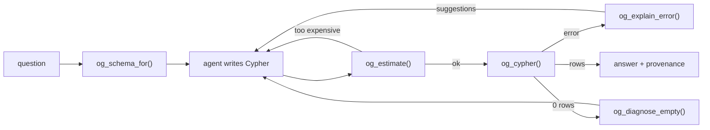

# Using Ontological from an LLM agent

An agent writing Cypher fails differently from a human: it invents labels,
reverses arrows and writes accidental cartesian products — confidently. Spec 008
exists because those failure modes are addressable by the database rather than by
prompt engineering.

The loop this surface is designed for:



---

## 1. Give it the schema, not the DDL

```sql
SELECT og_schema('default', 4000);   -- token budget
```

```json
{
  "graph": "default",
  "schema_version": 42,
  "entity_types": [
    { "name": "Person", "extends": [], "instances": 5,
      "properties": [{ "name": "name", "type": "text", "required": true, "key": false },
                     { "name": "born", "type": "int4", "required": false, "key": false }] },
    { "name": "Director", "extends": ["Person"], "instances": 3, "properties": [...] }
  ],
  "relation_types": [
    { "name": "ACTED_IN", "instances": 6,
      "roles": [{ "name": "actor", "player_type": "Person", "position": "source" },
                { "name": "production", "player_type": "Work", "position": "target" }] }
  ],
  "notes": [
    "A label matches all of its subtypes: MATCH (v:Vehicle) also returns Car and EV.",
    "Relationship direction matters. Check `roles` for which type sits at each end.",
    "Parameters use $name and are passed as the third argument to og_cypher."
  ]
}
```

Two details do most of the work. **`roles` tells the model which way the arrow
points**, which is the single most common generated-Cypher bug. And
`schema_version` is a cache key — hold the schema in context until it changes.

When the ontology is large, ask for only what matters:

```sql
SELECT og_schema_for('default', 'which directors worked with Keanu Reeves?');
```

When a budget forces truncation, the response says so explicitly, ordered by
instance count. A model that knows its schema is partial asks a follow-up
question; one that does not, hallucinates.

## 2. Check the cost before running

```sql
SELECT og_estimate('default', 'MATCH (a:Person), (b:Person) RETURN a.name, b.name');
```

```json
{
  "estimated_rows": 25,
  "estimated_cost": 4.3,
  "advice": ["the pattern contains an unconnected node — connect it with a
              relationship or it becomes a cartesian product"],
  "would_run": false
}
```

Letting the agent decline its own bad query is better than killing it later.

## 3. Make errors self-correcting

```sql
SELECT og_explain_error('default', 'MATCH (p:Persn) RETURN p');
```

```json
{
  "ok": false,
  "code": "UNKNOWN_LABEL",
  "stage": "compile",
  "message": "unknown label 'Persn' in graph 'default'. did you mean: Person",
  "suggestions": ["Person"]
}
```

`code` is stable across releases, so retry logic can branch on it. Candidates
come from edit distance over the real catalog — the model does not have to guess
what exists.

## 4. Diagnose the empty result

An empty result is the hardest case: nothing is wrong, and there is nothing to
read. So walk the pattern:

```sql
SELECT og_diagnose_empty('default',
  'MATCH (p:Person)-[:DIRECTED]->(w:Series) WHERE p.born > 1990 RETURN w');
```

```json
{ "steps": [
  { "elements": 1, "description": "(p:Person)", "rows": 8 },
  { "elements": 3, "description": "(p:Person)-[:DIRECTED]->(w:Series)", "rows": 1 },
  { "verdict": "the pattern matched; the WHERE clause removed every row",
    "hint": "relax the predicate or check property names with og_schema()" }
]}
```

## 5. Constrain what it can do

```sql
SELECT og_create_role('analyst', '{
  "statement_timeout_ms": 5000,
  "work_mem_kb": 65536,
  "read_only": true,
  "max_rows": 10000
}');
SELECT og_apply_role('analyst');
```

Every `og_cypher` call lands in `og_data.og_audit` with principal, query text,
row count, duration and error code — so what the agent did is reviewable after
the fact, not only preventable before it.

## 6. Cite the answer

```sql
SELECT og_set_source(<id>, 'https://example.org/doc/42', 0.92, 'ingest-v3');
SELECT og_enable_history('default', 'Person');   -- opt-in: it costs writes
SELECT og_history(<id>);
SELECT og_as_of(<id>, now() - interval '3 months');
```

`og_as_of` **raises an error** when no history is retained for that entity rather
than returning the current value. Silently answering a temporal question with
present-tense data is the kind of wrong answer that destroys trust in a knowledge
base.

---

## MCP

The Studio backend exposes the same functions over HTTP (`/api/schema`,
`/api/cypher`, `/api/diagnose`, `/api/explain`), which is enough to wrap as an
MCP server. A dedicated MCP binary is spec 008 phase 4 and is **not built yet** —
but nothing in the loop above needs it, because every step is a SQL call.

## A worked prompt

```
You query a graph database with Cypher.

SCHEMA (version 42):
<paste og_schema_for(graph, question)>

RULES
- A label matches all subtypes. Prefer the supertype unless the question is specific.
- Check `roles` for relationship direction before writing an arrow.
- Use $params, never string interpolation.
- Always LIMIT exploratory queries.

If a query errors, you will receive a JSON object with `code` and `suggestions`.
Apply the suggestion and retry once before changing approach.
```
