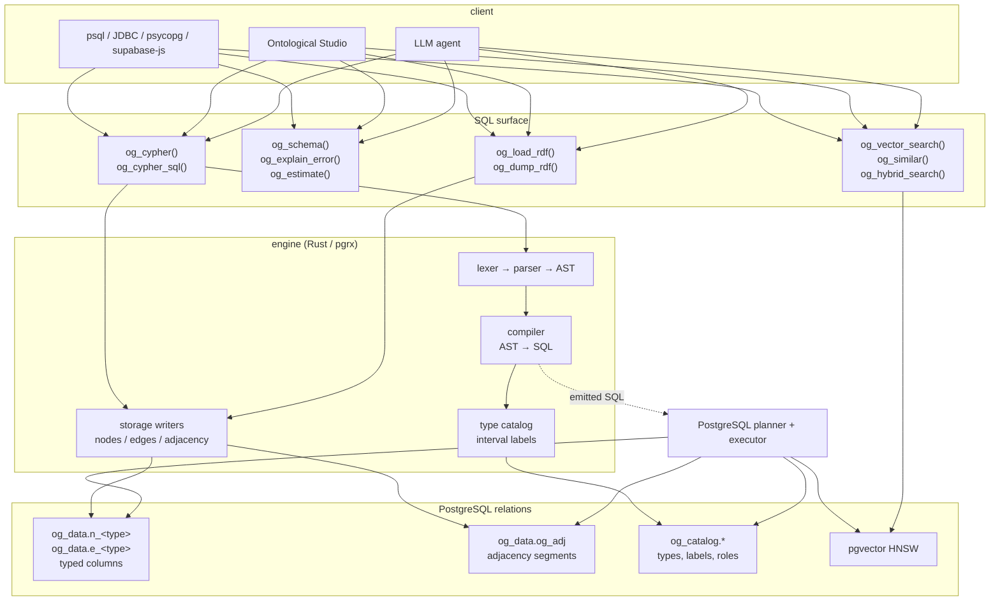
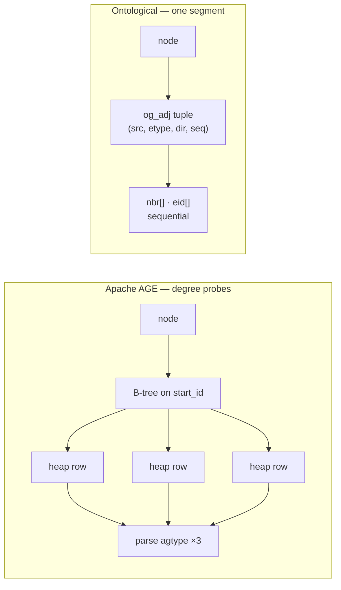
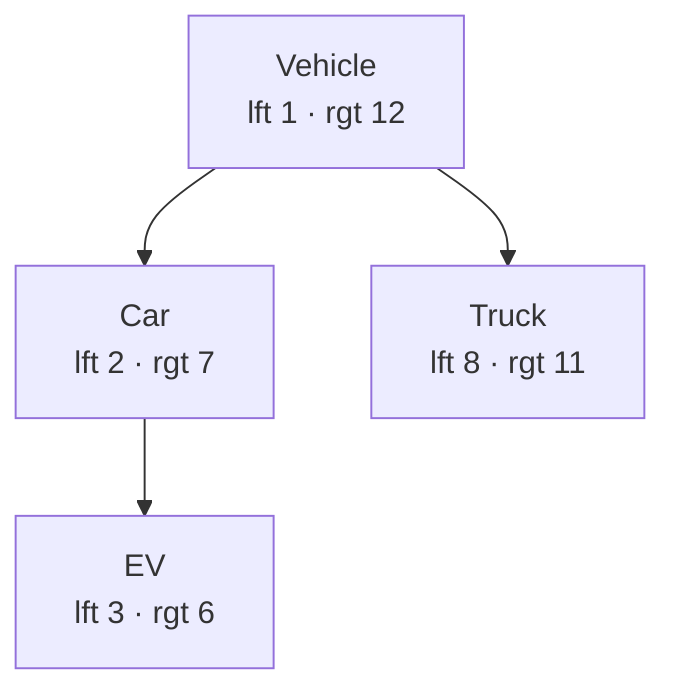
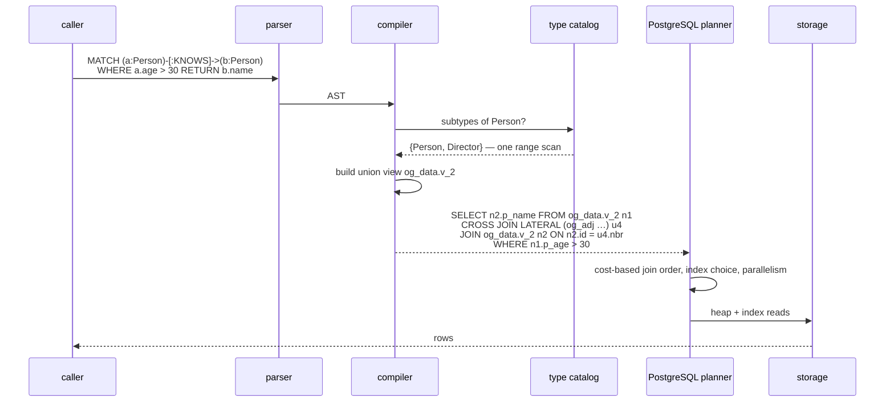
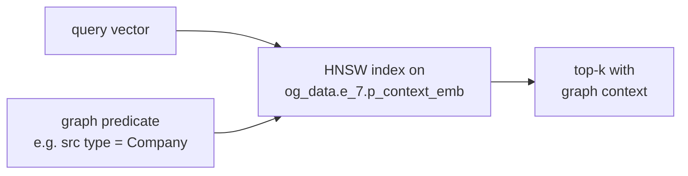

# Architecture

How a Cypher query becomes disk reads, and why the shape of that path is the
whole product.

---

## The one-paragraph version

Ontological is a PostgreSQL extension. Node and edge properties are stored as
**real typed columns** on tables generated from the type catalog. Adjacency is
stored as **CSR-style segments** — up to 256 neighbours of one node packed into
two aligned `int8[]` inside a single heap tuple. Cypher is parsed by a
hand-written recursive-descent parser and **compiled to ordinary SQL** over those
relations, so PostgreSQL's cost-based optimiser chooses the join order and scan
methods. Type inheritance is resolved at compile time through an interval-labelled
catalog, so a supertype query costs nothing extra at run time.

---

## Layers



---

## Storage: why a hop is cheap

Apache AGE stores each edge as its own row and finds neighbours through a B-tree
on the endpoint column. Expanding a node of degree *d* costs *d* index descents
plus *d* random heap fetches, and the property read on the other side costs a
JSON parse.

Ontological stores the same edges like this:

```sql
og_data.og_adj (
    src   int8,     -- the node
    etype int4,     -- relation type    → prune by type
    dir   "char",   -- 'o' | 'i'        → prune by direction
    seq   int4,     -- chunk number     → stream supernodes
    n     int4,
    nbr   int8[],   -- neighbour ids,  256 per row
    eid   int8[],   -- matching edge ids
    PRIMARY KEY (src, etype, dir, seq)
)
```

256 × 8 bytes × 2 arrays = 4 KB, which sits inside one 8 KB heap page. Expanding
a node of degree ≤ 256 is **one tuple read**, and the neighbour ids arrive in a
contiguous array rather than scattered across the heap. `STORAGE MAIN` on both
array columns keeps them from being TOASTed out of line, which would give back
the locality we just bought.

Splitting the key on `(etype, dir)` means a query that follows only `:KNOWS`
outgoing edges never reads the `:WORKS_AT` neighbours at all. Splitting on `seq`
means a node with ten million neighbours streams in 256-row chunks instead of
materialising.



pgGraph reaches the same array-shaped adjacency from the other direction — it
compiles a CSR out of your relational tables and holds it *outside* the heap, in
a backend-local memory mapping. That trade (a pointer-free hot loop, at the cost
of MVCC, row-level security and transactional visibility) is worked through in
[`comparison.md`](comparison.md).

### Identifiers

```text
 bit 63       54            36                               0
 +---+---------+-------------+--------------------------------+
 | 0 | shard:9 | type_id:18  |          local_id:36           |
 +---+---------+-------------+--------------------------------+
```

A node's type is a shift and a mask, not a catalog join. The shard bits are
reserved now so spec 007 can distribute later without rewriting a single
identifier — `local_id` stays stable across rebalancing.

### Properties

The type catalog generates one table per concrete type:

```sql
og_data.n_4 (id int8 PRIMARY KEY, p_model text, p_year int4, p_range_km int4, __ext jsonb)
```

Declared properties are columns. PostgreSQL gives us column pruning, per-column
statistics, `CHECK` constraints, unique indexes and HNSW indexes for free.
Undeclared properties fall into `__ext`, so schemaless use still works — it just
does not get the fast path, which is the correct incentive.

---

## Type system: inheritance without recursion

The catalog stores the inheritance DAG and, crucially, an **interval label** per
type per path from a root:



*Is EV a subtype of Vehicle?* → `Vehicle.lft ≤ EV.lft AND EV.rgt ≤ Vehicle.rgt`
→ `1 ≤ 3 AND 6 ≤ 12` → yes. One indexed range comparison, regardless of how deep
or wide the hierarchy is. Constitution principle IV forbids resolving this with a
recursive CTE at run time, and a regression test asserts that no `Recursive` node
appears in the plan of a supertype query.

Labels are spaced 1024 apart so that inserting a type into the middle of a
hierarchy usually consumes free space instead of renumbering everything. Multiple
inheritance gives a type several label rows — one per path — and the test stays a
range comparison.

**Roles** are what a string-typed relationship cannot express:

```sql
SELECT og_add_role('kb', 'ACTED_IN', 'actor',      'Person', 0);
SELECT og_add_role('kb', 'ACTED_IN', 'production', 'Work',   1);
```

Now the database itself refuses an `ACTED_IN` whose source is not a `Person`,
and the error says which role was violated and what it expected.

---

## Query engine: compile, don't interpret



Three properties fall out of compiling rather than interpreting:

1. **The optimiser sees the pattern.** `n1.p_age > 30` is a real column predicate
   on an indexable column, not an opaque function argument. Join order is chosen
   from statistics on the actual tables.
2. **Labels cost nothing at run time.** By execution, `:Person` has already become
   a fixed list of concrete tables the planner costs individually.
3. **Parameters bind.** `$name` is extracted from one bound `jsonb` argument and
   cast to the compared column's declared type, so the index stays usable and
   query injection is structurally impossible.

Run `SELECT og_cypher_sql(graph, query)` to see the statement for yourself, then
paste it into `EXPLAIN` — or into your own SQL, which is the honest answer to
"can I join graph results with my tables?"

### What compiles where

| Cypher | SQL |
|---|---|
| `(a:Label)` | scan of `og_data.v_<type>`, a `UNION ALL` view over concrete subtype tables |
| `-[:T]->` | `LATERAL` over `og_adj` filtered by `etype`/`dir`, then `unnest(nbr, eid)` |
| `-[:T*1..3]->` | `og_vlp()` when a path is observable, `og_reach()` — a visited-set BFS — when it is not and the depth makes it worth it ([`deep-traversal.md`](deep-traversal.md)) |
| `a.prop` | `alias.p_prop`, or `alias.__ext->>'prop'` when undeclared |
| `WHERE`, `ORDER BY`, `SKIP`, `LIMIT` | the same clauses |
| `count/sum/avg/collect` | aggregates with a derived `GROUP BY` |
| `vector.similarity(x, y)` | `1 - (x <=> y)` on a pgvector column |

Write clauses (`CREATE`, `MERGE`, `SET`, `DELETE`) run procedurally over the
bindings the read part produced, because spec 001 requires the registry, the
typed table and both adjacency directions to move together inside one
transaction. Correctness beats a single-statement plan there.

---

## Vectors on relationships

An embedding is declared as a property with a `vector(N)` type, so it becomes a
column on the type table — for **edge types exactly as for node types**:

```sql
SELECT og_add_embedding('kb', 'CITES', 'context_emb', 1536, 'cosine', 'note');
```

Everything else follows from that one decision: the HNSW index is an ordinary
index on that column, MVCC and row-level security apply unchanged, and a graph
predicate lands on the *same relation* as the ANN index — so filter push-down is
structural rather than something the planner has to be talked into. There is
nowhere for a post-filter to hide.



---

## Interoperability

Because a compiled query reads ordinary tables, **row-level security applies
mid-traversal for free**. A node the caller may not see does not join, and every
path through it disappears from the result. That is spec 005's hardest
requirement, and it costs no enforcement code — it is a dividend of being an
extension rather than a fork.

| direction | mechanism |
|---|---|
| graph → SQL | `og_node_view`, `og_edge_view`, or paste `og_cypher_sql()` into a CTE |
| SQL → graph | `og_map_table()` exposes an existing table as a node type, no copy |
| REST | `og_cypher_json()` as a PostgREST RPC |
| RDF | `og_load_rdf()` maps OWL classes onto the type hierarchy |

---

## What this architecture does not do yet

Stated plainly, with the reasoning in each `plan.md`:

- **It is not a Table Access Method.** Implementing one means writing tuple
  serialisation, visibility, vacuum and a WAL resource manager. The adjacency
  segments and typed columns already capture the performance intent; the AM is a
  v2 item, and `og_expand()` is the stable interface that will survive it.
- **Cypher still enters through a function call.** PostgreSQL 16 exposes no hook
  to replace the top-level parser, and Constitution principle I (never fork)
  outranks principle II. The optimiser integration — the part that actually
  matters — is real.
- **`WITH` and `UNION` are not implemented.** They fail loudly with a suggested
  alternative rather than silently doing something else.
- **Deep traversal was the weak axis, and most of the weakness was the
  question, not the storage.** `og_vlp()` returns one row per *path*, which is
  what Cypher's variable-length match means — and `degreeᵏ` rows to answer
  something bounded by `|V|`. A query that cannot observe path multiplicity now
  compiles to `og_reach()`, a visited-set BFS over the same heap tuples: six
  hops on a million-edge graph go from 49 s to 71 ms with MVCC and RLS intact.
  A backend-local compiled CSR (`og_csr_build`) buys a further 15× and gives up
  exactly what pgGraph gives up, so nothing routes to it automatically. Three
  hops through the Cypher surface are still 11× behind Neo4j; that gap is the
  query engine's own overhead, not the traversal.
  See [`deep-traversal.md`](deep-traversal.md).
- **Sharding is designed, not built.** Read replicas work today because every
  structure is a plain heap relation. Distributed writes without two-phase commit
  would violate principle IX quietly, so they wait.
