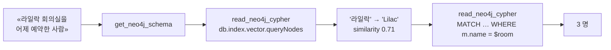

# Meeting rooms — answered through Neo4j's own MCP server

> «"라일락" 회의실을 어제 예약했던 사람 목록»

The database is Ontological. The client is
[`mcp-neo4j-cypher`](https://github.com/neo4j-contrib/mcp-neo4j) — the MCP
server Neo4j publishes — **installed from PyPI and not modified**. It is pointed
at this database with nothing but a Bolt URI, and it answers.

That is the claim this example exists to test, so it is run as a test:
`verify_mcp.py` prints a pass/fail matrix, and a check that fails names what is
missing rather than degrading quietly.

---

## The loop

An agent asking that question does four things, and each one is a tool call the
published server already advertises.



**Step 2 is the interesting one.** "라일락" is not in the database — rooms are
stored under English names — so the literal match returns zero rows, which is
exactly the failure that makes generated Cypher look plausible and be wrong.
`db.index.vector.queryNodes` returns the resolution *with its cosine
similarity*, so the caller can tell `Lilac 0.87` from a coin flip and ask a
follow-up question instead of guessing.

```
literal match on '라일락': []          ← nothing is stored under that name

→ Lilac      R-201   2F West    similarity=0.7065
  Magnolia   R-301   3F East    similarity=0.6582
  Rose       R-202   2F West    similarity=0.6504

canonical = 'Lilac'  (margin over runner-up: +0.0483)
```

and the answer, from the reservations that survive the date window:

```
김지영  Product Manager    Platform     2026-08-16T10:00:00  Sprint planning
박현우  Backend Engineer   Platform     2026-08-16T14:00:00  Schema review
이수민  Designer           Experience   2026-08-16T17:00:00  Design critique
```

The fixture is built so that a wrong answer is visible: one reservation on
Lilac today, one two days ago, and one *yesterday on a different room*. All
three are correctly absent.

## Running it

Needs a running Bolt gateway (spec 011) and an embedding model. The model here
is `qwen3-embedding` on a local Ollama; anything multilingual works — override
with `OG_EMBED_URL` / `OG_EMBED_MODEL` / `OG_EMBED_DIMS`.

```bash
pip install mcp-neo4j-cypher            # the real one, unmodified (needs Python ≥ 3.10)
psql -d ogstudio -f schema.sql          # declare the ontology
OG_GRAPH=meeting python3 load.py        # every write through the MCP server
OG_GRAPH=meeting python3 verify_mcp.py  # the compatibility matrix
OG_GRAPH=meeting python3 scenario.py    # the question, end to end
```

`verify_mcp.py` reports **11 of 11**.

One workaround is worth knowing about because it is not ours:
`mcp-neo4j-cypher` must be launched with `--schema-sample-size`. Its help text
says the default is 1000, but the argparse default is `None`, and `None` reaches
the database inside `apoc.meta.schema({sample: None})` — where it parses as a
variable name. It fails identically against Neo4j. `og_mcp.py` passes the flag.

## Why the schema step is SQL and the rest is not

`schema.sql` declares types, property types and **roles** — the named,
type-constrained ends of a relationship. Neo4j has no such declaration, so there
is no Neo4j syntax to send it through. Everything after it is ordinary Cypher:
the vector index is created with Neo4j's own `CREATE VECTOR INDEX … OPTIONS
{indexConfig: …}` DDL, sent as a `write_neo4j_cypher` call.

The declaration is what makes `get_neo4j_schema` worth calling. APOC samples a
Neo4j store and reports what it happened to find; here `apoc.meta.schema()`
reads the catalog, so `count` is exact, property types are the declared ones,
and relationship direction comes from the roles rather than from whichever
direction the sample happened to contain.

## Where the text becomes a vector

Step 2 has to turn "라일락 회의실" into an embedding, and **an agent holding only
`mcp-neo4j-cypher` cannot do that** — there is no embedding tool among its three.
So if that step is the client's job, this loop needs a second server, and the
"one unmodified MCP server" claim is not true.

Neo4j solved this by moving the step into the database, as
`genai.vector.encode()`. So does this, under the same name, and the resolution
becomes one statement an agent can actually send:

```cypher
CALL db.index.vector.queryNodes('room_name', 3, genai.vector.encode($text))
YIELD node, score
RETURN node.name AS canonical, score
```

It is **off by default**, because it makes a PostgreSQL backend wait on someone
else's HTTP server:

```sql
SELECT og_set_setting('genai.enabled',    'on');
SELECT og_set_setting('genai.endpoint',   'http://localhost:11434/api/embed');
SELECT og_set_setting('genai.provider',   'ollama');   -- or OpenAI-compatible
SELECT og_set_setting('genai.model',      'qwen3-embedding:latest');
SELECT og_set_setting('genai.dimensions', '1024');
```

The endpoint is deliberately **configuration and not an argument**, which is
where this departs from Neo4j: a caller who can write Cypher cannot make the
server fetch a URL of their choosing. Query rights are not fetch rights.

`scenario.py` tries the one-statement form and falls back to embedding on the
client if the database declines — so it runs either way, and says which path it
took.

## Configuring a client

[`mcp.json`](mcp.json) is the whole configuration: drop it in as `.mcp.json`,
or copy its `mcpServers` object into `claude_desktop_config.json` or any client
that reads the same shape. The only Ontological-specific line in it is the URI.

```json
{ "mcpServers": { "ontological": {
    "command": "uvx",
    "args": ["mcp-neo4j-cypher",
             "--db-url", "bolt://localhost:7687",
             "--username", "dev", "--password", "dev",
             "--database", "meeting",
             "--schema-sample-size", "1000"] } } }
```

`--database` names a **graph**, not a PostgreSQL database — a Bolt session's
database is a graph here (spec 011).
